# Java

## JDK 설치

## Eclipse 설치

## Java?

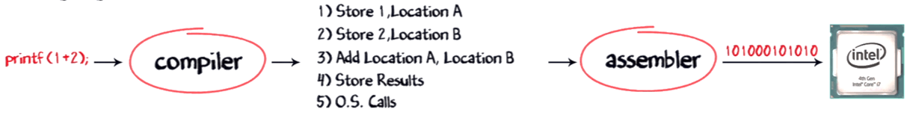

compiler : 자연어를 어셈블리어로

assembler: 어셈블리어를 기계어로

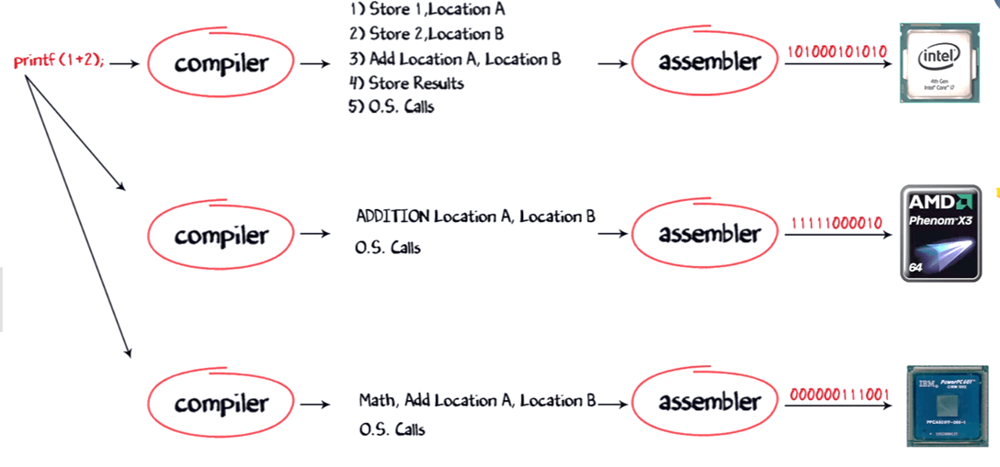

플랫폼 별로 컴파일러를 다르게 운영해야 하는 단점이 있다.

플랫폼에 맞는 컴파일러를 이용해서 플랫폼에 맞는 각각의 실행 파일을 생성해야 함

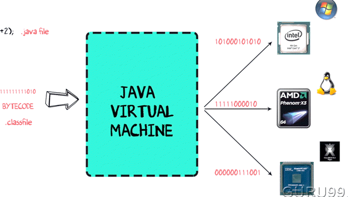

Java VM이 설치되면 플랫폼에 관계없이 동일한 코드가 실행될 수 있음

.java file -> javac -> .class file -> java -> 실행

(source)					(Byte Code)

## JVM 동작


## JVM 구조(아키텍처)


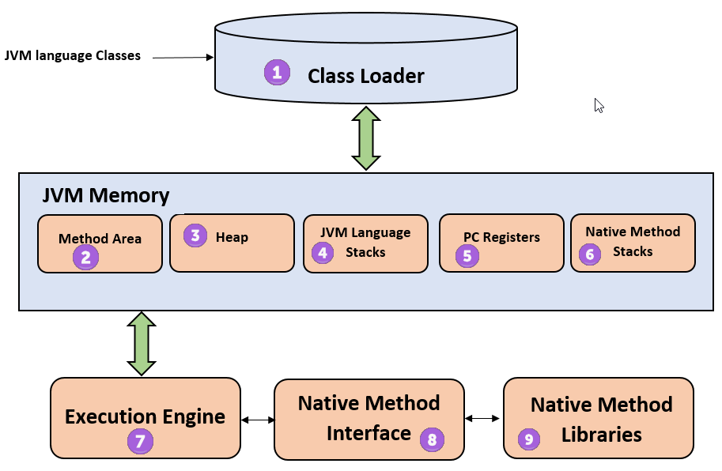

## 소스 코드를 만들어서 실행하는 절차

1. 작성(편집)
2. 컴파일
3. 링크
4. 로더
5. 실행

### C언어

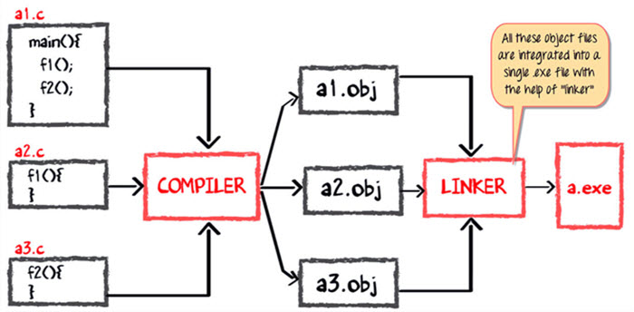


### Java

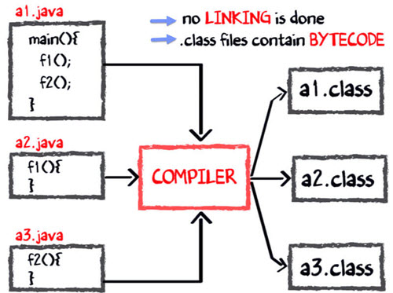


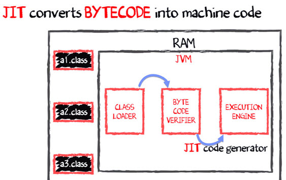


## Java_Home & PATH 환경변수 등록

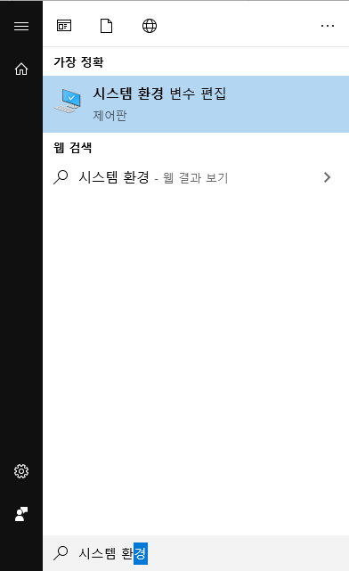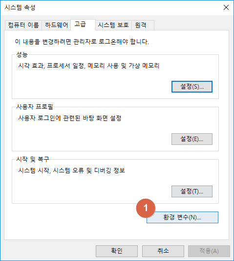
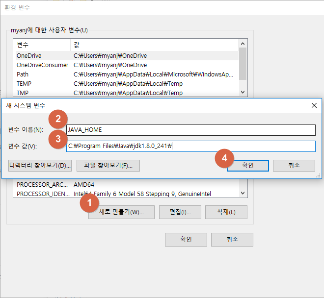변수 이름 : JAVA_HOME

변수 값 : C:\Program Files\Java\jdk1.8.0_241


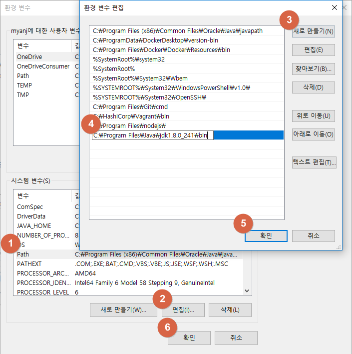

C:\Program Files\Java\jdk1.8.0_241\bin


명령 프롬프트를 새로 실행 후 확인

```cmd
> set JAVA_HOME
> set PATH
> javac
```


## 메모장 HelloJava

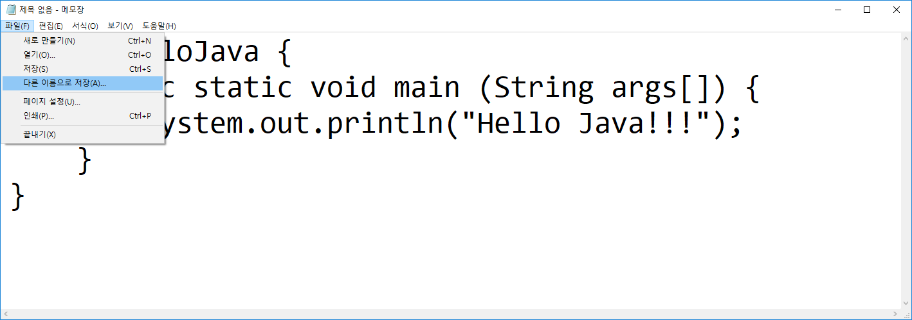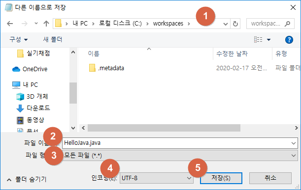

인코딩 UTF-8 말고 ANSI로

```cmd
C:\workspaces>javac HelloJava.java

C:\workspaces>dir
 C 드라이브의 볼륨에는 이름이 없습니다.
 볼륨 일련 번호: A0B4-FAD1

 C:\workspaces 디렉터리

2020-02-17  오전 10:39    <DIR>          .
2020-02-17  오전 10:39    <DIR>          ..
2020-02-17  오전 08:41    <DIR>          .metadata
2020-02-17  오전 10:39               425 HelloJava.class ⇐ Java ByteCode File
2020-02-17  오전 10:39               120 HelloJava.java  ⇐ Java Source File
               2개 파일                 545 바이트
               3개 디렉터리  856,509,513,728 바이트 남음

C:\workspaces>java HelloJava
Hello Java!!!    ⇐ HelloJava 실행 결과
```


## eclipse HelloJava

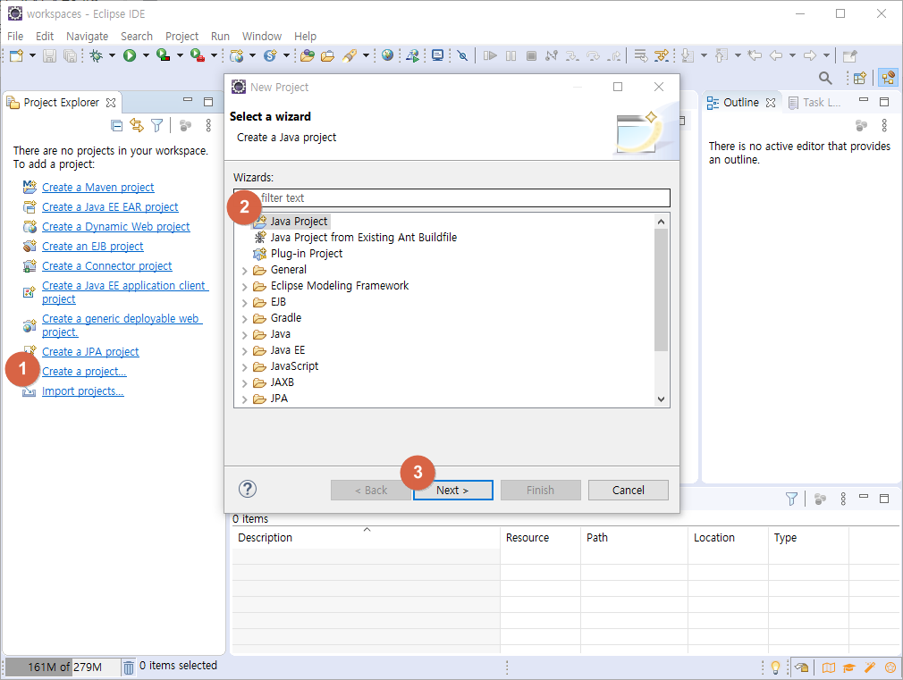

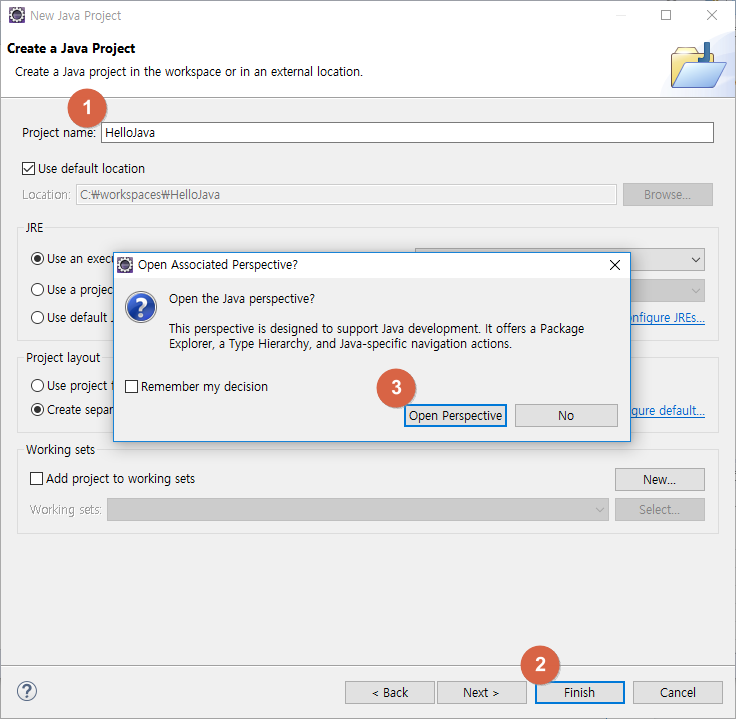
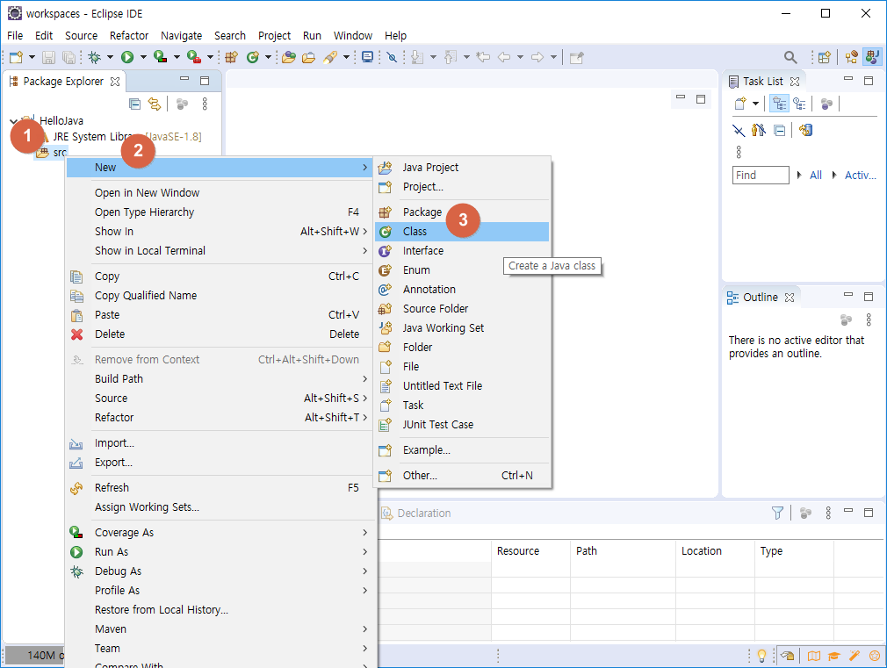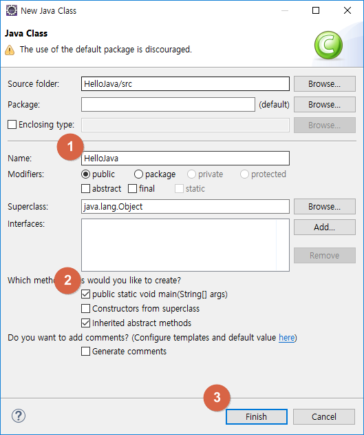

```java
public class HelloJava {
	public static void main(String[] args) {		System.out.println("Hello Java !!!");  ⇐ 코드 추가	}
}
```


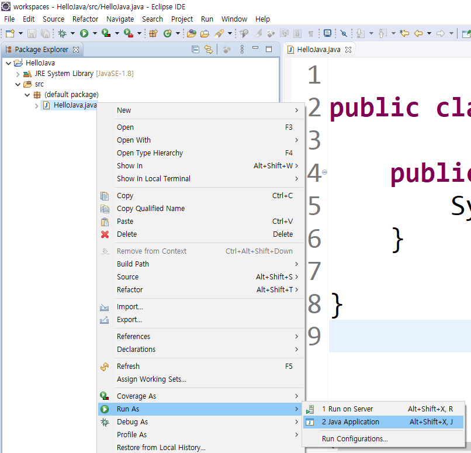
콘솔 창에서 실행 결과를 확인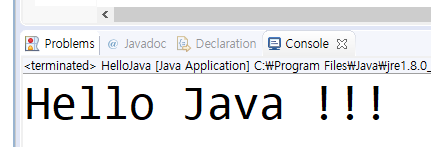

src에는 코드가 들어가고 bin엔 컴파일 된 파일이 들어간다.


```java
public class HelloJava {

	public static void main(String[] args) {
		System.out.println("Hello Java!!!");
	}
}

```

public

class

static

void

main: 운영체제의 진입점

운영체제가 함수를 실행할 때 처음부터 실행할 곳

(String[] args)

`HelloJava, System.`과 같이 첫 글자가 대문자로 시작하는 것은 대부분 Class


## OOP?


## Private

private이면 public으로 접근 할 수 있도록 해줘야 한다.

내부에서 외부로 접근하는 것을 getter

외부에서 private으로 접근하는 것을 setter


## 변수

* 값을 저장할 수 있는 메모리의 특정 주소에 붙여진 이름
* 변수 선언
  * 타입 이름
  * int age;
  * double value;
* 동일 타입의 변수는 콤마로 구분해서 동시에 정의
  * int x; int y; int z; 를
  * int x, y, z;로 표현 가능
* 변수 이름 규칙
  * 첫번째 글자는 `문자`, `$`, `_`이어야 하고, 숫자로 시작할 수 없다.
  * 영어 `대소문자`를 구분한다.
  * 첫번째 글자는 소문자로 시작하고, 다른 단어가 붙을 경우 첫 문자를 대문자로 한다. (관례)
  * 변수 이름의 길이는 제한이 없다.
  * 자바 예약어는 변수 이름으로 사용할 수 없다.

### 자바 예약어

* 자바 언어에서 의미를 가지고 사용되는 단어
* 기본 타입 : boolean, byte, char, short, int, long, flout, double
* 접근 제한자 : private, public, protected
* 클래스와 관련된 것 : class, abstract, interface, extends, implements, enum
* 객체와 관련된 것 : new, instanceof, this, super, null
* 메소드와 관련된 것 : void, return
* 제어문 : if, else, switch, case, default, for, do, while, break, continue
* 논리값 : true, false
* 예외 처리와 관련된 것 : try, catch, finally, throw, throws
* 기타 : package, import, synchronized, final, static

### 대입 연산자

* 변수에 값을 저장할 때 사용

```java
int score; // 변수를 선언
score = 90; // 변수에 값을 대입
```

### 변수 초기화

* 변수에 최초로 값을 대입하는 것

```java
int score = 90; 	// ⇐ 변수 선언과 동시에 값을 할당(초기화)
```

Q) 변수를 초기화하지 않고 변수를 사용할 수 있을까? 

A) 초기화하지 않으면 사용할 수 없다.


### 변수 사용

* 변수 값을 이용해서, 출력문이나 연산식을 수행하는 것

```java
public class HelloJava {

	public static void main(String[] args) {
		int hour = 3;
		int minute = 5;
		
		System.out.print(hour + "시간" + minute + "분은 ");
		
		int totalMinute = hour * 60 + minute;
		System.out.println(totalMinute + "분입니다");
	}
}
//print와 println의 차이 newLine
//out 이라는 패키지 안에 print와 println
```

### 변수 값 복사

* 변수의 값을 다른 변수에 저장

```java
public class HelloJava {

	public static void main(String[] args) {
		int x = 10;
		int y = x;
		x = 20;
		System.out.println("x = " + x + ", y = " + y);

	}
}
// x = 20, y = 10
```

```java
public class HelloJava {

	public static void main(String[] args) {
		int[] x = new int[ 10 ];
		int[] y = x;
		x = 20;
		System.out.println("x = " + x[0] + ", y = " + y[0]);

	}
}
// x = 20, y = 20
```

자바의 변수형은 `프리미티브 타입`과 `레퍼런스 타입`으로 나뉜다.

**프리미티브타입** : short, int, long, char, boolean, float, double / 값을 변수에 대입하여 사용하는 형태

**레퍼런스타입** : 클래스, 인터페이스, 배열, 열거형 / 값을 변수에 대입하지만 변수는 참조값(메모리상)을 가지고있지 값(프리미티브타입 값들로 이루어진)을 직접 들고있지는 않는 것이 특징이다.

### 로컬 변수

* 메소드 블록 내에서 선언된 변수
* 메소드 블록 내에서만 사용이 가능
* 메소드 실행이 끝나면 자동으로 삭제


```java
public class HelloJava {

	public static void main(String[] args) {
		int value = 10;
		int sum = value + 20;
		System.out.println(sum); // 30
	
		sum = HelloJava.add(3, 4);
		System.out.println(sum); // 7
	}
	
	public static int add(int x, int y) {
		return x+y;
	}
}

```


```java
public class HelloJava {     
    public static void main(String[] args) {   ------------+     
        int value1 = 10;                                   |
        if (value1 > 0) {           ----------------+      |
            int value2 = 20;                        |      |
            System.out.print(value1);               |      |
            System.out.print(value2);               |      |
        }                           ----------------+      |
        for (int i = 0; i < 1; i ++) {      --------+      |
            int value3 = 30;                        |      |
            System.out.print(value1);               |      |
            System.out.print(value2);               |      |
            System.out.print(value3);               |      |
        }                           ----------------+      |
        System.out.print(value1);                          |
        System.out.print(value2);                          |
        System.out.print(value3);                          |
    }       -----------------------------------------------+
}

```

## 기본 타입

정수타입

byte, char, short, int, long

실수타입

float, double

논리타입

boolean


## 리터럴

* 소스 코드에서 프로그래머가 직접 입력한 값
* 타입 이름 리터럴(문자형 리터럴, 숫자형 리터럴)

### 정수 리터럴

2진수 : 0b 또는 0B로 시작하고 0과 1로만 구성

0b1011 => 11

0B10100 => 20

8진수 : 0으로 시작하고 0~7 사이의 숫자로 구성

013 => 11

0206 => 134

10진수 : 소수점 없이 0~9 사이의 숫자로 구성

16진수 : 0x 또는 0X로 시작하고 0~9, a~f(A~F) 사이의 문자로 구성

### char 타입 - 하나의 문자를 저장

작은 따움표로 감싼 문자 리터럴

char var1 => 'A'; 유니코드 65

char var2 = '';

char var3 = '홍';

char var4 = 65; => 'A'

char var5 = 0x0041; => 'A'


### 문자열

큰 따움표로 감싼 문자들

char var1 = "A"; => X

String var2 = 'A'; => X

String var3 = "A"; => O


### 이스케이프 문자

문자열 내부에서 \는 이스케이프 문자를 뜻 함

문자열 내부에서 \는 이스케이프 문자를 뜻 함

// 나는 "자바"를 좋아합니다. 

String str = "나는 `\"자바\"`를 좋아합니다.";
// 번호 	이름 		나이  (항목들을 일정 간격을 띄워쓰기)

String str = "번호\t이름\t나이";


`\t` : 일정 간격(탭) 만큼 띄움

`\n` : 줄바꿈(라인피드)

`\r` : 캐리지 리턴

`\"` : " 출력

`\'` : ' 출력

`\\` : \ 출력

`\u16진수` : 16진수에 해당하는 문자를 출력

```java
public class HelloJava {
	public static void main(String[] args) {
		System.out.println("1\t2\t3\t4");
		System.out.println("a\tb\tc\td");
		
		System.out.println("1\n2\n3");
		System.out.println("a\rb\rc");
		
		System.out.println("1\"2\"3");
		System.out.println("1\'2\'3");
		System.out.println("1\\2\\3");
		
		System.out.println("1\u00413");	// u0041 = A
	}
}

```

## 자동 타입 변환 (promotion)

* 값의 허용 범위가 작은 타입이 큰 타입으로 저장될 때
  * `큰 타입 = 작은 타입;` 이런 수식일 때
* byte < short < int < long < float < double

```java
public class HelloJava {

	public static void main(String[] args) {

		char charValue = 'A';
		int intValue = charValue;
		
		System.out.println(charValue); // A
		System.out.println(intValue); // 65
	}
}

```

## 강제 타입 변환 (casting)

* 큰 허용 범위 타입을 작은 허용 범위 타입으로 강제로 나누어 한 조각만 저장
  * 캐스팅 연산자(=`()`)를 사용
  * `작은허용범위타입 = (작은허용범위타입) 큰허용범위타입;` 꼴

```java
public static void main(String[] args) {
		int intValue = 256;
		byte byteValue = (byte)intValue;

		System.out.println(intValue);		// 10
		System.out.println(byteValue);	// 10
	}
```


```java
public class HelloJava {

	public static void main(String[] args) {
		int intValue = 256;
		byte byteValue = (byte)intValue;

		System.out.println(intValue);		// 10
		System.out.println(byteValue);	// 10
		
		// 실수 타입을 정수 타입으로 캐스팅하면 소수점 이하를 버림
		double doubleValue = 3.14;
		int intValue2 = (int)doubleValue;
		System.out.println(doubleValue);	// 3.14
		System.out.println(intValue2);	// 3
	}
}

```


자동 타입 변환이 발생하는 경우(예)

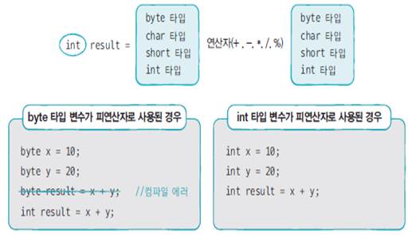

```java
public class HelloJava {

	public static void main(String[] args) {
		byte x = 10;
		byte y = 20;
		// byte result = x + y;
		// + 가 정수연산자라
		int result = x + y;
		System.out.println(result);
	}
}

```


피 연산자 중 하나가 long 타입이면 다른 피연자는 long 타입으로 자동 변환

피 연산자 중 하나가 double 타입이면 다른 피연자는 double 타입으로 자동 변환


```java
	public static void main(String[] args) {
		// 정수 연산의 결과를 실수로 저장할 때
		{
			int x = 1;
			int y = 2;
			double result = x / y;
			System.out.println(result); // 0.0
		}		
		{ 
			int x = 1;
			int y = 2;
			double result = (double)x / y;
			System.out.println(result); // 0.5
		}
		{ 
			int x = 1;
			int y = 2;
			double result = x / (double)y;
			System.out.println(result); // 0.5
		}
		{ 
			int x = 1;
			int y = 2;
			double result = (double)x / (double)y;
			System.out.println(result); // 0.5
		}
	}

```


## + 연산자

* 문자열 결합
  * 피연산자 중 하나라도 문자열인 경우(나머지 피연산자는 모두 문자열로 자동 변환)
* 덧셈 연산
  * 피연산자가 모두 숫자일 때

```java
public class HelloJava {

	public static void main(String[] args) {
		int value = 3 + 7;
		System.out.println(value);	// 10
		
		String s1 = "3" + 7;
		System.out.println(s1);		// "3" + 7 = "3" + "7" = "37"
		
		int value2 = 3 + 7 + 5;
		System.out.println(value2);	// 15
		
		String s2 = 1 + 2 + "3";
		System.out.println(s2);		// (1+2)+"3" = 3+"3" = "3"+"3" = "33"
		
		String s3 = 1 + "3" + 7;
		System.out.println(s3);		// "1"+"3"+7 = "13"+7 = "13"+"7" = "137"
	}
}

```


## 문자열을 기본 타입으로 강제 타입 변환

* 숫자 외 요소를 포함한 문자열을 숫자 타입 변환하면 NumberFormatException이 발생

* byte byteValue = Byte.parseByte(stringValue);
* short shortValue = Short.parseShort(stringValue);
* int intValue = Integer.parseInt(stringValue);
* long longValue = Long.parseLong(stringValue);
* float floatValue = Float.parseFloat(stringValue);
* double doubleValue = Double.parseDouble(stringValue);
* boolean booleanValue = Boolean.parseBoolean(stringValue);

```java
public class HelloJava {

	public static void main(String[] args) {
		String stringValue = "";

		stringValue = "10";
		byte byteValue = Byte.parseByte(stringValue);			// 

		stringValue = "200";
		short shortValue = Short.parseShort(stringValue);		// 

		stringValue = "300000";
		int intValue = Integer.parseInt(stringValue);			// 

		stringValue = "400000000";
		long longValue = Long.parseLong(stringValue);			// 

		stringValue = "12.345";
		float floatValue = Float.parseFloat(stringValue);		// 

		stringValue = "12.345";
		double doubleValue = Double.parseDouble(stringValue);		// 

		stringValue = "true"; // or "false"					
		boolean booleanValue = Boolean.parseBoolean(stringValue);	//
	
		System.out.println(byteValue); // 10
		System.out.println(shortValue); // 200
		System.out.println(intValue); // 300000
		System.out.println(longValue); // 400000000
		System.out.println(floatValue); // 12.345
		System.out.println(doubleValue); // 12.345
		System.out.println(booleanValue); // true
	}
}

```


## 기본 타입을 문자열로 변환

* String stringValue = String.valueOf(data);


## 시스템 입출력

println(내용) => 내용을 출력하고 행을 변경 

print(내용) => 내용만 출력

printf("형식문자열", 값1, 값2, …) => 첫번째 문자열 형식대로 내용을 출력

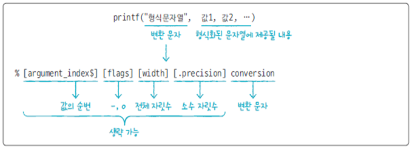

```java
	public static void main(String[] args) {
		String name = "홍길동";
		int age = 23;
		
		// 	이름: 홍길동, 나이: 23
		System.out.print("이름: " + name + ", ");
		System.out.println("나이: " + age);
		
		System.out.printf("이름: %s, ", name);
		System.out.printf("나이: %d\n", age);
		
		System.out.printf("이름: %s, 나이: %d\n", name, age);
	}
```


```java
	public static void main(String[] args) {
		System.out.printf("이름: %s, 나이: %3d\n", "홍길동", 3);
		System.out.printf("이름: %1$s, 나이: %2$3d\n", "이순신", 323);
	}
```

%d => 정수 => 123

%6d => 6자리 정수, 왼쪽 빈 자리 공백 => ___123

%-6d => 6자리 정수, 오른쪽 빈 자리 공백 => 123___

%06d => 6자리 정수, 왼쪽 빈 자리 0 채움 => 000123


%10.2f => 소수점 이상 7자리, 소수점 이하 2자리, 왼쪽 빈자리 공백 => ____123.45

%-10.2f => 소수점 이상 7자리, 소수점 이하 2자리, 오른쪽 빈자리 공백 => 123.45

%010.2f => 소수점 이상 7자리, 소수점 이하 2자리, 왼쪽 빈자리 0 채움 => 0000123.45

 ```java
public class HelloJava {

	public static void main(String[] args) {
		System.out.printf("%10.2f\n", 123.45);
		System.out.printf("%-10.2f\n", 123.45);
		System.out.printf("%010.2f\n", 123.45);
	}
}
 ```

\t => 탭

\n => 줄바꿈

%% => %


### 문제

```java
public class HelloJava {

	public static void main(String[] args) {
		// System.out.printf("%10.2f\n", 123.45); 함수의 실행 결과는?
		String s = "System.out.printf(\"%10.2f\\n\", 123.45); 함수의 실행 결과는?";
		System.out.printf("%s", s);
		System.out.println();
		System.out.printf("System.out.printf(\"%%10.2f\\n\", 123.45); 함수의 실행 결과는?");
		
}
}
```


## System.in.read()

키보드로 입력한 키코드를 읽어서 반환하는 메소드

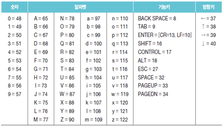

한계(단점)

* 2개 이상 키가 조합된 한글은 읽을 수 없음
* 키보드로 입력된 내용을 통문자열로 읽을 수 없음

```java
import java.io.IOException;

public class HelloJava {

	public static void main(String[] args) throws IOException {
		int keyin = System.in.read();
		System.out.println(keyin);
}
}
```


## Scanner 클래스

* 통문자열을 읽어 사용 가능

```java
import java.io.IOException;
import java.util.Scanner;

public class HelloJava 
{
	public static void main(String[] args) throws IOException {
		Scanner sc = new Scanner(System.in);
		while(sc.hasNextLine()) {
			String input = sc.nextLine();
			System.out.println(">>> " + input);
			if (input.equals("X"))
				break;
		}
		System.out.print("END");
		sc.close();
	}
}
```


## 비교

* 기본 타입 값 비교 ⇒ `==` 사용
* 문자열 타입 값 비교 ⇒ `equals()` 메소드 사용

```java
import java.io.IOException;

public class HelloJava {
	public static void main(String[] args) throws IOException {
		int x = 5;
		System.out.println( x == 5 );
		System.out.println( x == 6 );
		
		String s = "Java";
		System.out.println( s.equals("Java"));
		System.out.println( s.equals("java"));
	}
}

```

`==`는 값 비교(동일 주소)

`equals()`는 내용 비교

```java


String s1 = "Java";

String s2 = "Java";

String s3 = new String("Java");

String s4 = new String("Java");


System.out.println( s1 == s2 ); // true

System.out.println( s1.equals(s2) ); // true

System.out.println( s3 == s4 ); // false

System.out.println( s3.equals(s4) ); // true

System.out.println( s1 == s3 ); // false

System.out.println( s1.equals(s3) ); // true

```


