# Java

2일

## 비교

* heap 메모리 공간에서 동일한 내용이면 stack은 동일한 주소를 참조

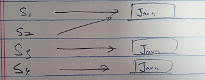

```java
import java.io.IOException;

public class HelloJava 
{
	public static void main(String[] args) throws IOException {
		int x = 5;
		System.out.println( x == 5 );	// true
		System.out.println( x == 6 );	// false
		
		String s1 = "Java";						
		String s2 = "Java";
		String s3 = new String("Java");
		String s4 = new String("Java");

		System.out.println( s1 == s2 );		// true   값 비교, 동일 주소이므로 true
		System.out.println( s1.equals(s2) );	// true   내용 비교
		System.out.println( s3 == s4 );		// false  값 비교, 주소가 다르므로 false
		System.out.println( s3.equals(s4) );	// true
		System.out.println( s1 == s3 );		// false
		System.out.println( s1.equals(s3) );	// true		
		
	}
}
```

## 연산자와 연산식

* 연산자(operator) : 연산에 사용되는 표시나 기호
* 피연산자(operand) : 연산자와 함께 연산되는 데이터
* 연산식(expression) : 연산자와 피연산자를 사용하여 연산 과정을 기술한 것


### 연산자 종류

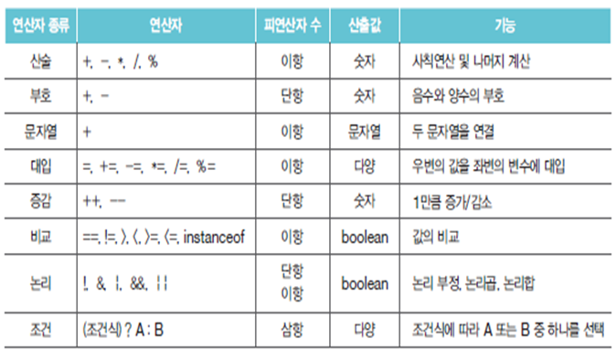

### 연산자의 우선순위

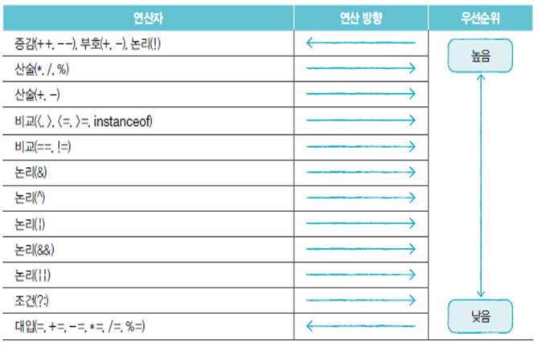단항 > 이항 > 삼항

산술 > 비교 > 논리 > 대입 순

​	예) System.out.println( x > 0 && y < 0 );

우선순위가 같은 연산자는 왼쪽에서 오른쪽 방향으로 수행 (대입 연산자는 예외)

예) System.out.println( 100 * 2 / 3 % 5 );

예) a = b = c = 5;


괄호를 이용해서 연산자의 우선순위를 변경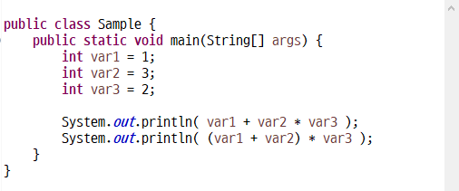

### 단항, 이항, 삼항 연산자

피연산자의 수에 따라 구분

* 단항 연산자 : 부호, 증감 연산자 예) ++x;
* 이항 연산자 : 산술, 비교, 논리 연산자 예) x + y;
* 삼항 연산자 : 조건 연산자 예) (sum > 90) ? "A" : "B";

### 부호 연산자

* boolean 타입과 char 타입을 제외한 기본 타입에 사용
* 부호 연산자의 연산 결과는 int

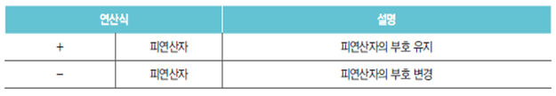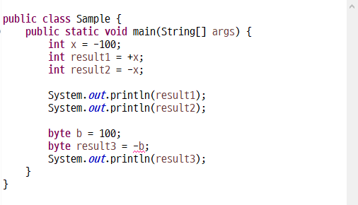

### 증감 연산자

* boolean 타입 외 모든 기본 타입 피연산자에 사용

* 다른 연산자와 함께 사용될 경우 증감 연산자 위치에 따라 결과가 달라질 수 있음

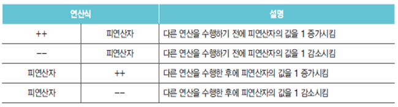

```java
import java.io.IOException;

public class HelloJava 
{
	public static void main(String[] args) throws IOException {
		int x = 10;
		int y = 10;
		
		int result1 = ++x + 100;
		int result2 = y++ + 100;
		
		System.out.println(x); // 11
		System.out.println(y); // 11
		System.out.println(result1); // 111
		System.out.println(result2); // 110		
	}
}
```

### 논리 부정 연산자

* boolean 타입에만 사용 가능
* 토글링에 많이 사용

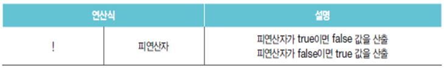

### 산술 연산자

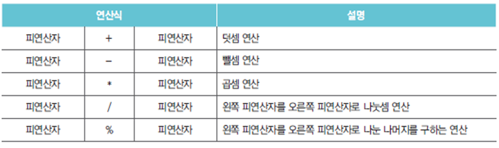피연산자 타입이 동일하지 않을 경우 다음 규칙에 따라 일치시킨 후 연산을 수행

* 피연산자가 byte, short, char 타입일 경우 모두 int 타입으로 변환
* 피연산자가 모두 정수 타입이고 long 타입이 포함된 경우 모두 long 타입으로 변환
* 피연산자 중 실수 타입이 있을 경우 허용 범위 큰 실수 타입으로 변환

### 문자열 결합 연산자

`+`연산자의 피연산자 중 한 쪽이 문자열인 경우

### 비교 연산자

* 피연산자의 크기를 비교하여 true/false를 산출
* 동등 비교 연산자는 모든 타입에 사용 가능
* 크기 비교 연산자는 boolean 외 모든 기본 타입에 사용 가능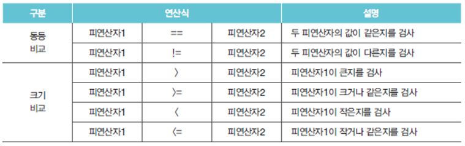

### 입력한 글자의 알파벳 여부 확인

```java
import java.io.IOException;

public class HelloJava 
{
	public static void main(String[] args) throws IOException {
		int input = System.in.read();
		if ((input >= 'a' && input <= 'z') || (input >= 'A' && input <= 'Z')) {
			System.out.println(String.valueOf(input) + "알파벳");
            //System.out.println("입력한 '" + (char)input + "'은 알파벳입니다.");

		} else {
			System.out.println("알파벳 아님");
		}
		}
}

```

### 논리 연산자

boolean 타입만 사용 가능

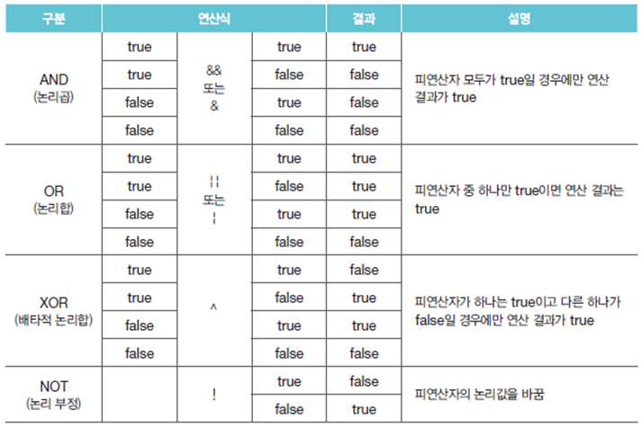

### 대입 연산자

오른쪽 피연자의 값을 왼쪽 피연산자인 변수에 저장

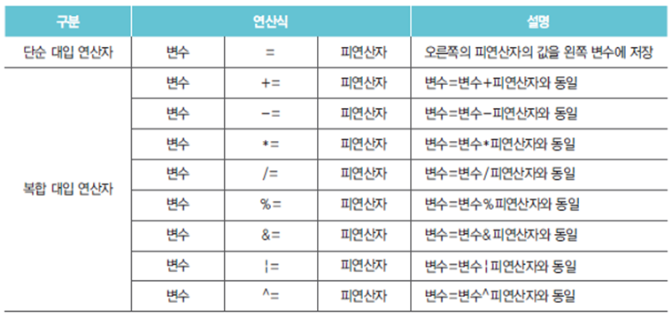

### 삼항 연산자

* 3개의 피연자를 필요로 하는 연산자
* ? 앞의 조건식에 따라 콜론 앞뒤의 피연산자 선택


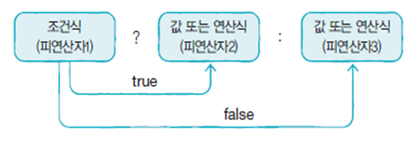

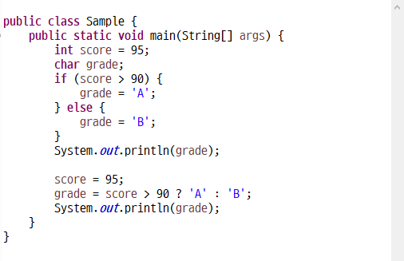

### 사용자가 입력한 숫자가 홀수인지 짝수인지 확인

* java.util.Scanner 클래스

```java
import java.io.IOException;
import java.util.Scanner;

public class HelloJava 
{
	public static void main(String[] args) throws IOException {
		String result = "";
		Scanner sc = new Scanner(System.in);
		int input = sc.nextInt();
		
		//	if-else 구문 이용
		if (input % 2 == 0) {
			result = "짝수";
		} else {
			result = "홀수";
		}
		System.out.printf("입력한 숫자는 %d는 %s입니다.\n", input, result);
		
		//	삼항 연산자 이용
		result = input % 2 == 0 ? "짝수" : "홀수";
		System.out.printf("입력한 숫자는 %d는 %s입니다.\n", input, result);
		
		sc.close();
	}
}

```

## 조건문

### If문

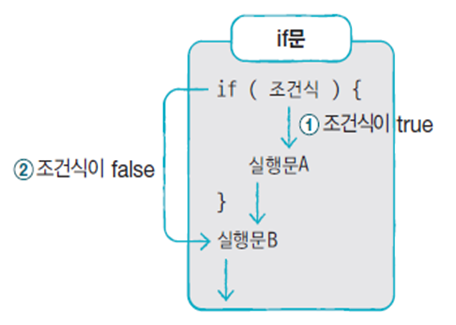

### if-else문

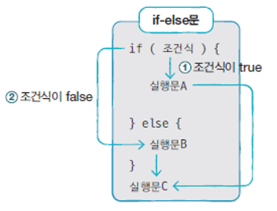

### if-else if-else 문

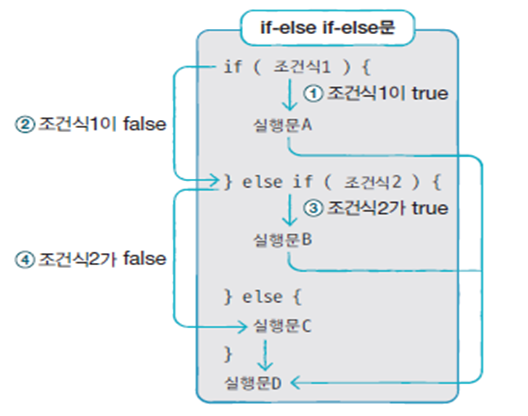

### switch 문

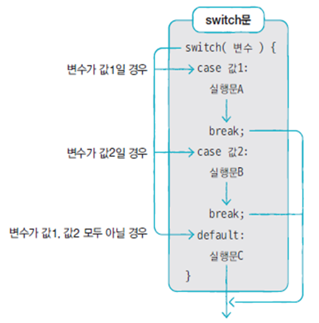

### 사용자가 입력한 알파벳이 모음인지 자음인지 판단

* System.in.read() 이용
* a, e, i, o, u ⇒ 모음 

```java
import java.io.IOException;

public class HelloJava 
{
	public static void main(String[] args) throws IOException {
		int input = System.in.read();
		if (input == 'a' || input == 'e' || input == 'i' || input == 'o' || input == 'u') {
			System.out.println("모음입니다.");
	} else {
		System.out.println("자음입니다.");
	}
	
	// switch-case 구문으로 구현
	switch(input) {
	case 'a' :
	case 'e' :
	case 'i' :
	case 'o' :
	case 'u' :
		System.out.println("모음입니다.");
		break;
	default :
		System.out.println("자음입니다.");
		break;
	}
	}
}

```

## 반복문

### for 문

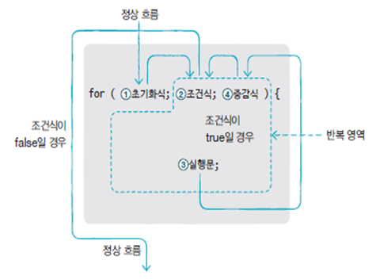

### while 문

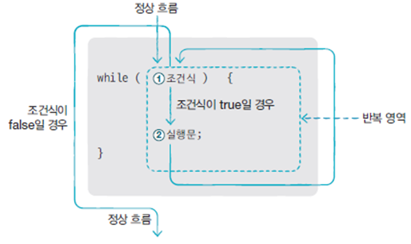

### do-while 문

* 무조건 한번은 실행해야 하는 식에 사용

**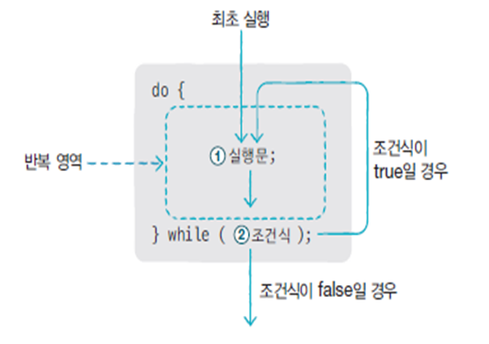

### break 문

for, while, do-while, switch 문의 실행을 중지할 때 사용

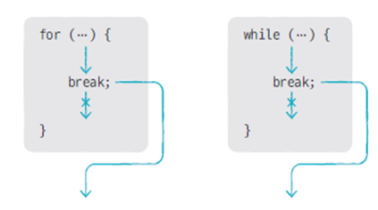
반복문이 중첩되어 있는 경우, Label을 이용해서 바깥 반복문을 빠져나갈 수 있음

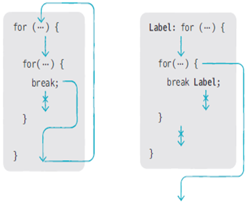

```java
import java.io.IOException;

public class HelloJava 
{
	public static void main(String[] args) throws IOException {
		for (int i = 0; i < 4; i ++) {
			for (int j = 0; j < 3; j ++) {
				if (i == 1 && j == 1) break;
				System.out.printf("i = %d, j = %d%n", i,j);
			}
		}
		
		Label: 		for (int i = 0; i < 4; i ++) {
			for (int j = 0; j < 3; j ++) {
				if (i == 1 && j == 1) break Label;
				System.out.printf("i = %d, j = %d%n", i,j);
			}
		}
	}
}
/*
i = 0, j = 1
i = 0, j = 2
i = 1, j = 0
i = 2, j = 0
i = 2, j = 1
i = 2, j = 2
i = 3, j = 0
i = 3, j = 1
i = 3, j = 2
i = 0, j = 0
i = 0, j = 1
i = 0, j = 2
i = 1, j = 0
*/

```


### continue 문

* form, while, do-while 문에서만 사용

* for 문의 증감식, while, do-while 문의 조건식으로 이동

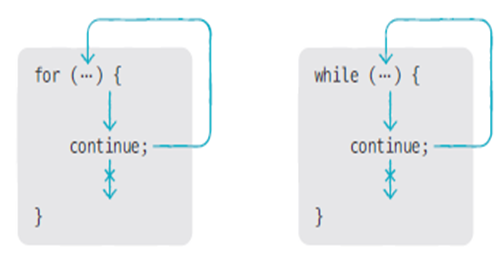

## 참조 타입

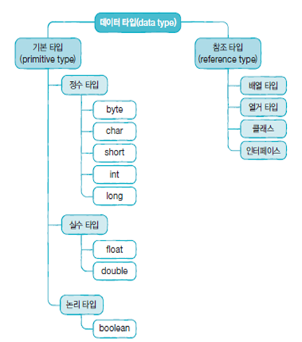

### 기본 타입 변수와 참조 타입 변수의 차이

기본 타입 변수

int age = 25;

double price = 100.5;


참조 타입 변수

String name = "신용권";

String hobby = "독서";

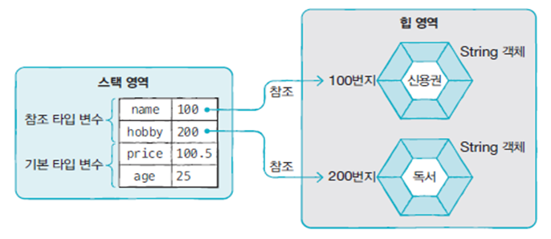

### 메모리 사용 영역

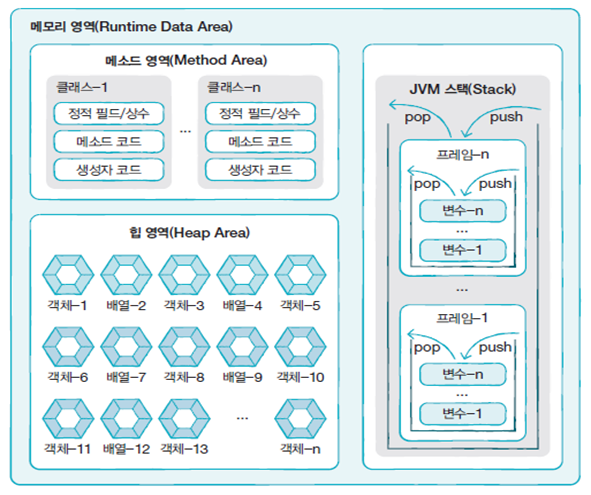

`메소드 영역(method area)`

* 클래스별 정적 필드(static filed)
* 상수(constant)
* 생성자(constructor)
* 메서드(method) 코드 등을 분류해서 저장

`힙 영역(heap area)` : 객체와 배열이 생성되는 영역

`JVM 스택 영역(stack area)` : 메소드가 호출되면 프레임이 추가되고, 메소드 종료되면 프레임이 제거됨

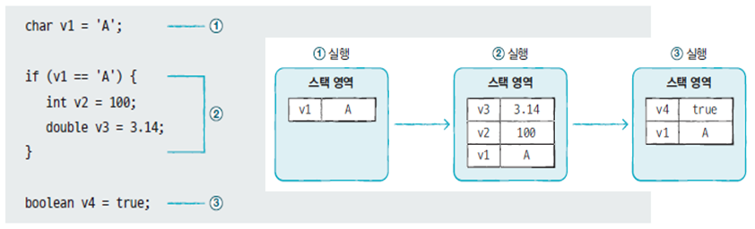

참조 타입 변수는 스택 영역에 힙 영역에 생성된 객체의 주소를 가짐

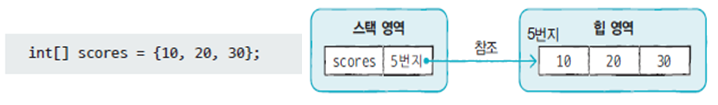

### 참조 타입 변수 간 ==, != 연산

동일 객체(= 같은 주소) 참조 여부를 판단할 때 사용

```java
		String s5 = null;
		String s6 = null;
		
		System.out.println( s5 == s6 ); // true
```


```java
import java.io.IOException;

public class HelloJava 
{
	public static void main(String[] args) throws IOException {
		String s1 = "Java String";
		String s2 = "Java String";
		String s3 = new String("Java String");
		String s4 = new String("Java String");
		
		System.out.println( s1 == s2 );
		System.out.println( s1 == s3 );
		System.out.println( s1 == s4 );
		System.out.println( s3 == s4 );

		String s5 = null;
		String s6 = null;
		
		System.out.println( s5 == s6 ); // true

	}
}

```

### null

참조 타입 변수는 객체를 참조하지 않는다는 뜻으로 null 값을 가질 수 있음

null로 초기화된 참조 변수도 스택 영역에 생성


### NullPointerException

참조 타입 변수가 null 상태에서 존재하지 않는 객체의 데이터나 메소드를 사용하는 경우 발생

```java
	public static void main(String[] args) throws IOException {
		int[] intArray2;
		intArray2[0] = 100;
		
		int[] intArray = null;
		intArray[0] = 100;
		
		String str = null;
		System.out.println("총 문자수: " + str.length());
	}

```

### String 타입 변수에 문자열 리터럴을 대입하는 경우

* 문자열 리터럴을 힙 영역에 String 객체로 생성하고, 변수가 String 객체를 참조

String name = "신용권";

String hobby = "자바";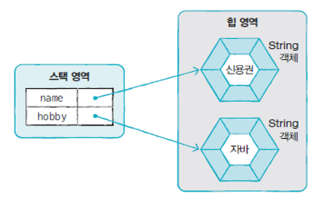

### 문자열 리터럴이 같은 경우에는 같은 String 객체를 공유

String name1 = "신용권";

String name2 = "신용권";

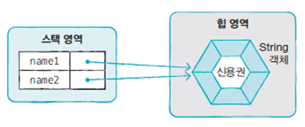

### new 연산자를 이용한 String 객체 생성

힙 영역에 새로운 String 객체를 생성
String name1 = new String("신용권");

String name2 = new String("신용권");

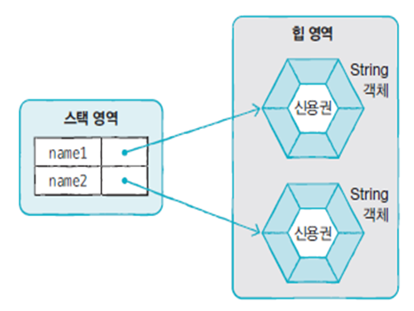

### 문자열 리터럴과 new 연산자로 생성된 객체를 비교

`==` : 주소를 비교

`equals()` = 값(문자열)을 비교


String 변수에 null 대입 => String 변수가 참조하는 객체가 없음 => 참조를 잃은 String 객체는 Garbage Collector를 통해 메모리에서 자동으로 제거

String hobby = "여행";

hobby = null;

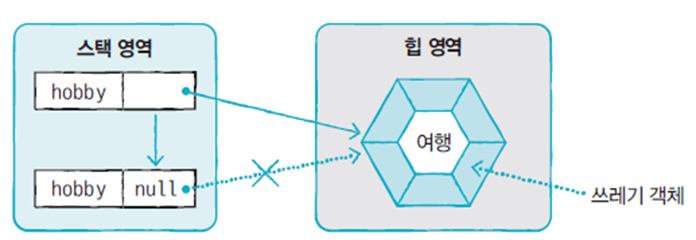


## 배열

### 배열 변수 선언

```java
int[] inArray;

int intArray[];
```


#### 배열 생성 방법 1. 값 목록으로 배열 생성


타입[] 변수 = { 값0, 값1, 값2, ... };

배열 변수 선언 후 다른 실행문으로 값 목록으로 배열 생성하는 것은 불가능


예)

타입[] 변수;

변수 = { 값0, 값1, 값2 , ...}; // 컴파일 오류 발생


배열 변수 선언 후 값 목록이 나중에 결정되는 경우 new연산자를 사용

타입[] 변수;

변수 = `new 타입[]` { 값0, 값1, 값2 , ...};

```java
import java.io.IOException;

public class HelloJava 
{
	public static void main(String[] args) throws IOException {
		String[] names;
		// names = {"홍길동", "이순신"};
		names = new String[] {"홍길동", "이순신"};
		
		for (int i = 0; i < names.length; i ++) {
			System.out.println(names[i]);
		}
	}
}

```

#### 배열 생성 방법 2. new 연산자를 이용한 배열 생성

>  타입별 기본값으로 배열 요소가 초기화

타입[] 변수 = new 타입[배열크기];

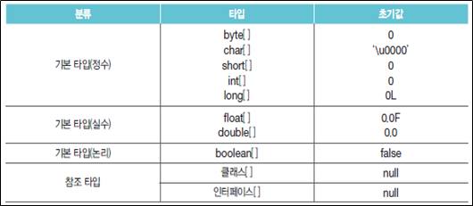

```java
import java.io.IOException;

public class HelloJava 
{
	public static void main(String[] args) throws IOException {
		String[] names;
		names = new String[10];
		for (int i = 0; i < names.length; i ++) {
			System.out.printf("names[%d] = %d%n", i, names[i]);
		}
		
		int[] numbers = new int[10];
		for (int i = 0; i < numbers.length; i ++) {
			System.out.printf("numbers[%d] = %d%n", i, numbers[i]);
		}
	}
}
/*
names[0] = null
names[1] = null
names[2] = null
names[3] = null
names[4] = null
names[5] = null
names[6] = null
names[7] = null
names[8] = null
names[9] = null
numbers[0] = 0
numbers[1] = 0
numbers[2] = 0
numbers[3] = 0
numbers[4] = 0
numbers[5] = 0
numbers[6] = 0
numbers[7] = 0
numbers[8] = 0
numbers[9] = 0
*/
```


## main() 메소드의 String[] args 매개변수

```java
public class HelloJava
{
	public static void main(String[] args) {
		for (int i = 0; i < args.length; i ++) {
			System.out.printf("args[%d] = %s\n", i, args[i]);
		}
	}
}

```

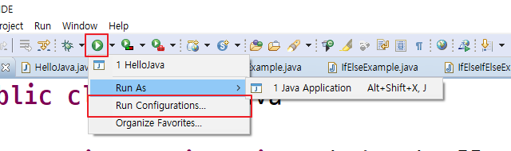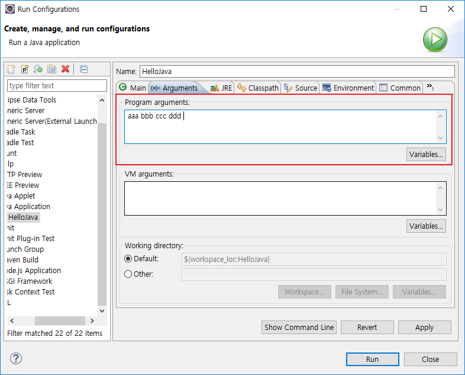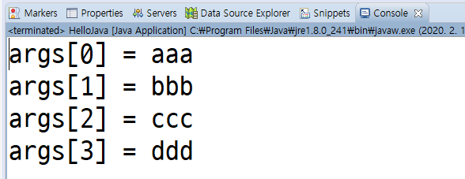

```cmd
C:\workspaces\HelloJava\bin>java HelloJava aaa bbb ccc ddd eee
```

args[0] = aaa

args[1] = bbb

args[2] = ccc

args[3] = ddd

args[4] = eee

### 구구단, 파라미터로 전달한 단을 출력

여러 단을 입력하면 낮은 단에서 높은 단으로 순차적으로 출력

예) java Gugudan 5 7 9 4 ⇒ 4단, 5단, 7단, 9단을 출력

```java
import java.util.Arrays;

public class Gugudan {

	public static void main(String[] args) {
		Arrays.sort(args);
		for (String arg : args) {
			for (int i = 1; i < 10; i ++) {
				int dan = Integer.parseInt(arg);
				System.out.printf("%2d x %d = %2d%n", dan, i, dan*i );
			}
			System.out.println();
		}
	}
}

```


## SortName

```
다음과 같은 출력의 프로그램을 작성하시오.

인원수는? 5
이름은? 홍길동
이순신
김나라
아다라
파순숭
정렬결과 >>> 김나라, 아다라, 이순신, 파순숭, 홍길동

```

```java

import java.util.Arrays;
import java.util.Scanner;

public class HelloJava {
	public static void main(String[] args)	{
		Scanner sc1 = new Scanner(System.in);
		Scanner sc2 = new Scanner(System.in);
	
		System.out.print("인원수는? ");
		int count = sc1.nextInt();
		
		System.out.print("이름은? ");
		String[] names = new String[count];
		for (int i = 0; i < count; i++) {
			names[i] = sc2.nextLine();
		}
		sc2.close();
		sc1.close();
		
		Arrays.sort(names);
		for (int i = 0; i < names.length; i ++ ) {
			if (i == 0) {
				System.out.print("정렬결과 >>> ");
			}
			System.out.print(names[i]);
			if (i != names.length-1) {
				System.out.print(", ");
			}
		}
	}
}

```


## ReverseWord

프로그램 실행 시 전달된 문장에 포함된 단어를 역순으로 출력하시오.

예) "Welcome to Java Word">>> emocleW ot avaJ droW

[참고] String.split() 메소드, String.charAt() 메소드 

```java

public class ReverseWord
{
	private static final String DELIMITER = " "; // 상수 선언
	
	public static void main(String[] args) {
		String[] words = args[0].split(DELIMITER);
		System.out.print(">>>");
		for (String word : words) {
			for (int i = word.length()-1; i>=0; i--) {
				System.out.print(word.charAt(i));
			}
			System.out.print(" ");
		}
	}
}

```

## 2차원 배열

### 행렬 구조

```java
int[][] scores = new int[2][3];
scores.length // 2 A
scores[0].length // 3 B
scores[1].length // 3 C 
```

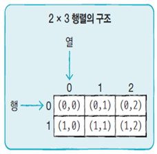

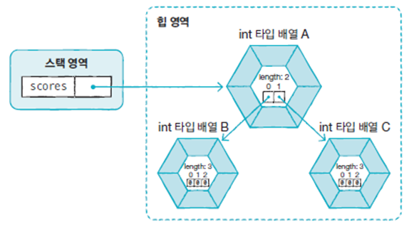

### 계단식 구조

```java
int [][] scores = new int [2][];
scores.length // A 2
scores[0].length // B 2
scores[1].length // C 3
```

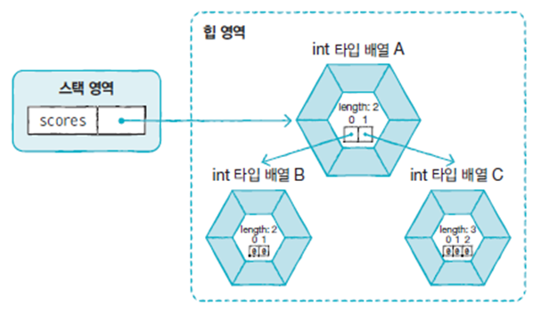


### 값 목록을 이용한 2차원 배열 생성

```java
타입[][] 변수 = { { 값1, 값2, ...}, { 값1, 값2, ... }. ... };
```

```java

public class Sample 
{
	public static void main(String[] args) {
		int [][] scores = { {95, 80}, {92, 75}, {20, 90} };
		
		System.out.printf("scores[0][0] = %d%n", scores[0][0]);
		System.out.printf("scores[1][1] = %d%n", scores[1][1]);
		System.out.printf("scores.length = %d%n", scores.length);
		System.out.printf("scores[0].length = %d%n", scores[0].length);
		System.out.printf("scores[1].length = %d%n", scores[1].length);
	}
}
/*
scores[0][0] = 95
scores[1][1] = 75
scores.length = 3
scores[0].length = 2
scores[1].length = 2
*/

```

## 참조 타입 배열

```java

public class Sample 
{
	public static void main(String[] args) {
		String[] strArray = new String[3];
		strArray[0] = "Java";
		strArray[1] = "Java";
		strArray[2] = new String("Java");
		
		System.out.println( strArray[0] == strArray[1] );
		System.out.println( strArray[0] == strArray[2] );
		System.out.println( strArray[0].equals(strArray[1]) );
		System.out.println( strArray[0].equals(strArray[2]) );
	}
}
/*
true
false
true
true
*/
```

## 배열 복사

* for 문을 이용해서 요소 하나 하나를 복사
* System.arraycopy() 메소드를 이용

```java
import java.util.Arrays;

public class Sample 
{
	public static void main(String[] args) {
		String[] sources = { "Java", "Array", "Copy" };
		String[] targets = sources;
		
		System.out.println(Arrays.toString(sources)); // [Java, Array, Copy]
		System.out.println(Arrays.toString(targets)); // [Java, Array, Copy]
		
		sources[2] = "Delete";
		targets[0] = "Python";
		
		System.out.println(Arrays.toString(sources)); // [Python, Array, Delete]
		System.out.println(Arrays.toString(targets)); // [Python, Array, Delete]
				
	}
}
```

### for 루프를 이용한 배열 값 복사

```java

{
			String[] sources = { "Java", "Array", "Copy" };
			String[] targets = null ;
			if (sources != null) {
				targets = new String[sources.length];
				for (int i = 0; i < sources.length; i ++) {
					targets[i] = sources[i];
				}
			}
			
			System.out.println(Arrays.toString(sources)); // [Java, Array, Copy]
			System.out.println(Arrays.toString(targets)); // [Java, Array, Copy]
			
			sources[2] = "Delete";
			targets[0] = "Python";
			
			System.out.println(Arrays.toString(sources)); // [Java, Array, Delete]
			System.out.println(Arrays.toString(targets)); // [Python, Array, Copy]
		}
```

### System.arraycopy() 이용한 배열 값 복사

```java
		{
			String[] sources = { "Java", "Array", "Copy" };
			String[] targets = null ;
			if (sources != null) {
				targets = new String[sources.length];
				System.arraycopy(sources, 0, targets, 0, sources.length);
			}
			System.out.println(Arrays.toString(sources)); // [Java, Array, Copy]
			System.out.println(Arrays.toString(targets)); // [Java, Array, Copy]
			
			sources[2] = "Delete";
			targets[0] = "Python";
			
			System.out.println(Arrays.toString(sources)); // [Java, Array, Delete]
			System.out.println(Arrays.toString(targets)); // [Python, Array, Copy]
		}
```

#### System.arraycopy 메소드를 이용해서 배열을 복사할 때

원본 배열과 타켓 배열의 크기가 다르면 어떻게 될까?

* 원본 > 타켓 => java.lang.ArrayIndexOutOfBoundsException
* 원본 < 타켓 => 남는 부분은 초기값으로 채워짐

## 향상된 for 문

* 배열이나 컬렉션 등을 쉽게 다룰 수 있는 방법
* 반복 실행을 위한 루프 카운터 변수나 증감식을 필요로 하지 않을 때 사용

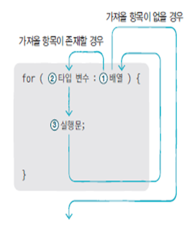

## 열거형

* 열거 상수( 한정된 값)를 저장하는 타입


### 열거형 선언

public enum 열거형 이름 { ... }

예)

public enum Week { MONDAY, TUESDAY, WEDNESDAY, THURSDAY, FRIDAY, SATURDAY, SUNDAY }

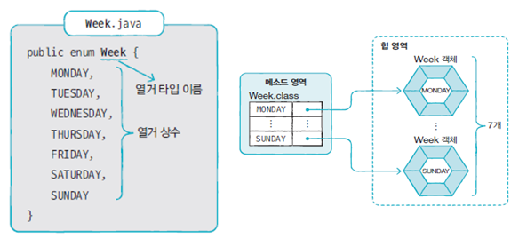

### 열거형 변수 선언

열거형 변수이름;

예)

Week today;

Week reservationDay;


### 열거 상수 저장

열거형변수 = 열거타입.열거상수;

예)

Week today = Week.SUNDAY;

today = Week.SUNDAY;

### Robot1

#### Robot.java

```java
public class Robot {
	private String name;
	
	//생성자(constructor) : 해당 객체가 생성될 때 호출되는 메소드
	public Robot(String name) {
		this.name = name;
	}
	
	// 동작을 수행하는 메소드를 정의
	public void order(int command) {
		if (command == 0) {
			System.out.println(this.name + " walks.");
		} else if (command == 1) {
			System.out.println(this.name + " stops.");
		} else if (command == 2) {
			System.out.println(this.name + " jumps.");
		} else {
			System.out.println("Command Error");
		}
	}
}

```


#### Main.java

```java
public class Main {
	public static void main(String[] args) {
		Robot robot = new Robot("Andrew");
		robot.order(0); // walk
		robot.order(1); // stop
		robot.order(2); // jump
	}
}

```

숫자로 되어 있는 코드의 혼선으로 인한 오용이 발생할 수 있음


### Robot2

#### Robot.java

```java
public class Robot {
	public enum Command {
		WALK,
		STOP,
		JUMP
	};
	
	private String name;
	
	//생성자(constructor) : 해당 객체가 생성될 때 호출되는 메소드
	public Robot(String name) {
		this.name = name;
	}
	
	// 동작을 수행하는 메소드를 정의
	public void order(Robot.Command command) {
		if (command == Command.WALK) {
			System.out.println(this.name + " walks.");
		} else if (command == Command.STOP) {
			System.out.println(this.name + " stops.");
		} else if (command == Command.JUMP) {
			System.out.println(this.name + " jumps.");
		} else {
			System.out.println("Command Error");
		}
	}
}

```

#### Main.java

```java
public class Main {
	public static void main(String[] args) {
		Robot robot = new Robot("Andrew");
		robot.order(Robot.Command.WALK); // walk
		robot.order(Robot.Command.STOP); // stop
		robot.order(Robot.Command.JUMP); // jump
	}
}

```


