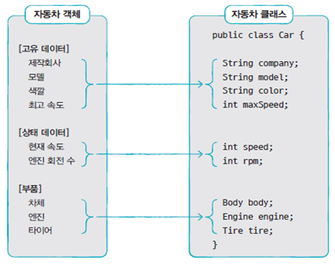

# Java

3일

## 객체

> 객체(object) = 속성(field, member field) + 동작(method, member method)


## 객체와 객체간 상호작용

> 메소드 호출을 통해서 한 객체가 다른 객체의 기능을 이용


## 객체 간의 관계

> 집합 관계 : 부품과 완성품의 관계
>
> 사용 관계 : 객체간 상호작용 (메소드 호출하는 관계)
>
> 상속관계 : 상위 객체를 기반으로 하위 객체를 생성


## 클래스

> 인스턴스(instance) : 클래스로 만들어진 객체


## 클래스 선언

> 클래스명.java 소스 파일로 작성
>
> (접근제한자) class 클래스명 (extends 부모클래스명) { ... }


## 클래스부터 객체를 생성

> 클래스명 변수명;
>
> 변수명 = `new` 클래스명();
>
> or 클래스명 변수명 = new 클래스명();

1. new 연산자로 힙 메모리 영역에 객체를 생성
2. 객체 생성 후 객체의 주소를 반환
3. 클래스 변수에 저장하여 객체를 사용


## 클래스 용도

**라이브러리(API: Application Programming Interface) 클래스**

객체 생성 및 메소드 제공하는 역할


**실행 클래스**

main() 메소드를 제공하는 역할


예) Student.java(라이브러리 클래스) 와 StudentExample.java(실행 클래스)

### Student.java

```java
public class Student {
	
}
```

### StudentExample.java

```java
public class StudentExample {
	public static void main(String[] args) {
		Student s1 = new Student();
		System.out.println("s1 변수는 Student 객체를 참조합니다."); 
		
		Student s2 = new Student();
		System.out.println("s2 변수는 Student 객체를 참조합니다.");
	}
}
```


## 클래스 멤버


## 필드



## 필드 선언

* 클래스 중괄호 블록 어디에 존재해도 무관

* 생성자나 메서드 블록 안에는 정의할 수 없다.

* 필드를 선언할 때 초기값을 설정할 수도 있고, 생략도 가능

  (생략하면 객체가 생성될 때 기본 초기값으로 자동 설정됨)

```java

public class Car {
	String company = "현대자동차";
	String model = "그랜저";
	String color = "검정";
	int maxSpeed = 350;
	int speed;
	
	byte byteField;
	short shortField;
	int intField;
	long longField;
	boolean booleanField;
	char charField;
	float floatField;
	double doubleField;
	int[] intArrayField;
	String stringField;
		
	public static void main(String[] args) {
		Car c = new Car();
		System.out.println(c.company);
		System.out.println(c.model);
		System.out.println(c.color);
		System.out.println(c.maxSpeed);
		System.out.println(c.speed);
		
		System.out.println("byteField = " + c.byteField    );
		System.out.println("shortField = " + c.shortField   );
		System.out.println("intField = " + c.intField     );
		System.out.println("longField = " + c.longField    );
		System.out.println("booleanField = " + c.booleanField );
		System.out.println("charField = " + c.charField    );
		System.out.println("floatField = " + c.floatField   );
		System.out.println("doubleField = " + c.doubleField  );
		System.out.println("intArrayField = " + c.intArrayField);
		System.out.println("stringField = " + c.stringField  );
	}
}

/*
현대자동차
그랜저
검정
350
0
byteField = 0
shortField = 0
intField = 0
longField = 0
booleanField = false
charField = 
floatField = 0.0
doubleField = 0.0
intArrayField = null
stringField = null
*/

```

## 필드 사용

* 클래스 내부에서 사용하는 경우 (생성자 또는 메소드에서 사용)
  * 필드 이름으로 접근
* 클래스 외부에서 사용하는 경우
  * 클래스로부터 객체를 생성한 후 필드를 사용


```java
public class Car {
	String company = "현대자동차";
	String model = "그랜저";
	String color = "검정";
	int maxSpeed = 350;
	int speed;
	
	public static void main(String[] args) {
		Car c = new Car();
		System.out.println("현재 속도: " + c.speed);
		
		c.speed = 60;
		System.out.println("변경된 속도: " + c.speed);
	}
}
/*
현재 속도: 0
변경된 속도: 60
*/
```

클래스는 동일하지만 인스턴스는 따로 움직인다.

```java
public class Car {
	String company = "현대자동차";
	String model = "그랜저";
	String color = "검정";
	int maxSpeed = 350;
	int speed;
	
	public static void main(String[] args) {
		Car c1 = new Car();
		Car c2 = new Car();
		System.out.println("C1 현재 속도: " + c1.speed);
		System.out.println("C2 현재 속도: " + c2.speed);
		
		c1.speed = 60;
		
		System.out.println("C1 변경된 속도: " + c1.speed);
		System.out.println("C2 변경된 속도: " + c2.speed);
	}
}
/*
C1 현재 속도: 0
C2 현재 속도: 0
C1 변경된 속도: 60
C2 변경된 속도: 0
*/
```

외부에서 사용할 때, c1,c2 처럼 생성하고! c1.~ , c2.~ 처럼 사용

```java
public class Car {
	String company = "현대자동자";
	String model = "그랜저";
	String color = "검정";
	int maxSpeed = 350;
	int speed;
	
	public void speedUp(int no) {
		speed += no;
	}

	public void speedDown(int no) {
		speed -= no;
	}
	
	public static void main(String[] args) {
		Car c1 = new Car();
		Car c2 = new Car();
		
		System.out.println("C1 현재 속도: " + c1.speed);
		System.out.println("C2 현재 속도: " + c2.speed);
		
		c1.speed = 60;
		c2.speedUp(100);
		
		System.out.println("C1 변경된 속도: " + c1.speed);
		System.out.println("C2 변경된 속도: " + c2.speed);
	}
}

```

## 생성자(constructor)

* 클래스로부터 new 연산자로 객체를 생성할 때 호출되는 객체 초기화를 담당하는 메소드

  * 객체 초기화 : 필드를 초기화하거나 메소드를 호출해서 객체를 사용할 준비를 하는 것
* 생성자가 성공적으로 동작하면 힙 영역에 객체를 생성하고 객체의 주소를 반환


## 기본 생성자(default constructor)

* 클래스에 생성자를 선언하지 않으면 바이트 코드에 자동으로 생성되는 생성자
* 클래스에 생성자를 선언하지 않아도 new 연산자를 이용해서 객체를 생성할 수 있다.


## 생성자 선언

* 클래스명(매개변수, ...) { ... 객체 초기화 코드 등의 코드들 }
* 매개변수는 생략할 수도 있고, 여러개 사용할 수도 있다.
* 클래스에 생성자가 명시적으로 선언된 경우, 반드시 선언된 생성자를 호출해서 객체를 생성해야 한다.

## 생성자 오버로딩(overloading)

매개변수의 타입, 개수, 순서가 다른 생성자를 여러 개 선언

**클래스 외부에서 호출할 때 다양한 방식으로 호출하기 위해서 사용**

### Car.java

```java
public class Car {
	// 필드
	String company = "현대자동자";
	String model;
	String color;
	int maxSpeed;
	
	// 생성자
	// 매개변수의 개수가 다른 생성자를 정의 : 오버로딩
	
	Car() {}
	Car(String model) {
		this.model = model;
	}

	Car(String model, String color) {
		this.model = model;
		this.color = color;
	}
	
	// 매개변수의 개수와 타입이 동일하고 이름이 다른 것은 오버로딩될 수 없다.
	// Duplicate method 오류 발생
	/*
	Car(String color, String model) {
		this.model = model;
		this.color = color;
	}
	*/

	Car(String model, String color, int maxSpeed) {
		this.model = model;
		this.color = color;
		this.maxSpeed = maxSpeed;
	}
	
	// 순서를 다르게 함
	Car(String model, int maxSpeed, String color) {
		this.model = model;
		this.color = color;
		this.maxSpeed = maxSpeed;
	}

}
```

### CarExample.java

```java

public class CarExample {

	public static void main(String[] args) {
		Car c1 = new Car();
		System.out.println("c1");
		System.out.println("- company" + c1.company);
		System.out.println("- model" + c1.model);
		System.out.println("- color" + c1.color);
		System.out.println("- maxSpeed" + c1.maxSpeed);
		
		Car c2 = new Car("자가용");
		System.out.println("c2");
		System.out.println("- company" + c2.company);
		System.out.println("- model" + c2.model);
		System.out.println("- color" + c2.color);
		System.out.println("- maxSpeed" + c2.maxSpeed);
		
		Car c3 = new Car("택시", "검정", 200);
		System.out.println("c3");
		System.out.println("- company" + c3.company);
		System.out.println("- model" + c3.model);
		System.out.println("- color" + c3.color);
		System.out.println("- maxSpeed" + c3.maxSpeed);
		
	}

}
/*
c1
- company현대자동자
- modelnull
- colornull
- maxSpeed0
c2
- company현대자동자
- model자가용
- colornull
- maxSpeed0
c3
- company현대자동자
- model택시
- color검정
- maxSpeed200

*/
```

### this()

> 생성자에서 다른 생성자를 호출 (생성자 오버로딩 코드 작성 시 발생하는 중복을 해결)

* 생성자에 첫번째 줄에서만 사용 가능

Car.java에서 보면 this.model 과 this.color가 계속 중복됨

```java
public class Car {
	// 필드
	String company = "현대자동자";
	String model;
	String color;
	int maxSpeed;
	
	// 생성자
	// 매개변수의 개수가 다른 생성자를 정의 : 오버로딩
	
	Car() {}
	Car(String model) {
		// this.model = model;
		// String model, String color, int maxSpeed 를 기준으로
		this(model, null, 0);
	}

	Car(String model, String color) {
		// this.model = model;
		// this.color = color;
		this(model, color, 0);
	}
	
	// 매개변수의 개수와 타입이 동일하고 이름이 다른 것은 오버로딩될 수 없다.
	// Duplicate method 오류 발생
	/*
	Car(String color, String model) {
		this.model = model;
		this.color = color;
	}
	*/

	Car(String model, String color, int maxSpeed) {
		this.model = model;
		this.color = color;
		this.maxSpeed = maxSpeed;
	}
	
	// 순서를 다르게 함
	Car(String model, int maxSpeed, String color) {
		//this.model = model;
		//this.color = color;
		//this.maxSpeed = maxSpeed;
		this(model, color, maxSpeed);
	}

}
```

## 메소드 선언부(signature)

> 리턴타입, 메소드 이름, 매개변수 선언, 메소드 실행 블록


## 리턴 타입

> 메소드 실행 결과 반환되는 데이터 타입

* 반환 값이 없을 수 있고, 반환 값이 있을 수 있다.
  * 있을 경우, 선언부에 데이터 타입을 명시
    * 없는 경우, void powerOn() { ... }
    * 있을 경우, double divied() { ... }


## 메소드 이름

* `숫자`로 시작할 수 없다.
* `_` 또는 `$` 기호를 제외한 특수문자를 사용할 수 없다.
* 관례적으로 `소문자`로 시작한다.
* 서로 다른 단어가 혼합될 경우, 뒤에 오는 단어의 첫 글자를 `대문자`로 작성한다.

```java
public class CalculatorExe {

	public static void main(String[] args) {
		Calculator myCalc = new Calculator();
		
		myCalc.powerOn();
		
		int result1 = myCalc.plus(5, 6);
		System.out.println("5 + 6 = " + result1);
		
		int x = 10;
		int y = 4;
		double result2 = myCalc.devide(x, y);
		System.out.println("10 / 4 = " + result2);
		
		myCalc.powerOff();		
	}

}
/*
전원을 켭니다.
5 + 6 = 11
10 / 4 = 2.5
전원을 끕니다.
*/

```

## 매개변수 선언

* 매개변수의 타입이 일치하지 않으면 컴파일 오류가 발생


## 매개변수의 개수를 모를 경우

1. 배열 타입으로 선언

   ```java
   int sum(int[] values) { … }
   
   int[] params = { 1, 2, 3 };
   int result = sum(params);
   	or
   int result = sum(new int[] { 1, 2, 3 });
   ```

2. 배열을 생성하지 않고 값 목록만 넘겨주는 방식

   ```java
   // 메소드 정의
   int sum(int ... values) { ... }
   
   
   int result = sum(1, 2, 3);
   		or
   	int result = sum(1, 2, 3, 4, 5);
   		or
   int[] params = { 1, 2, 3 };
   int result = sum(params);
   	or
   int result = sum(new int[] { 1, 2, 3 });
   ```

예 )

### Computer.java

```java
	// 가변 길이의 숫자를 받아서 합계를 반환하는
	// sum() 메소드를 제공하는 클래스
public class Computer {
	int sum1(int[] values) {
		int sum = 0;
		for (int v : values) {
			sum += v;
		}
		return sum;
	}
	
	int sum2(int ... values) {
		int sum = 0;
		for (int v : values) {
			sum += v;
		}
		return sum;
	}
}
```

### ComputerExe.java

```java
public class ComputerExe {

	public static void main(String[] args) {
		Computer myCom = new Computer();
		
		int[] value1 = { 1, 2, 3 };
		int result1 = myCom.sum1(value1);
		System.out.println("result1 = " + result1);

		int result2 = myCom.sum1(new int[] {1, 2, 3});
		System.out.println("result2 = " + result2);

		int result3 = myCom.sum2(1, 2, 3, 4);
		System.out.println("result3 = " + result3);
	}

}
```

## 리턴값이 있는 메소드

* 메소드 선언에 리턴 타입이 있는 경우
  * return 구문을 이용해서 리턴값을 지정
* return 구문을 통해서 반환하는 리턴값의 타입은 리턴 타입이거나 변환될 수 있는 타입이어야 함

예)

```java
int plus(int x, int y) {
    int result = x + y;
    return result;
}

int plus(int x, int y) {
    byte result = (byte)(x + y);
    return result;
}
----------------------------------------위엔 문제 안됨
int plus(int x, int y) {
    double result = (double)(x + y);
    return result;
}

----------------------------------------위엔 문제
```


## 리턴값이 없는 메소드

* void로 선언된 메소드에서는 return 구문을 사용해서 메소드 실행을 종료

### Car.java

```java
public class Car {
	// 필드
	int gas;
	
	// 생성자
	
	// 메소드
	// setter = 필드의 값을 매개변수로 전달된 값으로 설정하는 메소드
	void setGas(int gas) {
		this.gas = gas;
	}
	
	// 가스가 남아 있는지 여부를 확인
	boolean isLeftGas() {
		if (gas == 0) {
			System.out.println("가스가 없습니다.");
			return false;		
		}
		System.out.println("가스가 있습니다.");
		return true;
	}
	void run() {
		// 무한루프
		while (true) {
			if ( gas > 0 ) {
				System.out.println("달립니다.(가스잔량: " + gas + ")");
				gas --;
			} else {
				System.out.println("멈춥니다.(가스잔량: " + gas + ")");
				return;
			}
		}
	}
}
```


### CarExample.java

```java
public class CarExample {

	public static void main(String[] args) {
		Car myCar = new Car();
		myCar.setGas(10);
        
		if (myCar.isLeftGas()) {
			System.out.println("출발합니다.");
			myCar.run();
		}
		

		if (myCar.isLeftGas()) {
			System.out.println("가스를 주입할 필요가 없습니다.");
		} else {
			System.out.println("가스를 주입하세요..");
		}
	}

}
```

## 메소드 호출

* 클래스 내부의 경우, 단순 메소드 이름으로 호출
* 클래스 외부의 경우, 클래스로부터 객체를 생성한 후 참조변수와 도트 연산자를 이용해서 메소드를 호출


예) avg

```java
public class Calculator {
	// 메소드
	// 전원을 켜는 것
	void powerOn() {
		System.out.println("전원을 켭니다.");
	}
	
	// 더하기 연산 결과를 반환
	int plus(int x, int y) {
		return x + y;
	}
	
	// 평균을 구해서 결과를 반환
	double avg(int x, int y) {
		return plus(x, y) / 2;
	}
	
	// 나누기 연산 결과를 반환
	double devide(int x, int y) {
		return (double)x / (double)y;
	}
	
	// 전원을 끄는 것
	void powerOff() {
		System.out.println("전원을 끕니다.");
	}

}
```

## 메소드 오버로딩(overloading)

* 같은 이름의 메소드를 여러 개 선언
* 매개변수의 타입, 개수, 순서가 다른 것
* 오버로딩된 메소드가 호출되면 JVM은 매개변수 타입을 보고 메소드를 선택

```java
int plus(int x, int y) { … }
double plus(double x, double y) { … }

plus(10, 20); // int plus(int x, int y) { … } 실행
plus(10.5, 20.3); // double plus(double x, double y) { … } 실행
plus(10, 20.3); // double plus(double x, double y) { … } 실행
```

### 반환 데이터 타입이 다른 것은 오버로딩에 들어가지 않는다.

```java
public class Calculator {
	//	정사각형의 넓이는 계산해서 반환하는 메소드
	int areaRect(int width) {
		//	return width * width;
		return areaRect(width, width);
	}

	/*	리턴타입은 오버로딩에 포함되지 않음
	double areaRect(int width) {
		return width * width;
	}
	*/
	
	//	직사각형의 넓이를 계산해서 반환하는 메소드
	int areaRect(int width, int height) {
		return width * height;
	}
	
	/*	매개변수의 이름이 바뀌는 것은 오버로딩에 포함되지 않음
	int areaRect(int height, int width) {
		return width * height;
	}
	*/
}
```


## 인스턴스 멤버 vs 정적 멤버

* 멤버 : 필드 + 메소드
* 인스턴스 멤버 : 객체(힙 영역에 올라가 있는) 마다 가지고 있는 멤버
  * 인스턴스 필드 : 힙 영역에 객체 마다 가지고 있는 멤버, 객체마다 다른 데이터를 저장
  * 인스터드 메서드 : 객체가 있어야 호출 가능한 메소드, 클래스 코드(메소드 영역)에 위치

* 정적 멤버 : 객체와 상관 없는 멤버, 클래스 코드(메소드 영역)에 위치
  * 정적 필드 : 객체 없이 클래스만으로 사용 가능한 코드
  * 정적 메서드 : 객체 없이 클래스만으로 사용 가능한 메서드


```java
public class Car { 
	int gas;
	void setSpeed(int speed) { … }
}

Car myCar = new Car();
myCar.gas = 10;
myCar.setSpeed(60);

Car yourCar = new Car();
yourCar.gas = 20;
yourCar.setSpeed(80);
```


### 정적 멤버

```java
public class CalculatorExe {

	public static void main(String[] args) {
		// 정적 필드 사용 방법
		// => 클래스명.필드명
		
		// 반지름이 10인 원의 넓이
		double result1 = 10 * 10 * Calculator.PI; 
	
		// 정적 메소드 사용 방법
		// => 클래스명.메소드명()
		
		// 10 + 5 와 10 - 5
		int result2 = Calculator.plus(10, 5);
		int result3 = Calculator.mius(10, 5);
		
		System.out.println("result1 = " + result1);
		System.out.println("result2 = " + result2);
		System.out.println("result3 = " + result3);
	
	}

}
```


## 정적 메소드 선언시 주의사항 main()동일

```java
static double PI = 3.14159; 	
	
	static int plus(int x, int y) {
		//	정적 메소드에서 정적 필드를 사용하는 것은 가능
		System.out.println(PI);
		System.out.println(Calculator.PI);
		
		//	정적 메소드에서 인스턴스 필드, 메소드, this를 사용하는 것은 불가능
		/*
		this.setColor("red");
		System.out.println(color);
		System.out.println(this.color);
		*/

		//	정적 메소드에서 인스턴스 필드와 메소드를 사용하기 위해서는 
		//	반드시 해당 객체를 생성한 후 사용해야 함
		Calculator c = new Calculator();
		c.setColor("red");
		System.out.println(c.color);
		
		return x + y;
	}

```


## this

> 객체 자기 자신

* 객체 내에서 인스턴스 멤버에 접근하기 위해 사용
* 생성자와 메소드의 매개변수 이름이 필드 이름과 동일한 경우, 필드임을 지정하기 위해서 사용

```java
public class Calculator {
	// 계산기 마다 상이
	String color;
	
	// 인스턴스 멤버 필드를 사용해야 하므로,
	// 해당 메소드는 인스턴스 메서드로 선언
	void setColor(String color) {
		this.color = color;
	}
	
	// 모든 계산기가 동일
	static double PI = 3.14159;
	
	static int plus(int x, int y) {
		return x + y;
	}
	
	static int mius(int x, int y) {
		return x - y;
	}
}
```


## 싱글톤(singleton)

> 전체 프로그램에서 단 하나의 객체만 만들어지도록 보장하는 코딩 기법

* DB접근, 결제할 때 등 사용

```java
public class 클래스명 {
	private 클래스명() { ... }
    
    private static 클래스명 singleton = new 클래스명();
    
    public static 클래스명 getInstance() {
        return singleton;
    }
}

클래스명 변수1 = 클래스명.getInstance();
클래스명 변수1 = 클래스명.getInstance();
```


```java
public class Singleton {
	// 생성자가 정의되어 있지 않으면, default생성자가 생성되서 
	// 생성자를 정의해줘서 default 생성자가 생성되는 것을 막으려고 private Singleton() { }해 줌
	private Singleton() { }
	
	private static Singleton singleton = new Singleton();
	
	public static Singleton getInstance() {
		return singleton;
	}
	
}
```

### Singleton.java

```java
public class Singleton {
	// 생성자가 정의되어 있지 않으면, default생성자가 생성되서 
	// 생성자를 정의해줘서 default 생성자가 생성되는 것을 막으려고 private Singleton() { }해 줌
	private Singleton() { }
	
	private static Singleton singleton = new Singleton();
	
	public static Singleton getInstance() {
		return singleton;
	}
	
}
```


### SingletonExe.java

```java
public class SingletonExe {
	public static void main(String[] args) {
		
		//Singleton obj1 = new Singleton();
		Singleton obj1 = Singleton.getInstance();
		Singleton obj2 = Singleton.getInstance();
		
		if (obj1 == obj2) {
			System.out.println("같은 싱글톤 객체 입니다.");
		} else {
			System.out.println("다른 싱글톤 객체 입니다.");
		}
	}
}
```


## final 필드

> 초기값이 저장되면 최종값이 되어 프로그램 실행 중 변경이 불가능
>
> 값을 바꿀 수 없다(= 상수)


## final 필드 초기화

* 단순 값인 경우 필드 선언할 때 초기화
  * 주로 정적 필드(상수)인 경우
* 객체 생성 시 외부 데이터로 초기화가 필요한 경우
  * 생성자에서 초기화
  * 주로 인스턴스 필드인 경우

### Person.java

```java
public class Person {
	// 모든 객제가 국적으로 "한국"을 가져야하고,
	// 국적을 변경할 수 없으므로 final로 선언과 동시에 초기화
	
	final String nation = "한국";
	
	// 주민번호는 생성되는 시점에 결저오디어야 하고,
	// 한번 설정되면 수정할 수 없어야 하므로 final로 선언
	final String ssn;

	int age;
	
	public Person(String ssn, int age) {
		this.ssn = ssn; // final 변수의 초기화가 실행
						// 이후에 변수값 변경이 불가능
		this.age = age;
	}
	
	public static void main(String[] args) {
		Person p = new Person("880222-1046712", 22);
		
		System.out.println(p.nation);
		System.out.println(p.ssn);
		System.out.println(p.age);
		
		// The final field Person.ssn cannot be assigned
//		p.nation = "미국";
//		p.ssn = "880222-1046712";
		p.age = 23;
	}
}
```

## 정적(static) final 필드

상수, 관례적으로 모두 대문자를 사용

```java
public class Earth {
	//지구의 반지름
	static final double EARTH_RADIUS = 6400;
	
	
	// 지구의 표면적
	static final double EARTH_AREA = 4 * Math.PI * EARTH_RADIUS * EARTH_RADIUS;
	
	
	public static void main(String[] args) {
		
		
		System.out.println("지구의 반지름: " + Earth.EARTH_RADIUS);
		System.out.println("지구의 표면적: " + Earth.EARTH_AREA);
	}

}
```

## 패키지(package)

> 물리적으로는 파일 시스템의 디렉터리
>
> 클래스 이름의 일부 = 클래스를 유일하게 만들어주는 식별자 역할

클래스 이름이 동일하더라도 패키지 아름이 다르면 다른 클래스로 인식


A 클래스 => com.mycompany.A

B 클래스 => com.yourcompany.B


## 패키지 명명 규칙

* 숫자로 시작 불가
* _ 또는 $ 기호를 제외한 나머지 특수문자 사용 불가
* java로 시작하는 패키지는 자바 표준 API에서만 사용 가능
* 관례상 모두 소문자로 작성


## import 문

* 사용하고자 하는 클래스 또는 인터페이스가 다른 패키지에 소속된 경우, 해당 패키지 클래스 또는 인터페이스를 가져와 사용하는 것을 컴파일러에 통지

* import 상위패키지.하위패키지.클래스이름;

* import 상위패키지.하위패키지.*;

* 다른 패키지에 동일한 이름의 클래스가 존재하는 경우, import 구문과 관계없이 (패키지명을 포함한) 클래스 전체 이름을 기술

  

*하위 패키지는 별도로 import 해야 한다.*

com.mypage.subpackage.MyClass; 이 클래스를 사용하려면

(X) import com.mypage.*;

(O) import com.mypage.subpackage.*;


```java
package com.mycompany;
import com.yourcompany.OtherClass;

public class MyClass {
	public void doSomething() {
		// com.yourcompany.MyClass의 기능을 사용
		com.yourcompany.MyClass mc = new com.yourcompany.MyClass(); 
		
		//	com.mycompany.OtherClass
		OtherClass oc1 = new OtherClass();
		com.yourcompany.OtherClass oc2 = new com.yourcompany.OtherClass();
	}
}
```


