# Java

5일차

## 다형성

### 형변환

(부모) (변수) = new 자식();

1.  변수 부모 멤버 사용
2.  변수 자식 재정의 메소드 사용

#### 예제 동물(개 , 고양이)

```java
public class AnimalTest {
	public static void main(String[] args) {
		Animal a = new Cat();
		//		Animal a = new Animal();
		a.sound();
		a.run();
		
//		Cat c = new Cat();
//		c.sound();
//		
//		Dog d = new Dog();
//		d.sound();
	}
}


public class AnimalTest {
	public static void main(String[] args) {
		Animal a = new Animal();
		Cat c = new Cat();
		BabyCat b = new BabyCat();
		
		a.sound();
		b.sound();
		c.sound();
		
		Animal a2 = new BabyCat();
		a2.sound();
		// BabyCat() 에 '아기야옹' 소리가 정의 돼 있지 않으면 그 위 '야옹'이 출력
		
	}
}
```

```java
public class Animal {
	void sound() {
		System.out.println("동물 소리");
	}
	
	void run() {
		System.out.println("뛴다");
	}
}
```

```java
public class Cat extends Animal {
	public void sound() {
		System.out.println("야옹 야옹");
	}
}
```

```java
public class Dog extends Animal{

}
```

```java
public class BabyCat extends Cat {
	public void sound() {
		System.out.println("아기야옹 아기야옹");
	}
}
```


### 매개변수의 다형성

> 매개변수 타입을 부모 객체로 선언하면,
>
> 매개변수 값으로 부모 객체 또는 모든 자식 객체를 전달할 수 있음

매개변수 다형성을 이용하면,

매소드 오버로딩을 하지 않아도 다양한 자식 클래스에 대해

동일한 처리를 제공할 수 있다.

```java
package sample05;

public class Vehicle {
	public void run() {
		System.out.println("차량이 움직인다.");
	}
}
```

```java
package sample05;

public class Driver {
	// 기존
//	public void drive(Bus bus) {
//		bus.run();
//	}
//	public void drive(Taxi taxi) {
//		taxi.run();
	
	public void drive(Vehicle v) { // 매개변수의 타입을 부모 클래스로 정의
		v.run();	
	}
}
```

```java
package sample05;

public class Bus extends Vehicle {
	public void run() {
		System.out.println("버스가 움직인다.");
	}
}
```

```java
package sample05;

public class Taxi extends Vehicle{
	public void run() {
		System.out.println("택시가 움직인다.");
	}
}
```

```java
package sample05;

public class DriverTest {
	public static void main(String[] args) {
	
	Driver d = new Driver();
	
	d.drive(new Taxi()); // 자식 클래스의 인스턴스를 매개변수의 값으로 전달
	d.drive(new Bus());
	}
}
```

## 강제 타입 변환(casting)

*프로모션 이후* 자식 객체가 가지고 있는 멤버에 접근하기 위해 사용


자동 타입 변환(promotion) : 부모 변수 = new 자식();

> 자식 타입이 부모 타입으로 자동 타입 변환된 이후

* 부모 멤버
* 자식 재정의 메소드


강제 타입 변환(casting) : (자식) 부모;

* 자식 멤버


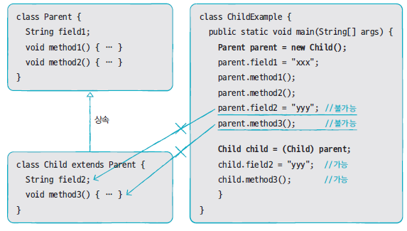

```java
package sample06;

public class Parent {
	public String strParent;
	
	public void method1() {
		System.out.println("Parent Method1()");
	}
	public void method2() {
		System.out.println("Parent Method2()");
	}
}
```

```java
package sample06;

public class Child extends Parent{
	public String strChild;
	
	public void method3() {
		System.out.println("Child Method3()");
	}
}
```

```java
package sample06;

public class ChildTest {
	public static void main(String[] agrs) { 
		//promotion 발생 => p 변수는 부모 클래스의 멤버만 사용
		//단, 자식 클래스에서 재정의 된 메소드는 제외

		Parent p = new Child();
		p.strParent = "parent";
		p.method1();
		p.method2();
		//자식 클래스 멤버로는 접근이 불가
		/*
		p.strChild = "xxx";
		p.method3();
		*/
		
		// 부모 클래스의 인스턴스 변수를 자식 클래스로 casting
		// Child c = new Child(); 와 같아짐
		Child c = (Child) p;
		c.strChild = "child";
		c.method3();
		c.strParent = "child -> parent";
		c.method1();
		c.method2();
		
		/*
		Other o = new Other();
		Child c2 = (Child)o;
		*/
	}
}
```

## instanceof 연산자

객체가 어느 클래스의 인스턴스인지를 확인

매소드 내에서 casting 할 때, 타입을 확인하지 않고 casting 하면 ClassCastException이 발생


boolean result = 객체 instanceof 타입;

=> 타입에 해당하는 객체이면 true를 아니면 false를 반환

```java
package sample06;

public class ChildTest {
	public static void main(String[] agrs) { 
		//promotion 발생 => p 변수는 부모 클래스의 멤버만 사용
		//단, 자식 클래스에서 재정의 된 메소드는 제외

		Parent p = new Child();
		p.strParent = "parent";
		p.method1();
		p.method2();
		//자식 클래스 멤버로는 접근이 불가
		/*
		p.strChild = "xxx";
		p.method3();
		*/
		
		// 부모 클래스의 인스턴스 변수를 자식 클래스로 casting
		// Child c = new Child(); 와 같아짐
		Child c = (Child) p;
		c.strChild = "child";
		c.method3();
		c.strParent = "child -> parent";
		c.method1();
		c.method2();
		
		/*
		Other o = new Other();
		Child c2 = (Child)o;
		*/
		
		// 문법적으로 문제가 없음
		// 문제는 캐스팅이 되기 위해서는 프로모션이 전제되어야 함
		// 부모는 여러 자식이 있을 수 있는데 프로모션 되지 않으면, 캐스팅 때 알 수 없을 수 있음
		/*
		Parent p2 = new Parent();
		Child c2 = (Child) p2;	// 프로모션되지 않은 인스턴스 변수를 캐스팅하므로
								// java.lang.ClassCastException 발생
		*/
		Parent p2 = new Parent();
		if (p2 instanceof Child) {
			Child c2 = (Child) p2;
		} else {
			System.out.println("p2는 Child의 인스턴스가 아님");
		}
		
	}
}
```

## p446~p497


## 추상 클래스

실제 클래스(= 객체 생성 용도의 클래스, new `여기 들어간 클래스`)들의 공통적인 특성(필드, 메소드 등)을 추출하여 선언한 것

추상 클래스와 실제 클래스는 부모와 자식 클래스로서 상속 관계를 가진다.

실제 클래스에 반드시 존재해야 하는 필드와 메소드를 선언

* 실제 클래스의 설계(규격)

* 실제 클래스는 추상 클래스를 상속받아서 다른 부분만 선언, 구현하면 빠르게 개발이 가능

### 추상 클래스 선언

* abstract 키워드를 사용해서 정의
* 필드, 생성자, 메소드를 정의
* 상속은 가능하나 객체를 생성할 수는 없다. ( = new 할 수 없다.)
  * 자식 클래스가 생성될 때 객체화 됨
  * 자식 클래스의 생성자에서 super() 메소드로 추상 클래스의 생성자를 호출

```java
package sample07;

public abstract class Phone {
	public String owner;
	
	public Phone(String owner) {
		this.owner = owner;
	}
	
	public void turnOn() {
		System.out.println("핸드폰을 켭니다.");
	}
	public void turnOff() {
		System.out.println("핸드폰을 끕니다.");
	}
}
```

```java
package sample07;

public class SmartPhone extends Phone{
	public SmartPhone(String owner) {
		 super(owner);
		// this.owner = owner;
	}
	
	public void internetSearch() {
		System.out.println("인터넷 검색");
	}
}
```

```java
package sample07;

public class PhoneTest {
	public static void main(String[] args) {
		
		/* Phone에 abstract를 사용하면서 아래를 사용할 수 없게 됨.
		 * 단순히 도와주는 역할로 변함.
		Phone p = new Phone("홍길동");
		p.turnOn();
		p.turnOff();
		*/
		
		SmartPhone sp = new SmartPhone("홍길동");
		
		sp.turnOn();
		sp.internetSearch();
		sp.turnOff();
	}
}
```


## 추상 메소드


> 메소드 선언만 통일하고 실행 내용은 실제 클래스 마다 달라야 하는 경우에 정의

* abstract 키워드로 선언되고 중괄호가 없는 메소드
* 하위 클래스는 반드시 해당 메소드를 재정의해서 구현해야 함


## 인터페이스


> 인터페이스는 객체로 생성할 수 없다. = 생성자가 없다.

```java
interface 인터페이스이름 {
	// 상수 필드 <- 인스턴스 필드 또는 정적 필드는 선언 불가
	데이터타입 상수이름 = 상수값;

    // 추상 메소드
    데이터타입 메소드이름 (매개변수, ...);
}
```

### 상수필드 선언

```java
[public static final] 데이터타입 상수이름 = 값;
```

* 상수이름은 대문자로 작성하는 것이 관례
* 여러 문자로 구성되는 경우, _ (언더바)로 연결해서 표기

```java
public interface RemoteControl {
    public static final MAX_VOLUME = 10;
    public static final MAX_VOLUME = 0;
}
```

### 추상 메소드 선언

```java
public interface RemoteControl {
	public static final MAX_VOLUME = 10;
	public static final MIN_VOLUME = 0;

	public void turnOn();
	public void turnOff();
	public void setVolume(int volume);
}
```


##  구현 클래스

> 인터페이스에서 정의된 추상 메소드를 재정의해서 실행 내용을 가지고 있는 클래스

```java
public class 구현클래스이름 implements 인터페이스이름 {
	// 인터페이스에서 선언한 추상 메소드를 재정의한다.
}
```

```java
public class TvRemoteControl implements RemoteControl {
    
    public void turnOn() {
        :
    }
    
    
	public void turnOff() {
        :
    }
    	:
}
```

### RemoteControl 예제

```java
package sample09;

public interface RemoteControl {
	int MAX_VOLUME = 10;
	int MIN_VOLUME = 0;
	
	void turnOn();
	void turnOff();
	void setVolume(int volume);
	
}

```

```java
package sample09;

public class Audio implements RemoteControl {

	int volume;
	
	@Override
	public void turnOn() {
		System.out.println("Audio를 켭니다.");
		
	}

	@Override
	public void turnOff() {
		System.out.println("Audio를 끕니다.");
	}

	@Override
	public void setVolume(int volume) {
	
		if (volume < RemoteControl.MIN_VOLUME) {
			this.volume = RemoteControl.MIN_VOLUME;
		} else if (volume > RemoteControl.MAX_VOLUME) {
			this.volume = RemoteControl.MAX_VOLUME;
		} else {
			this.volume = volume;
		}
		System.out.println("현재 Audio 볼륨은 " + this.volume + "입니다.");
	}
}

```

```java
package sample09;

public class TV implements RemoteControl {
int volume;
	
	@Override
	public void turnOn() {
		System.out.println("Tv를 켭니다.");
		
	}

	@Override
	public void turnOff() {
		System.out.println("Tv를 끕니다.");
	}

	@Override
	public void setVolume(int volume) {
	
		if (volume < RemoteControl.MIN_VOLUME) {
			this.volume = RemoteControl.MIN_VOLUME;
		} else if (volume > RemoteControl.MAX_VOLUME) {
			this.volume = RemoteControl.MAX_VOLUME;
		} else {
			this.volume = volume;
		}
		System.out.println("현재 Tv 볼륨은 " + this.volume + "입니다.");
	}
}

```

```java
package sample09;

public class RemoteControlTest {
	public static void main (String[] args) {
		RemoteControl rc;
		
		rc = new Audio();
		rc.turnOn();
		rc.setVolume(15);
		rc.turnOff();
	
		rc = new TV();
		rc.turnOn();
		rc.setVolume(5);
		rc.turnOff();
	
	}

}
```


## 인터페이스는 다중 상속이 가능하다.

```java
public class 구현클래스이름 implements 인터페이스1, 인터페이스2 {
// 인터페이스1에 정의된 메소드를 재정의	
 //	인터페이스2에 정의된 메소드를 재정의
}
```


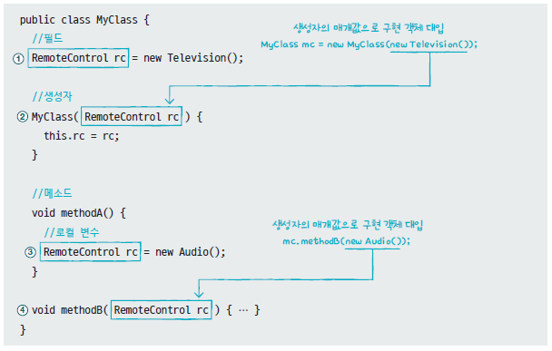

### Car 예제 바꿔서

```java
package sample04;

public interface Tire {
	public void roll() ;
}
```

```java
package sample04;

public class Car {
	Tire frontLeftTire = new HankookTire();
	Tire frontRightTire = new HankookTire();

	Tire backLeftTire = new KumhoTire();
	Tire backRightTire = new KumhoTire();

	void stop() {
		System.out.println("자동차가 멈춥니다.");
	}

	void run() {
		System.out.println("자동차가 달립니다. =3=33=333=3333=33333");
		frontLeftTire.roll();
		frontRightTire.roll();
		backLeftTire.roll();
		backRightTire.roll();
		
	}
}
```

```java
package sample04;

public class HankookTire implements Tire {

	// 메소드 재정의
	public void roll() {
		System.out.println("한국 타이어가 굴러갑니다.");
		
	}

}

```

```java
package sample04;

public class KumhoTire implements Tire {

	public void roll() {
		System.out.println("금호 타이어가 굴러갑니다.");
	}
}

```

```java
package sample04;

public class CarTest {
	public static void main(String[] args) {
		Car car = new Car();

		for (int i = 1; i < 5; i++) {
			car.run();
			System.out.println("-------------------------------");
		}
	}
}

```

### sample10 다중 상속

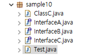

```java
package sample10;

public class ClassC implements InterfaceC{
	public void methodC() {
		System.out.println("mtethodC() 호출");
	}
	
	// 상속 받은 인터페이스의 메소드도 함께 재정의, 구현 해야 함
	public void methodA() {
		System.out.println("mtethodC() 호출");
	}
	
	public void methodB() {
		System.out.println("mtethodC() 호출");
	}
}

```

```java
package sample10;

public interface InterfaceA {
	public void methodA();
}

```

```java
package sample10;

public interface InterfaceB {
	public void methodB();
}

```

```java
package sample10;

// 인터페이스는 다중 상속이 가능하다.

public interface InterfaceC extends InterfaceA, InterfaceB{
	public void methodC();
}

```

```java
package sample10;

public class Test {
	public static void main(String[] args) {
		ClassC c = new ClassC();
		
		c.methodA();
		c.methodB();
		c.methodC();
		
		// 프로모션
		InterfaceA a = c;
		
		a.methodA();
		
		InterfaceB b = c;
		b.methodB();
		
		InterfaceC cc = c;
		cc.methodA();
		cc.methodB();
		cc.methodC();
	
	}
}

```

## 예외처리

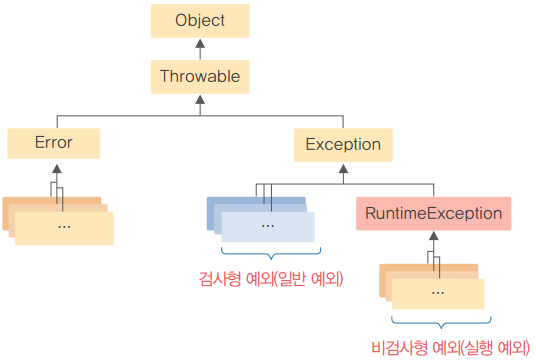

* Error(오류) - 개발자가 해결할 수 없는 치명적인 오류

* Exception(예외) - 개발자가 해결할 수 있는 오류

### 실행예외

실행 시점에 결정되는 값으로 인해서 발생하는 예외

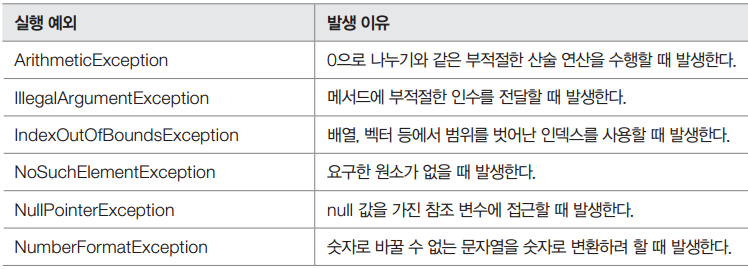


```java
import java.util.StringTokenizer;

public class Sample {
	public static void main(String[] args) {
		String s = "Java Programming Language";
		StringTokenizer st = new StringTokenizer(s);
		while(st.hasMoreTokens()) {
			System.out.println(st.nextToken()); 
		}
		// NoSuchElementException
		System.out.println(st.nextToken());
	}
	
}

```

```java
public class Sample {
	public static void main(String[] args) {
		int[] numbers = { 0 , 1 , 2 };
		
		//  java.lang.ArrayIndexOutOfBoundsException
		// 0<= 배열의 인덱스 <= 배열 길이 -1 이어야 한다.
		System.out.println(numbers[3]);
	}
}
```


### 일반예외

컴파일 시점 (IDE 도구에서는 코드를 작성하는 시점)에 알 수 있음

=> 개발자가 예외 처리 코드를 반드시 추가해야 한다.

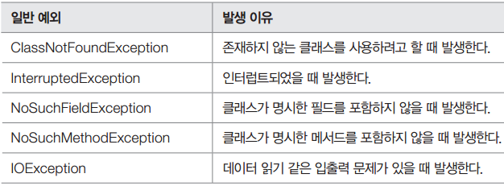

```java
public class Sample {
	public static void main(String[] args) {
		// 1초 동안 실행을 중지하려고 할 때, ...
		// Unhandled exception type InterruptedException
		Thread.sleep(1000);
		
		// MyClass cannot be resolved to a type
		MyClass my = new MyClass();
	}
}
```

## 예외를 잡아서처리 방법

### try, catch예외를 잡아서 처리하는 방법

```java
try {
   // 예외 발생 예상 구문
} catch (예외) {
   // 예외 처리
} finally {
   // 예외 발생 여부와 관계 없이 수행해야 할 코드
}
```


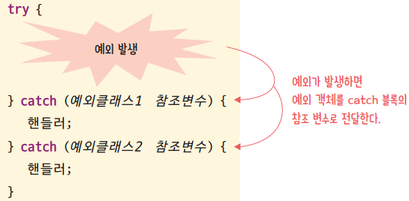

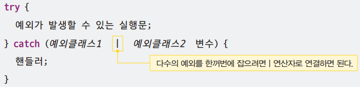

```java
public class Sample {
	public static void main(String[] args) {
		int[] numbers = { 7, 8, 9 };
		
		System.out.println("첫번째 숫자는 : " + numbers[0]);
		try {
		System.out.println("마지막 숫자는 : " + numbers[3]);
		} catch (ArrayIndexOutOfBoundsException e) {
			System.out.println("배열 인덱스를 초과했습니다.");
		}
		System.out.println("숫자의 개수 : " + numbers.length);
	}
}
```


#### 예제

```java
public class Sample {
	public static void main(String[] args) {
		System.out.println("시작");
		try {
			int x = Integer.parseInt(args[0]);
			System.out.println(100 / x);
		} catch (ArrayIndexOutOfBoundsException e) {
			System.out.println("파라미터가 입력되지 않았습니다." + e.getMessage());
		} catch (NumberFormatException e) {
			System.out.println("숫자형식이 아닙니다." + e.toString());
		} catch (ArithmeticException e) {
			System.out.println("0으로 나눌 수 없습니다.");
			e.printStackTrace();
		} finally { // 정상 실행 여부와 관계없이 항상 마지막에 호출되는 구문
			System.out.println("항상 호출");
		}
		System.out.println("끝"); 
	}
}
```


```java
public class Sample {
	public static void main(String[] args) {
		System.out.println("시작");
		try {
			int x = Integer.parseInt(args[0]);
			System.out.println(100 / x);
		} catch (ArrayIndexOutOfBoundsException e) {
			System.out.println("파라미터가 입력되지 않았습니다." + e.getMessage());
		} catch (Exception e) { // 꼭 finally 바로 앞에 써줘야 함
			System.out.println("예외가 발생!!!!!!!!!!!!!!!!");
		} finally {
			System.out.println("항상 호출");
		}
		System.out.println("끝"); 
	}
}

```


* cmd에서 해당 파일이 있는 곳으로 들어가서 명령어 실행

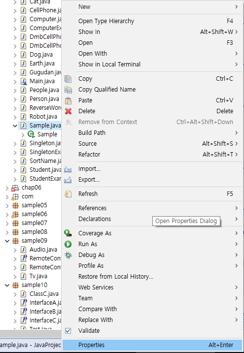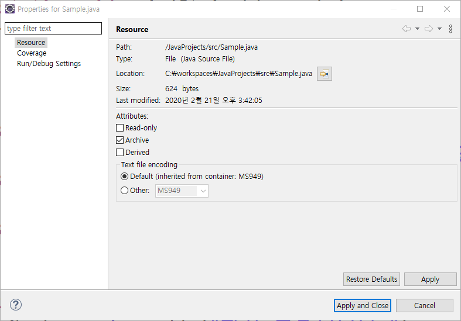

```cmd
c:\workspaces\HelloJava\bin>java Sample ⇐ 파라미터가 누락 
시작
파라미터가 입력되지 않았습니다.0
항상 호출
끝

c:\workspaces\HelloJava\bin>java Sample "하나" ⇐ 숫자 형식이 아닌 문자가 입력
시작
숫자형식이 아닙니다.java.lang.NumberFormatException: For input string: "하나"
항상 호출
끝

c:\workspaces\HelloJava\bin>java Sample "0" ⇐ 숫자로 변환되었으나 연산과정에서 오류
시작
0으로 나눌 수 없습니다.
java.lang.ArithmeticException: / by zero
        at Sample.main(Sample.java:6)
항상 호출
끝

c:\workspaces\HelloJava\bin>java Sample "10" ⇐ 정상적인 처리가 왼료
시작
10
항상 호출
끝
```


#### Throwable 클래스의 주요 메소드

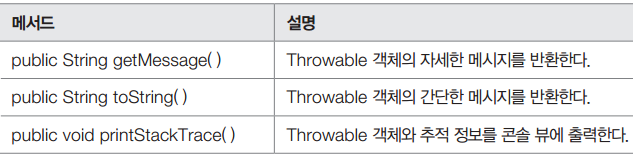


### finally

> 자원해제 구문 (정리해주는 역할)

```java
finally { // 정상 실행 여부와 관계없이 항상 마지막에 호출되는 구문
 	System.out.println("항상 호출");
}
```


### try - catch - finally 구문

```java
try { 
	자원 생성 및 사용
} catch(예외 e) {
	예외처리
} finally {
	자원 해제
}
```


### try - with - resource 문 (JDK 7)

```java
try (자원 생성) {
	자원 사용
} catch(예외 e) {
	예외처리
} 
```


## 예외를 떠넘기는 방법

### throws

>메소드에서 발행한 예외를 메소드 내부에서 처리하기 부담스러울 경우, **throws 키워드**를 사용해서 상위 코드로 예외를 전달하는 방법

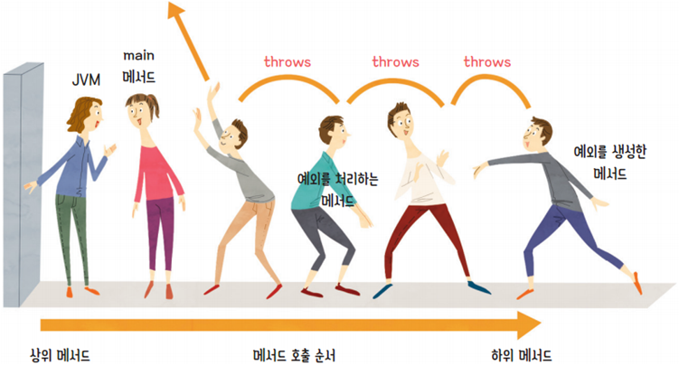


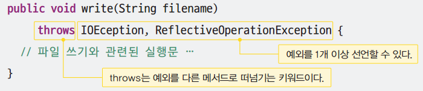

```java
import java.util.Scanner;

public class Sample {
	private static void square(String s) throws NumberFormatException {
		int n = Integer.parseInt(s);
		System.out.println(n * n);
	}
	
	
	public static void main(String[] args) {
		Scanner in = new Scanner(System.in);
		try {
		square(in.nextLine());
		} catch (NumberFormatException e) {
			System.out.println("숫자 타입이 아닙니다.");
		}
	}
}

```

## 제네릭

>하나의 코드를 다양한 타입의 객체에 재사용하는 객체 지향 기법클래스, 인터페이스, 메소드를 정의할 때 타입을 변수로 사용

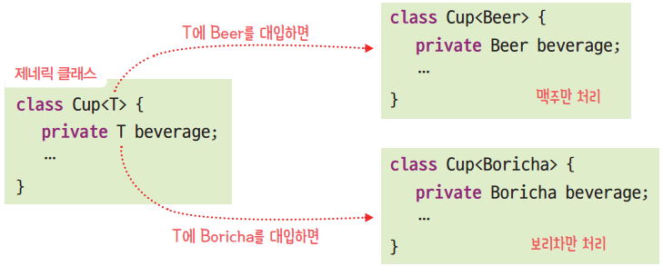


