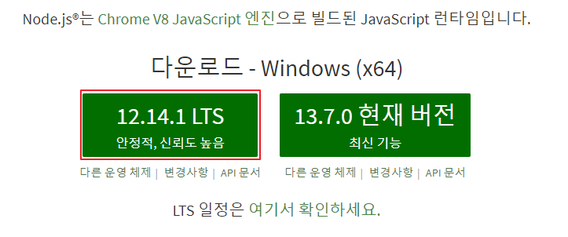
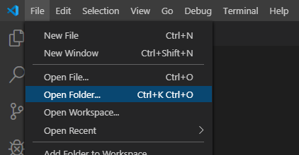
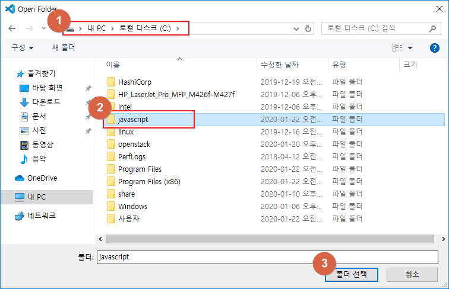
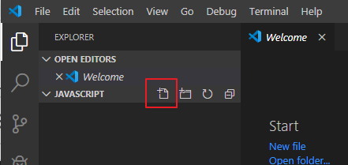
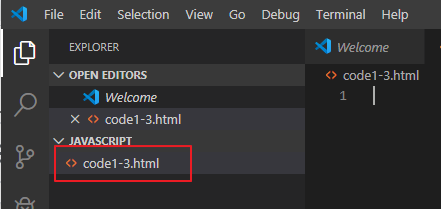
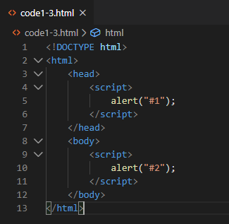
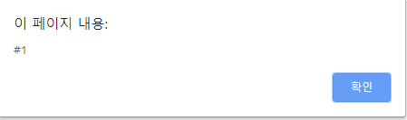
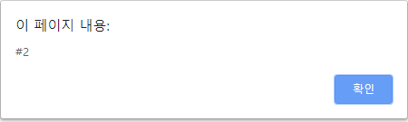
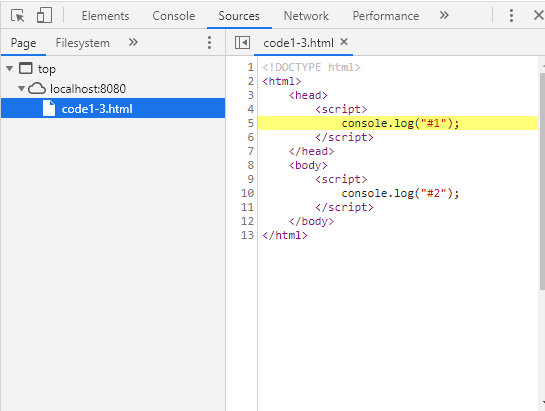

박창렴 / myanjini@gmail.com / 010-2982-7033

[공유](https://bit.ly/30Jf3TV)


# JavaScript

1일

## 개요

Web : HTTP 프로토콜 기반의 서비스

​	HTTP 프로토콜의 특징

 1. 요청-응답 구조

 2. Stateless => 상태관리(유지) X

    server side

    `정적`이라는 것은 server에 contents(자원:gif, jpg, png, html, txt ...)를 바꾸지 않으면 항상 동일한 내용이 client에게 보내주는 것

    contents를 공유하기 위해서 만듦

    정적 모델의 문제점 : 사용자 입장에서 어떤게 어디 있는지 모름

    이 문제점을 해결하기 위해 나온 것이 Yahoo(Yellow book service)

    Yahoo는 directory로 정리해놔서 file을 찾을 때 문제가 있음

    이 문제점을 해결하기 위해 나온 것이 검색(`동적` search.jsp)

    처음 동적모델(CGI)


client side에서 JavaScript등장

​	JavaScript 2번의 변화

 1. Jquery : JavaScript를 쉽게 다룰 수 있도록 해준

 2. Node : JavaScript의 실행환경

    JavaScript는 client side에서 작성해야 했는데 Node가 나오면서 client에서 작성한 JavaScript가 server에서도 작동

## 설치

**환경설정**#1 기본 설정 상태로 설치 진행Visual Studio Code 설치 ⇒ https://code.visualstudio.com/docs/?dv=winnode.js 설치 ⇒ https://nodejs.org/ko/
\#2 명령 프롬프트 실행 (시작 > cmd.exe)
\#3 작업 디렉터리(폴더) 생성C:\Users\myanj>cd \
C:\>mkdir javascript
C:\>cd javascript
C:\javascript>
\#4 node 설치 여부를 확인C:\javascript>node --versionv12.14.1
\#5 Visual Studio Code 실행 > File > Open Folder 메뉴 선택
\#6 새문서 생성 및 작성

<!DOCTYPE html><html>  <head>    <script>      console.log("#1");    </script>  </head>  <body>    <script>      console.log("#2");    </script>  </body></html>

\#7 http-server 를 설치https://www.npmjs.com/package/http-server
C:\javascript>npm init -yC:\javascript>npm install http-server -g
C:\Users\*PC_USER_NAME*\AppData\Roaming\npm\node_modules
C:\javascript>npx http-serverStarting up http-server, serving ./Available on: http://172.26.225.177:8080 http://10.0.75.1:8080 http://59.29.224.11:8080 http://192.168.56.1:8080 http://192.168.133.1:8080 http://10.0.0.1:8080 http://127.0.0.1:8080
브라우저를 통해서 http://localhost:8080/code1-3.html 로 접속


### HTML(HyperText Markup Language)

​	Markup Language: 마크업 언어는 태그 등을 이용하여 문서나 데이터의 구조를 명기하는 언어의 한 가지이다.

​	ex) <div> data</div> -- <div>(tag=>mart)

​	왜 만들었나? 1. 2기종간 정보 교환을 위해 만듦.

​							2.  server에 파일을 client에게 형식에 맞춰 보여주기 위해서

HTML이 추구하는 철학

1. 시맨틱 웹**[Semantic Web]([https://ko.wikipedia.org/wiki/%EC%8B%9C%EB%A7%A8%ED%8B%B1_%EC%9B%B9#%EC%8B%9C%EB%A7%A8%ED%8B%B1_%EC%9B%B9%EC%9D%98_%EA%B0%9C%EB%85%90](https://ko.wikipedia.org/wiki/시맨틱_웹#시맨틱_웹의_개념))

2. 개발 편의성

   정규화한다 : 예를들어 의미는 같은데 형태가 다르게 들어오는 것을 똑같은 형태로

자바스크립트를 사용하려면 기본 페이지의 head 태그 사이에 <script> , </script>를 입력.

 

렌더링(rendering) :


위에서부터 아래로 순서대로 해석이 된다.






file:///C:/javascript/code1-3.html

http://www.naver.com/asdffs

http=스킴 , www.naver.com=호스트 , /asdffs경로


URI

​	URL (위치를 가지고 식별)

1. 호스트명으로 유니크하게 리소스를 시별 할 수 있음
2. 경로로 유니크하게 리소스를 시별 할 수 있음

​	URN


### HTTP server 설치

https://www.npmjs.com/package/http-server


```powershell
C:\javascript> npm init -y
C:\javascript> npm install http-server -g

C:\javascript> npx http-server
Starting up http-server, serving ./
Available on:
  http://10.0.75.1:8080
  http://59.29.224.148:8080
  http://192.168.56.1:8080
  http://192.168.142.1:8080
  http://10.0.0.1:8080
  http://127.0.0.1:8080
  http://172.29.35.161:8080
```

-g옵션 주면 사용자 홈에 설치 됨 (C:\Users\HPE\AppData\Roaming\npm\node_modules)

npx : 모듈을 실행한다


브라우저를 통해서 http://localhost:8080/code1-3.html 로 접속

탐색기에서 실행한 것은 내 PC에서 실행, 위 브라우저를 통해서 보는 것은 Web서버에 요청해서 보는 것


​	[DOM](https://m.blog.naver.com/magnking/220972680805)

​	web server 와 web root


### alert < console 명령어

1. http://localhost:8080/code1-3.html

2. F12

3. Console에 보이도록

4. code1-3.html을 변경

   ```html
   <!DOCTYPE html>
   <html>
       <head>
           <script>
               console.log("#1");        
           </script>
       </head>
       <body>
           <script>
               console.log("#2");        
           </script>
       </body>
   </html>
   ```

5. console에 보이는 것은 browser의 메모리에 있는 것

   

### body에 작성

```html
<!DOCTYPE html>
<html>
    <head>
        <script>
            console.log("#1");        
        </script>
    </head>
    <body>

        <div id="up">up</div>
        
        <script>
            console.log("#2");        
        </script>
        <div id="down">down</div>

    </body>
</html>
```

### 

```html
<!DOCTYPE html>
<html>
    <head>
        <script>
            console.log("#1");        
        </script>
    </head>
    <body>

        <div id="up">up</div>
        
        <script>
            console.log("#2");
            document.getElementByID("up").innerText = "UP";        
        </script>
        <div id="down">down</div>

    </body>
</html>
```

`document.getElementById("up").innerText = "UP";` 설명

document.getElementById("up").innerText 는 up 을 찾아서 불러오기만,

document.getElementById("up").innerText = "UP";은 불러와서 UP으로 변경

getElement 요소를 찾는다 ID로


```html
<!DOCTYPE html>
<html>
    <head>
        <script>
            console.log("#1");        
        </script>
    </head>
    <body>

        <div id="up">up</div>
        
        <script>
            console.log("#2");
            document.getElementByID("up").innerText = "UP";
            document.getElementByID("down").innerText = "DOWN";
        </script>
        <div id="down">down</div>

    </body>
</html>
```

document.getElementByID("down").innerText = "DOWN"; 이 위에서 부터 해석되기 때문에 오류 발생


### Event

```html
<!DOCTYPE html>
<html>
    <head>
        <script>
            console.log("#1");
            console.log("#2");
            document.getElementById("up").innerText = "UP";
            document.getElementById("down").innerText = "DOWN";     
        </script>
    </head>
    <body>

        <div id="up">up</div>
        <div id="down">down</div>
        

    </body>
</html>
```

이게 실행되게 하려면 window.onload = function() {} 를 추가해줘야함 => event

```html
<!DOCTYPE html>
<html>
    <head>
        <script>
            window.onload = function() {
            console.log("#1");
            console.log("#2");
            document.getElementById("up").innerText = "UP";
            document.getElementById("down").innerText = "DOWN";
            }     
        </script>
    </head>
    <body>

        <div id="up">up</div>
        <div id="down">down</div>
        

    </body>
</html>
```

function을 => 로 바꿔서 해도 됨. 더 많이 씀

```html
<!DOCTYPE html>
<html>
    <head>
        <script>
            window.onload = () => {
            console.log("#1");
            console.log("#2");
            document.getElementById("up").innerText = "UP";
            document.getElementById("down").innerText = "DOWN";
            }     
        </script>
    </head>
    <body>

        <div id="up">up</div>
        <div id="down">down</div>
        

    </body>
</html>
```


## 기본 문법

### 2.1 기본 용어

1. 표현식과 문장

   > 표현식이란?

   * 값을 만들어내는 간단한 코드

   > 문장이란?

   * 하나 이상의 표현식이 모인 것
   * 문장이 모여 프로그램 구성
   * 문장의 끝에는 세미콜론을 찍어 문장의 종결을 알려줌
   * 하나의 표현식에도 세미콜론만 찍히면 문장

2. 키워드

   > 키워드란?

   * 자바스크립트가 처음 만들어질 때 정해진 특별한 의미가 있는 단어
   * 모든 브라우저에서 28개의 키워드를 지원 p28 표2-1

   > 미래에 사용될 가능성이 있는 자바스크립트 키워드

   * W3C에서 자바스크립트 프로그램 작성 시 p28 표 2-2 키워드를 사용하지 않기 권고

3. 식별자

   * 자바스크립트에서 이름을 붙일 때 사용
   * 식별자의 예
     * 변수명과 함수명
   * 식별자 생성 시 규칙
     * 키워드 사용 불가
     * 숫자로 시작하면 불가
     * 특수 문자는 _과 $만 허용
     * 공백 문자 포함 불가
       * break, 273apple, has space 등..

4. 식별자 생성 규칙

   * 모든 언어가 사용 가능하나 알파벳 사용이 개발자들 사이 관례
   * Input, output 같은 의미 있는 단어 사용
   * 자바 스크립트 개발자가 식별자를 만들 때 지키는 관례
     * 생성자 함수의 이름은 대문자로 시작
     * 변수와 인스턴스, 함수, 메서드의 이름은 항상 소문자로 시작
     * 식별자가 여러 단어로 이루어지면 각 단어의 첫 글자는 대문자
       * will out 을 will_out(snake_expretion) , willOut(camel_expretion)

`클린코드` Agile방법론이 나오면서 서로 의사소통할 때 필요

5. 식별자 종류

   * p30 표 2-3

     속성[객체.속성~ ex)student.age]과 메서드, 변수와 함수

6. 주석

   * 프로그램 진행에 영향을 끼치지 않음
   * 코드의 특정 부분을 설명

   1. HTML 태그 주석
      * `<!-- -->`로 문자열을 감싸 생성
        * 주석처리 한 곳도 브라우저 메모리에 들어가는데 랜더링 과정에서 주석처리해서 화면에 보이지 않음
   2. 자바스크립트 주석
      * `//`를 사용해 한 줄 주석 표현
        * `//`뒤의 문장은 실행되지 않음
        * `Enter`로 구분
          * CR(맨 앞으로 당김) + LF(다음줄로) 
      * `/*`와`*/`사이의 문장은 실행되지 않음

### 2.2 출력

기본 출력 방법 : alert()함수를 사용

* alert() 함수
  * 가장 기본적인 출력 방법
  * 브라우저에 경고창을 띄울 수 있음
  * 함수 괄호안에 문자열
* 매개 변수(=파라미터, 인자값)
  * 함수의 괄호 안에 들어가는 것
  * http:///abc.jsp`?name=value&n2=v2....'web에선 ?뒤 이런 형태

### 2.3 문자열 자료형

* 문자를 표현할 때 사용하는 자료의 형태

* 문자열을 만드는 방법

  * 큰따옴표 `""`, 작은따옴표 `''`로 사용

    ```html
    <!DOCTYPE html>
    <html>
        <head>
            <script>
            console.log('작은 " 따옴표');
            console.log("큰 ' 따옴표");
    
            // 이스케이프 문자를 활용 '\'
            console.log('작은 \' 따옴표');
            console.log("큰 \" 따옴표"); 
            </script>
        </head>
        <body>
    
        </body>
    </html>
    ```

    > 이스케이프란? 

    의미문자(meta-char) : 특별한 의미를 갖은 문자

    이 의미문자에서 의미를 지우는 것

    의미문자에서 의미를 없애는 방법

    1. 이스케이프 문자를 이용

    2. 약속(규칙) 변형 (=인코딩)

    3. ` 백틱 활용 

       ` 백틱의 유용성

       ```html
       <!DOCTYPE html>
       <html>
           <head>
               <script>
               console.log('작은 " 따옴표');
               console.log("큰 ' 따옴표");
       
               // 이스케이프 문자를 활용 '\'
               console.log('작은 \' 따옴표');
               console.log("큰 \" 따옴표");
       
               // 백틱(` : 숫자 1 왼쪽 옆에 있는 글자)을 활용
               console.log(`'작은 따움표`, "큰 따움표");
       
               /*
                   a = "철수";
                   b = "사과";
                   
                   "철수"는 "사과"를 좋아해
               */
               const a = "철수";
               const b = "사과";
               console.log('"' + a + '"는 "' + b + '"를 좋아해');
               console.log(`"${a}"는 "${b}"를 좋아해`);
               </script>
           </head>
           <body>
       
           </body>
       </html>
       ```

  * 문자열 연결 `+`

### 2.4 숫자 자료형

사칙연산

### 2.5 불 자료형

* 참과 거짓이라는 값을 표현

* 비교 연산자
* 논리 연산자
  * `&&` 둘 다 true 일 때 true, 하나라도 false면 false, 좌변이 false이면 `&&` 뒤는 연산 안함
  * `||`는 `or`, 좌변이 false일 때만 `||`뒤를 실행 함

### 2.6 변수

1. 변수

   * 값을 저장할 때 사용하는 식별자

   * 숫자뿐 아니라 모든 자료형 저장 가능

   * 변수를 사용하려면?

     1. 변수 선언 : 변수를 만듦
     2. 변수에 값 할당

   * 변수 선언 방법

     * `var` 식별자;
       * `var`는 옛날, `let` 이나 `const` (상수형 변수)로 사용하기
         * const는 선언하면서 할당해 줘야함. 처음에 초기값이 들어가기 때문에

   * ```html
     <!DOCTYPE html>
     <html>
         <head>
             <script>
                 /*
                     prompt(메세지, 초기값) 함수를 이용해서 반지름을 입력받아서
                     원의 둘레를 출력
                 */
                 let radius = prompt("반지름을 입력하세요");
                 const PI = 3.14159;
                 console.log(`원의 둘레는 ${radius * 2 * PI}입니다.`);
             </script>
         </head>
         <body>
     
         </body>
     </html>
     ```

2. 자료형

   * 문자열, 숫자, 불리언, 함수, 객체와 같은 것
   * 자바스크립트에는 총 여섯 가지 자료형이 있음
     * undefined 자료형
       * 선언되지 않거나 할당되지 않은 변수
       * 변수에 저장해도 의미가 없음
   * 다른 언어와 다르게 할당 될 때 자료형이 결정됨 (동적이다 라고 표현)

