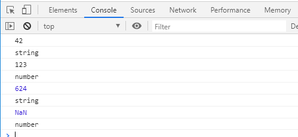
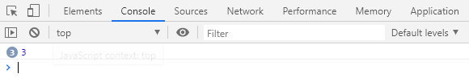

# JavaScript

2일차

## HTML 공부

[w3c](https://www.w3schools.com/html/html_basic.asp)

Basic ~ Id까지 최소

## 2. 기본 문법

### 2.9 입력

```html
<script>
let inputNumber = prompt('숫자를 입력하세요');	// 사용자 입력을 받는 코드 
console.log(inputNumber);		       		// 입력받은 값을 콘솔에 출력
alert(inputNumber)			        		// 입력받은 값을 사용자에게 알림
</script>
```


```html
<script>
let yn = confirm('1 + 2 = 3 이 맞습니까?');
console.log(yn);                   // 확인을 클릭하면 ture, 취소를 클릭하면 false를 반환
</script>
```

confirm 안 예뻐서 잘 안씀 => toastjs로 사용


```html
<!DOCTYPE html>
<html>
    <head>
        <script>
            let aaa = prompt("input your name");
            console.log(aaa);

            aaa = prompt("input ur name"); // let aaa = prompt("input ur name") 재정의하면 오류가 남
            console.log(aaa);

        </script>
    </head>
    <body>

    </body>
</html>
```


### 2.10 숫자와 문자열 자료형 변환

```html
<!DOCTYPE html>
<html>
    <head>
        <script>
            let a = 52+123;
            console.log(a);
            console.log(typeof(a));
            let b = 52+'123';
            console.log(b);
            console.log(typeof(b));
        </script>
    </head>
    <body>

    </body>
</html>
```


숫자 + '문자열' = 문자열, `덧셈 연산`은 문자열이 우선


```html
<!DOCTYPE html>
<html>
    <head>
        <script>
            let a = 52*123;
            console.log(a);
            console.log(typeof(a));
            let b = 52*'123';
            console.log(b);
            console.log(typeof(b));
            let c = '52'*'12';
            console.log(c);
            console.log(typeof(c));
        </script>
    </head>
    <body>

    </body>
</html>
```


숫자와 문자열 덧셈을 제외한 사칙 연산은 숫자가 우선


`명시적 형변환` = 강제적으로 형변환 (반대개념 : `암시적 형변환`)

다른 데이터 타입을 숫자형으로 변환 => Number() 함수를 사용

다른 데이터 타입을 문자열로 변환 => String() 함수를 사용

```html
<!DOCTYPE html>
<html>
    <head>
        <script>
            let a = "42";
            console.log(a);
            console.log(typeof(a));
            let b = '123';
            console.log(b);
            console.log(typeof(Number(b)));
            let c = 52*12;
            console.log(c);
            console.log(typeof(String(c)));
            let d = 52*'ABC';
            console.log(d);
            console.log(typeof(Number(d)));
        </script>
    </head>
    <body>

    </body>
</html>
```



NaN = Not a Number

* 자료형은 숫자이나 자바스크립로 나타낼 수 없는 숫자를 의미

  * 예) 자바스크립트에서는 복소수 표현이 불가능 

    ****

### 2.11 불 자료형 변환

> 다른 자료형을 불(bool) 자료형으로 변환

* 0 , NaN , '' , null , undefined 는 false를 반환

  ****

0, NaN, '', null, undefined 데이터에 대한`암시적인 형변환` = Boolean() 함수의 결과와 동일


### 2.12 일치 연산자

자동 형변환(=암시적 형변환)의 문제점: 혼돈을 야기

```html
<script>
	console.log('' == false);
	console.log('' == 0);
	console.log(0 == false);
	console.log('273' == 273);
</script>
```

모두 true

> 일치 연산자: 양변의 자료형과 값의 일치 여부를 모두 확인

`===`: 양변의 자료형과 값이 모두 일치함

`!==`: 양변의 자료형과 값이 일치하지 않음

```html
<script>
	console.log('' === false);
	console.log('' === 0);
	console.log(0 === false);
	console.log('273' === 273);
</script>
```

모두 false


### 2.13 +a

#### 백틱

#### 스코프

```html
<!DOCTYPE html>
<html>
    <head>
        <script>
            {
                var variable =273;
            }

            {
                console.log(variable);
            }

            console.log(variable);
        </script>
    </head>
    <body>

    </body>
</html>
```

자바스크립트에서 `var`는 스코프가 다름에도 다른 애들이 참조할 수 있다.

​	`var`키워드는 '전역 스코프 위치'에 변수를 선언하는 키워드이기 때문

따라서 `var`보다 `let`을 쓰자


```html
<!DOCTYPE html>
<html>
    <head>
        <script>
            for (var i =0; i < 3; i++) {
                setTimeout(() => {
                    console.log(i);
                }, 1000 * i);
            }
        </script>
    </head>
    <body>

    </body>
</html>
```



setTimeout(() => {
                    console.log(i);
                }, 1000 * i);

원래 함수는

​	function a() {

​							}

로 쓰는데 a 처럼 함수이름을 안 가져갈 수 있다. (=`익명함수`: 1회성으로 쓸 때)

화살표 함수, () => {}

함수를 정의함과 동시에 실행

setTimeout : 1000 * i 시간이 지나면 함수를 호출하라는 뜻


3이 3번 찍힌다.

setTimeout가 비동기함수라서

<B>i가 3이된 상태여서 for문은 안 돌지만 setTimeout은 시간차를 두고 불러오기 때문에</B>

`동기 방식` : 하나씩 처리

`비동기 방식` : 일이 끝나지 않았는데 다른 일을 처리 (+콜백)

```html
<!DOCTYPE html>
<html>
    <head>
        <script>
            for (var i =0; i < 3; i++) {
                ((i) => {
                    setTimeout(() => {
                    console.log(i);
                }, 1000 * i)
            })(i);
            }
        </script>
    </head>
    <body>

    </body>
</html>
```

이렇게 해야 0,1,2로 나오는데 복잡하다.  따라서 `var`보다 `let`을 쓰자

```html
<!DOCTYPE html>
<html>
    <head>
        <script>
            for (let i =0; i < 3; i++) {
                setTimeout(() => {
                    console.log(i);
                }, 1000 * i);
            }
        </script>
    </head>
    <body>

    </body>
</html>
```

함수단위로 스코프를 가지고 감. 나머지는 글로벌 (호이스팅)

#### `호이스팅(Hoisting)` 

> 선언한 변수나 함수가 최상위 위치로 옮겨지는 것

```html
<!DOCTYPE html>
<html>
    <head>
        <script>

console.log ("2 + 3 =", add(2,3));

            function add( x, y ) {
                return x + y;
            }

            console.log ("4 + 5 =", add(4,5));
        </script>
    </head>
    <body>

    </body>
</html>
```


## 3. 조건문

### if문

```html
<!DOCTYPE html>
<html>
    <head>
        <script>

            const date = new Date();
            const hour = date.getHours();
            
            console.log(`현재는 ${hour}시 입니다.`);
            // 현재 시간이 오전, 오후 여부를 판정
            if(hour < 12) {
                console.log("오전입니다.");
            }
            if(hour >= 12) {
                console.log("오후입니다.");
            }

        </script>
    </head>
    <body>

    </body>
</html>
```


### if-else문

```html
<!DOCTYPE html>
<html>
    <head>
        <script>

            const date = new Date();
            const hour = date.getHours();
            const week = date.getDay() // 요일을 숫자로 반환

            console.log(week);            
            console.log(`현재는 ${hour}시 입니다.`);
            // 현재 시간이 오전, 오후 여부를 판정
            /*
            if(hour < 12) {
                console.log("오전입니다.");
            }
            if(hour >= 12) {
                console.log("오후입니다.");
            }
            */
            if(hour < 12) {
                console.log("오전입니다.");
            } else {
                console.log("오후입니다.");
            }
        </script>
    </head>
    <body>

    </body>
</html>
```

### if-else if문

```html
<!DOCTYPE html>
<html>
    <head>
        <script>

            const date = new Date();
            const hour = date.getHours();
            const week = date.getDay() // 요일을 숫자로 반환

            console.log(week);            
            console.log(`현재는 ${hour}시 입니다.`);
            // 현재 시간이 오전, 오후 여부를 판정
            /*
            if(hour < 12) {
                console.log("오전입니다.");
            }
            if(hour >= 12) {
                console.log("오후입니다.");
            }
            */
            if(hour < 12) {
                console.log("오전입니다.");
            } else {
                console.log("오후입니다.");
            }

            if (week == 0) console.log(`일요일 입니다.`);
            else if (week == 1) console.log(`월요일 입니다.`);
            else if (week == 2) console.log(`화요일 입니다.`);
            else if (week == 3) console.log(`수요일 입니다.`);
            else if (week == 4) console.log(`목요일 입니다.`);
            else if (week == 5) console.log(`금요일 입니다.`);
            else console.log(`일요일 입니다.`);

        </script>
    </head>
    <body>

    </body>
</html>
```

### switch문

```html
<!DOCTYPE html>
<html>
    <head>
        <script>

            const date = new Date();
            const hour = date.getHours();
            const week = date.getDay() // 요일을 숫자로 반환

            console.log(week);            
            console.log(`현재는 ${hour}시 입니다.`);
            // 현재 시간이 오전, 오후 여부를 판정
            /*
            if(hour < 12) {
                console.log("오전입니다.");
            }
            if(hour >= 12) {
                console.log("오후입니다.");
            }
            */
            /*
            if(hour < 12) {
                console.log("오전입니다.");
            } else {
                console.log("오후입니다.");
            }

            if (week == 0) console.log(`일요일 입니다.`);
            else if (week == 1) console.log(`월요일 입니다.`);
            else if (week == 2) console.log(`화요일 입니다.`);
            else if (week == 3) console.log(`수요일 입니다.`);
            else if (week == 4) console.log(`목요일 입니다.`);
            else if (week == 5) console.log(`금요일 입니다.`);
            else console.log(`일요일 입니다.`);
            */
            switch (week) {
                case 0: console.log(`일요일 입니다.`);
                break;
                case 1: console.log(`월요일 입니다.`);
                break;
                case 2: console.log(`화요일 입니다.`);
                break;
                case 3: console.log(`수요일 입니다.`);
                break;
                case 4: console.log(`목요일 입니다.`);
                break;
                case 5: console.log(`금요일 입니다.`);
                break;
                case 6: console.log(`토요일 입니다.`);
                break;
                default: console.log(`잘못된 구문 입니다.`);
                break;

            }

        </script>
    </head>
    <body>

    </body>
</html>
```

switch는 break가 나올 때까지 만족한 조건 아래는 모두 실행


### 삼항 연산자

> (조건식) ? 참인경우 : 거짓인경우 ;

```html
<!DOCTYPE html>
<html>
    <head>
        <script>

            let num = prompt("숫자를 입력하세요.");
            num = Number(num);

            num % 2 === 0 ?
            console.log("짝수입니다.") : console.log("홀수입니다.");
            
        </script>
    </head>
    <body>

    </body>
</html>
```


### [isNaN](https://developer.mozilla.org/ko/docs/Web/JavaScript/Reference/Global_Objects/isNaN)

```html
<!DOCTYPE html>
<html>
    <head>
        <script>

            // 사용자로부터 숫자를 입력받습니다.
            // 숫자가 아닌 경우 콘솔에 오류 메시지를 출력하고,
            // 숫자인 경우 짝수, 홀수, 여부를 판정해서 콘솔에 메세지를 출력

            let num = prompt("숫자를 입력하세요.");
            num = Number(num);

            console.log(typeof num);
            if(isNaN(num)) {
                console.log("숫자가 아닙니다.");
            } else {
                if (num % 2 == 0) {
                    console.log("짝수입니다.");
                    } else {
                        console.log("홀수입니다.");
                    }
            }
        </script>
    </head>
    <body>

    </body>
</html>
```


### 짧은 조건식(short-circuit)

A || B ⇐ A 또는 B, 둘 중 하나가 참이면 참 = A와 B, 둘 모두 거짓이어야 거짓

A && B ⇐ A와 B, 둘 모두 참이어야 참 = A 또는 B 둘 중 하나가 거짓이면 거짓


### 3가지 조건문 방법

```html
<!DOCTYPE html>
<html>
    <head>
        <script>
            //  입력한 숫자의 홀짝 여부를 판정하는 코드
     
            let input = prompt("숫자를 입력하세요");
     
            //  방법1. if - else 구문을 이용한 구현
            if (input % 2 === 0) {
                console.log("짝수");
            } else {
                console.log("홀수");
            }
     
            //  방법2. 삼항 연산자를 이요한 구현
            input % 2 === 0 ? console.log("짝수") : console.log("홀수");
     
            //  방법3. 짧은 조건문을 이용한 구현
            input % 2 === 0 || console.log("홀수");
            input % 2 === 0 && console.log("짝수");
            
        </script>
    </head>
    <body>

    </body>
</html>
```


## 4. 반복문

```javascript
for ([1]변수=초기값; [2][5]조건문; [4][7]증가분) {
    [3][6]조건문을 만족하는 경우 수행할 구문
}
```

### 배열

> 여러 개의 변수를 한꺼번에 선언해 다룰 수 있는 `자료형`

```javascript
<!DOCTYPE html>
<html>
    <head>
        <script>
            // 배열 선언
            let arr = [ 273, 'String', true, function() {}, {}, [100, 200 ] ];
            // 숫자 문자열 불 함수 객체 배열 다 들어갈 수 있음
            console.log(arr);
            console.log(arr.length);

            console.log(`방법1`);
            console.log(arr[0]);
            console.log(arr[1]);
            console.log(arr[2]);
            console.log(arr[3]);
            console.log(arr[4]);
            console.log(arr[5]);

            console.log(`방법2`);
            for (let i=0; i< arr.length; i++) {
                console.log(arr[i]);
            }
            console.log(`방법3`);
            arr.forEach(function(ii) { console.log(ii);} );

            console.log(`방법4`);
            arr.forEach(ii => console.log(ii));

        </script>
    </head>
    <body>

    </body>
</html>
```

방법4 권장

```javascript
<!DOCTYPE html>
<html>
    <head>
        <script>
            // 배열 선언
            let arr = [ 273, 'String', true, function() {}, {}, [100, 200 ] ];
            // 숫자 문자열 불 함수 객체 배열 다 들어갈 수 있음
            console.log(arr);
            console.log(arr.length);

            arr.push("xyz");
            console.log(`push 이후`, arr.length);

            console.log(`방법1`);
            console.log(arr[0]);
            console.log(arr[1]);
            console.log(arr[2]);
            console.log(arr[3]);
            console.log(arr[4]);
            console.log(arr[5]);

            console.log(`방법2`);
            for (let i=0; i< arr.length; i++) {
                console.log(arr[i]);
            }
            console.log(`방법3`);
            arr.forEach(function(ii) { console.log(ii);} );

            console.log(`방법4`);
            arr.forEach(ii => console.log(ii));

        </script>
    </head>
    <body>

    </body>
</html>
```

`push` 배열에 추가하는 명령어, 제일 마지막에 붙고 length가 추가된다.


### while문

```javascript
<!DOCTYPE html>
<html>
    <head>
        <script>
            let value = 0;
            let startTime = new Date().getTime(); // 현재 시간
            
            while (new Date().getTime() < startTime + 1000) {
                value ++;
                }

                console.log("1초 동안 while 루프를 수행한 횟수:" + value);
        </script>
    </head>
    <body>

    </body>
</html>
```

```javascript
<!DOCTYPE html>
<html>
    <head>
        <script>
            //사용자 입력이 숫자이면 짝수, 홀수 여부를 콘솔에 출력 다시 입력을 요구
            //숫자가 아니면 종료

            let input = prompt("숫자를 입력하세요");
            while (!isNaN(input)) {
                input % 2 === 0 ? console.log("짝수") : console.log("홀수")
                input= prompt("숫자를 입력하세요");

            }
            console.log("종료");
            
        </script>
    </head>
    <body>

    </body>
</html>
```


### do while문

```javascript
<!DOCTYPE html>
<html>
    <head>
        <script>
            // 숫자 맞추기 게임
            // 1~20 사이의 임의의 숫자를 맞추는 게임

            const MIN = 1;
            const MAX = 20;

            let answer = Math.floor(Math.random()) * (MAX - MIN + 1) + MIN;

            let guesses = 0; // 사용자가 입력한 횟수
            let input;
            do {
                let input = prompt(`${MIN} ~ ${MAX} 사이의 숫자를 입력하세요.`);
                input = Number(input);
                guesses ++;

                if (input > answer) {
                    console.log("입력한 값 보다 작은 값을 입력하세요");
                } else if (input < answer) {
                    console.log("입력한 값 보다 큰 값을 입력하세요");
                } else {
                    console.log(`정답입니다. (시도횟수: ${guesses}`);
                }
                } while (input !== answer);
            

        </script>
    </head>
    <body>

    </body>
</html>
```


### for

```javascript
<!DOCTYPE html>
<html>
    <head>
        <script>
            const fruits = ["사과", "오렌지", "딸기", "바나나"];

            console.log("방법1.for loop");
            for (let i=0; i < fruits.length; i++) {
                console.log(fruits[i]);
            }

            console.log("방법2. for in");
            for (let i in fruits) {
                console.log(fruits[i]);
            }

            console.log("방법3. forEach");
            fruits.forEach(function(fruit) {
                console.log(fruit);
            });

            console.log("방법4. forEach + arrow function");
            fruits.forEach(fruit => console.log(fruit));
            
             
        </script>
    </head>
    <body>

    </body>
</html>
```


