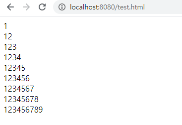
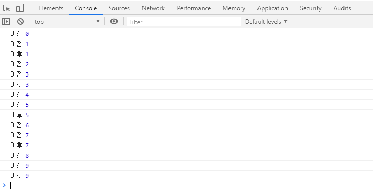
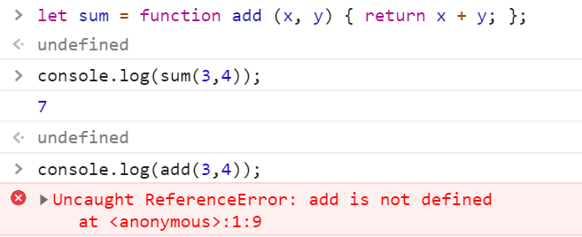
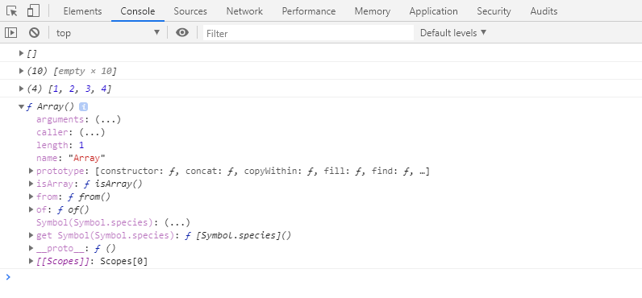
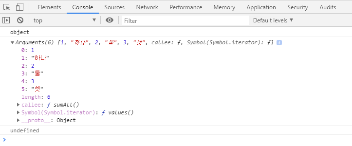
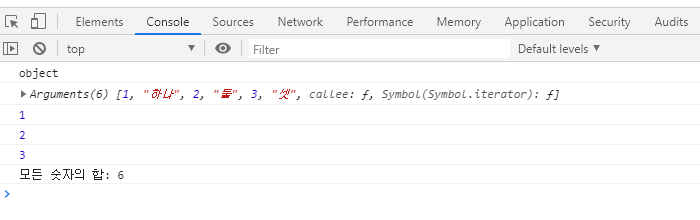
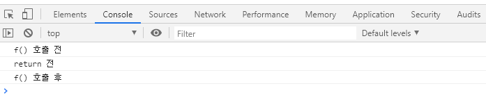
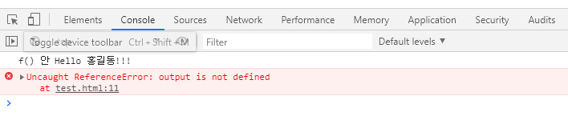

# JavaScript

3일차

## 4. 반복문

### for 문

#### console 확인 환경 작업

1. Visual Studio Code 실행 
2. File
3. Open Folder 메뉴 선택
4. C:\JavaScript 폴더 선택 New File 아이콘 클릭
5. test.html 파일 생성
6. Terminal
7. New Terminal 메뉴 클릭
8. PS C:\javascript> npx http-server
9. 브라우저(크롬)에서 http://localhost:8080/test.html 로 접속
10. 개발자도구(F12) 실행

#### 구구단

```html
<!DOCTYPE html>
<html>
    <head>
        <script>
            for (let dan = 2; dan <= 9; dan ++) {
                for (let num = 1; num <= 9; num ++) {
                    console.log(`${dan} * ${num} = ${dan * num}`);
                }
            }
        </script>
    </head>
    <body>

    </body>
</html>
```


사용자에게 보여주기 위해선 body에 적어야 함

```html
<!DOCTYPE html>
<html>
    <head>
        <script>
            window.onload = function() {
            for (let dan = 2; dan <= 9; dan ++) {
                for (let num = 1; num <= 9; num ++) {
                    document.getElementById("display").innerText =
                    document.getElementById("display").innerText + (`${dan} * ${num} = ${dan * num}`); 
                    }
                }
            }
            
        </script>
    </head>
    <body>
        <div id = "display">
            
        </div>
    </body>
</html>
```

body 에 id로 적어서 불러주는데 `window.onload`가 없으면 위에서 부터 실행되기 때문에 오류가 남. 꼭 `window.onload`로 마지막으로 실행 되도록 해줘야 함

`getElementById`는 고유의 Id를 불러옴

`innerText`와 `innerHTML`은 태그 안에 들어갈 때 값으로 text로 인식하느냐 html로 인식하느냐 차이가 있음

> //div.innerText = div.innerText + `${dan} * ${num} = ${dan * num}\n`;
>                         div.innerText += `${dan} * ${num} = ${dan * num}\n`;

```html
<html>
    <head>
        <script>
            window.onload = function() {
                for (let dan = 2; dan <= 9; dan ++) {
                    for (let num = 1; num <= 9; num ++) {
                        let div = document.getElementById("display");
                         //div.innerText = div.innerText + `${dan} * ${num} = ${dan * num}\n`;
                        div.innerText += `${dan} * ${num} = ${dan * num}\n`;
                    }                
                }
            }
        </script>
    </head>
    <body>
        <div id="display">

        </div>
    </body>
</html>

```

##### 가로로 출력 \t

```html
<html>
    <head>
        <script>
            window.onload = function() {
                let div = document.getElementById("display");
                for (let num = 1; num <= 9; num ++) {
                    for (let dan = 2; dan <= 9; dan ++) {
                        div.innerText = div.innerText + `${dan} * ${num} = ${dan*num} \t`;
                    }                
                    div.innerText = div.innerText + '\n';
                }
            }
        </script>
    </head>
    <body>
        <pre id="display"></pre>
    </body>
</html>

```

##### 사용자가 입력한 숫자의 구구단 출력

```html
<html>
    <head>
        <script>
            window.onload = function() {
                let div = document.getElementById("display");
                let dan = prompt("몇 단을 출력할까요?", "2");
                for (let num = 1; num <= 9; num ++) {
                    // div.innerText = div.innerText + `${dan} * ${num} = ${dan*num} \n`;
                    div.innerText += `${dan} * ${num} = ${dan*num} \n`;

                }
            }
        </script>
    </head>
    <body>
        <div id="display"></div>
    </body>
</html>

```

#### 1초 동안 수행된 for문 횟수 출력

```html
<html>
    <head>
        <script>
            window.onload = function() {
                // getTime 은 현재 시간을 밀리세컨드 (1/1000초) 단위로 반환
                const startTime = new Date().getTime();
                let cps = 0;
                for (cps = 0; new Date().getTime() < startTime + 1000; cps ++) {

                }
                document.getElementById("display").innerText = `1초 동안 수행된 for문 횟수 : ${cps}` ;
            }
        </script>
    </head>
    <body>
        <div id="display"></div>
    </body>
</html>

```

#### 배열 + for문

```html
<html>
    <head>
        <script>
            window.onload = function() {
                let fruits = [ '사과', '딸기', '바나나', '배' ];

                console.log('for 문을 이용한 출력');
                for (let i = 0; i < fruits.length; i ++) {
                    console.log(fruits[i]);
                }

                console.log('for in 문을 이용한 출력');
                for (let i in fruits) {
                    console.log(fruits[i]);
                }

                console.log('forEach 문을 이용한 출력 1');
                fruits.forEach(function(i) {
                    console.log(i);
                });

                console.log('forEach 문을 이용한 출력 2');
                fruits.forEach(i => {
                    console.log(i);
                });
            }
        </script>
    </head>
    <body>
        <div id="display"></div>
    </body>
</html>

```

#### 숫자 트리, `*` 트리

```html
<html>
    <head>
        <script>
            window.onload = function() {
                let output = '';
                for (let y = 1; y <= 9; y ++) {
                    output = '';
                    for (let x = 1; x <= y; x ++) {
                        output += x;
                    }
                    console.log(output);
                    document.getElementById("display").innerHTML += output+'<br>';
                }
            }
        </script>
    </head>
    <body>
        <div id="display"></div>
    </body>
</html>

```




#### break 와 continue

```html
<html>
    <head>
        <script>
            window.onload = function() {
                for (let i = 0; true; i ++) {
                    console.log(`${i}번째 반복입니다.`);
                    if (!confirm("계속할까요?")) {
                        break;
                    }
                }

                console.log('프로그램을 종료합니다.');
            }
        </script>

    </head>
    <body>
        <div id="display"></div>
    </body>
</html>

```

`for (let i = 0; true; i ++)` 가운데 true.

for문을 계속 돌지 말지 결정해주는 부분. `true`로 해놓으면 `무한루프`

> if (!confirm("계속할까요?")) {
>                         break;
>                     }

'예' 를 선택하면 true에서 !confirm으로 false

'취소 를 선택하면 false 반환 !false가 돼서 true로 변환되고 if문 실행 break로 반복문 빠져나옴


continue 재기

> continue를 만나면 다음 loop로 실행

```html
<html>
    <head>
        <script>
            window.onload = function() {
                for (let i = 0; i < 10; i ++) {
                    console.log("이전", i);
                    if (i % 2 === 0) {
                        continue;
                    }

                    console.log("이후", i);
                }
            }
        </script>

    </head>
    <body>
        <div id="display"></div>
    </body>
</html>

```




#### for in 과 for of

```html
<html>
    <head>
        <script>
            window.onload = function() {
                // 배열에 포함된 숫자의 합을 구하시오.
                const values = [100, '백', 200, '이백', 300, '삼백'];
                let sum = 0;

                // for in 구문은 배열의 인덱스를 반환
                
                // for ( let i in values) {
                //     let v = Number(values[i]);
                //     if (!isNaN(v)) {
                //         sum += v;
                //     }
                // }

                // for of 구문 배열의 값을 반환
                for (let i of values) {
                    let v = Number(i);
                    if (!isNaN(v)) {
                        sum += v;
                    }
                }
                console.log(`배열에 포함된 숫자의 합은 ${sum}입니다.`);
                document.getElementById("result").innerText = `배열에 포함된 숫자의 합은 ${sum}입니다.`;
            }
        </script>

    </head>
    <body>
        <div id="result"></div>
    </body>
</html>

```

> for in 구문은 배열의 인덱스를 반환
>
> for of 구문 배열의 값을 반환


## 5. 함수

> 코드의 집합을 나타내는 자료형

입력 값 = 매개변수 = 파라미터 = 인자(값)

출력 값 = 반환 값 = 리턴 값

### 함수 리터럴

`function add (x, y) {return x + y;}`

1. function 은 키워드
2. add 는 함수명(=식별자)
3. (x, y) 는 매개변수(=파라미터)
4. {return x + y;} 는 함수 본문(body)


### 함수 정의 방식

#### 함수 선언문 (function statement)

* 함수 선언문을 이용한 함수 정의 방식

  * 함수 리터럴과 동일

  * 반드시 함수 이름을 정의 해야 함

    * 함수 선언

    ```javascript
    function add( x, y ) {
    
         return x + y;
    
    }
    ```

    * 함수 호출

    ```javascript
    add (3, 4);
    ```

    

#### 함수 표현식 (function expression)

> 자바스크립트에서 함수는 하나의 값으로 취급
>
> 자바스크립트에서 가장 많이 쓰는 방식

(= 문자열, 숫자 처럼 변수에 할당이 가능하다는 뜻)

​	let str = "hong gill dong"; 처럼 

​	let add = function (x, y) { return x+y; };

`함수 선언문과 다른점`은 `함수 이름`이 없다. 함수 이름이 없는 것을 `익명 함수` 라고 함

* add(3, 4);
* let sum = add;
* sum(4, 5);


​	let add = function (x, y) { return x+y; }; 에서 이름을 줘도 됨 `기명 함수`라고 함

`기명 함수`일 때, 함수 표현식에서 사용된 함수 이름은 외부 코드에서 접근 불가



> 함수 선언문 형식으로 정의한 함수는 자바스크립트 냉부에서 함수 이름과 함수 변수 이름이 동일한 함수 표현식 형식으로 변경

```javascript
function add( x, y ) {

   return x + y;

}
```

는 내부적으로

```javascript
let add = function add (x, y) { 
    return x + y;
};
```


#### [function()](https://developer.mozilla.org/ko/docs/Web/JavaScript/Reference/Global_Objects/Function) 생성자 함수 생성

```
new Function ([arg1[, arg2[, ...argN]],] functionBody)

let add = new Function ('x', 'y', 'return x+y');
add (3,4);
```

함수 선언문, 표현식보다 더 내부적인 방식.

### 5.1 익명함수

`익명함수 표현식`

* 함수 선언

let 함수이름변수 = fuction (매개변수) {함수본문};

* 함수 호출

함수이름변수(매개변수);


```html
<html>
    <head>
        <script>
            // 1부터 사용자가 입력한 숫자 만큼의 합을 반환하는 함수를 정의
            function sigma1(n) {
                let sum = 0;
                for (let i = 1; i <= n; i++) {
                    sum += i;
                }
                return sum;
            }

            
            let sigma2 = function(n) {
                let sum = 0;
                for (let i = 1; i <= n; i++) {
                    sum += i;
                }
                return sum;    

            };

            let sigma3 = (n) => {
                let sum = 0;
                for (let i = 1; i <= n; i++) {
                    sum += i;
                }
                return sum;
            };

            

            let num = prompt("숫자를 입력하세요.");
            console.log(`1~${num}까지 합은 ${sigma1(num)}입니다.`);
            console.log(`1~${num}까지 합은 ${sigma2(num)}입니다.`);
            console.log(`1~${num}까지 합은 ${sigma3(num)}입니다.`);

        </script>

    </head>
    <body>
    </body>
</html>

```

sigma1 은 선언문

sigma2 는 표현식

sigma3 은 화살표


표현식과 화살표로 많이 사용한다.

표현식과 화살표는 변수에 할당하는 것으로 마지막에 `;`을 써주는게 좋다.


### 5.2 선언적 함수

> 함수 선언문 방식으로 생선한 함수

* 함수 선언

  * function 함수이름 (매개변수) {함수본문}

* 함수 호출

  * 함수이름(매개변수) ;

* 함수 재정의

  * > 동일한 이름의 함수가 중복해서 정의되는 것

  * 표현식이나 선언문이나 마지막에 재정의 된 것이 출력된다.

  ```html
  <html>
      <head>
          <script>
              // 같은 이름의 함수를 정의하고 호출
              function doSomething (x, y) {return x + y; }
              function doSomething (x, y) {return x * y; }
  
              console.log(doSomething(3,4)); // 12
  
              var doSomething2 = function(x, y) {return x + y; }
              var doSomething2 = function(x, y) {return x * y; }
              console.log(doSomething2(4,5)); // 20
          </script>
  
      </head>
      <body>
      </body>
  </html>
  
  ```

  ```html
  <html>
      <head>
          <script>
              // 같은 이름의 함수를 정의하고 호출
              console.log(doSomething(3,4)); // 12
              function doSomething (x, y) {return x + y; }
              function doSomething (x, y) {return x * y; }
  
  
              console.log(doSomething2); // undefined
              console.log(doSomething2(4,5)); // doSomething2 is not a fuction
              var doSomething2 = function(x, y) {return x + y; }
              var doSomething2 = function(x, y) {return x * y; }
  
          </script>
  
      </head>
      <body>
      </body>
  </html>
  
  ```

  * 표현식과 선언문의 차이점

    * console.log를 둘 다 위로 올리면, 12는 나오고 아래 20은 오류

    * 선언적 함수는 호이스팅 돼서 오류가 안 남

    * 여러 함수가 있을 때 (팀 프로젝트) 아래 표현식으로 쓰는 것이 오류가 안 날 확률이 높다.

    * ```html
      <html>
          <head>
              <script>
                  // 선언문 형식으로 정의된 함수와
                  // 익명함수(표현식) 형식으로 정의된 함수가 공존하는 경우
      
                  var f = function() { console.log("#1 f is called.")};
                  function f () { console.log("#2 f is called."); }
                  f();
              </script>
      
          </head>
          <body>
          </body>
      </html>
      
      ```

      선언적 함수가 먼저 생성되고 익명 함수가 나중에 생성되어 #1이 출력됨!!!!!!!!!

  * 표현식에서 두 개 의 차이

    * ```html
      console.log(doSomething2); // undefined
      console.log(doSomething2(4,5)); // doSomething2 is not a fuction
      
      ```

    * 더 알고 싶으면 인사이드 자바스크립트 라는 책 추천 + 러닝 자바스크립트, 코어 자바스크립트, javaScript Good Parts(PDF)


### 5.3 매개변수와 리턴 값


### 5.4 매개변수

```
[element0, element1, ..., elementN]
new Array(element0, element1[, ...[, elementN]])
new Array(arrayLength)
```

`Array()함수`

> 다양한 형식의 매개변수를 전달할 수 있다.

```html
<html>
    <head>
        <script>
            // 다양한 형식의 매개변수를 전달할 수 있다.
            let arr1 = new Array();
            let arr2 = new Array(10);
            let arr3 = new Array(1, 2, 3, 4);

            console.log(arr1); // []
            console.log(arr2); // [empty x 10]
            console.log(arr3); // [1, 2, 3, 4]
        </script>

    </head>
    <body>
    </body>
</html>

```

### 5.5 가변 인자 함수

> 파라미터(매개변수)의 개수가 변할 수 있는 (= 고정되어 있지 않은) 함수
>
> -> 함수 객체의 arguments 속성을 이용해서 매개변수를 이용(처리)

```html
<html>
    <head>
        <script>
            let arr1 = new Array();
            let arr2 = new Array(10);
            let arr3 = new Array(1, 2, 3, 4);

            console.log(arr1); // []
            console.log(arr2); // [empty x 10]
            console.log(arr3); // [1, 2, 3, 4]

            console.dir(Array); // 여기 있는 내용의 구조 전체를 보여주는 dir
        </script>

    </head>
    <body>
    </body>
</html>

```



arguments = 내가 정의하지 않아도 함수 안에서 가지고 있는 값, 매개변수의 배열

모든 함수는 arguments를 가지고 있다.

```html
<html>
    <head>
        <script>
            // 매개변수로 전달된 숫자값의 합을 구하는 함수를 정의
            function sumAll() {
                console.log(typeof arguments);
                console.log(arguments);
            }

            console.log(sumAll(1, "하나", 2, "둘", 3, "셋")); // 6

        </script>

    </head>
    <body>
    </body>
</html>
```



배열 비슷한 객체


따라서 배열처럼 처리 할 수 있다.

```html
<html>
    <head>
        <script>
            // 매개변수로 전달된 숫자값의 합을 구하는 함수를 정의
            function sumAll() {
                console.log(typeof arguments);
                console.log(arguments);
                let sum = 0;

                for (i of arguments) {
                    // let n = Number(i);
                    // if (isNaN(n))
                if (!isNaN(Number(i))) {
                    console.log(i);
                    sum += i;
                }
                
                }
                return sum;
            }

            console.log("모든 숫자의 합: " + sumAll(1, "하나", 2, "둘", 3, "셋")); // 6

        </script>

    </head>
    <body>
    </body>
</html>

```



### 5.6 리턴 값


```html
<html>
    <head>
        <script>
            // 함수 (실행) 중간에 반환하는 경우
            console.log("f() 호출 전");
            function f() {
                console.log("return 전")
                return;
                console.log("return 후")
            }
            f();
            console.log("f() 호출 후");
        </script>

    </head>
    <body>
    </body>
</html>

```



return이 나오면 아래 쪽 코드는 실행하지 않는다.


```html
<html>
    <head>
        <script>
            // 파라미터로 전달된 숫자 중 첫번째 3의 배수를 반환하는 함수를 작성하시오.
            function f() {
                for ( i of arguments) {
                    if (i % 3 === 0) {
                        return i;
                    }
                }                          
            }
            console.log(f(3));
            console.log(f(1, 7, 3));
            console.log(f(1, 7, 11, 15, 20 ,12)); // 15
            console.log(f(1, 5, 8, 21, 3, 24));
        </script>

    </head>
    <body>
    </body>
</html>

```

```html
            function f2() {
                let value;
                Array.from(arguments).forEach(i => {
                    if ( i % 3 === 0) {
                        value = i;
                        return false;
                    }                    
                });
                return value;
            }
			// [...arguments] 전개
            function f3() {
                let value;
                [...arguments].forEach(i => {
                    if ( i % 3 === 0) {
                        value = i;
                        return false;
                    }                    
                });
                return value;
            }

			          let f = f3;
```

안 돌아감. forEach는 중간에 멈출 수 없음 따라서

```html
<html>
    <head>
        <script>
            //  파라미터로 전달된 숫자 중 첫번째 3의 배수를 반환하는 함수를 작성하시오.
            function f1() {
                for (let i of arguments) {
                    if (i % 3 === 0) return i;
                }
            }
            //  예외를 던지지 않고는 forEach()를 중간에 멈출 수 없음
            //  중간에 멈춰야 한다면 forEach()는 적절하지 않음
            function f2() {
                let value;
                Array.from(arguments).forEach(i => {
                    if (i % 3 === 0) {
                        value = i;
                        return false;
                    }
                });  
                return value; 
            }
            function f3() {
                let value;
                [...arguments].forEach(i => {
                    if (i % 3 === 0) {
                        value = i;
                        return false;
                    }
                });  
                return value; 
            }
            // https://developer.mozilla.org/ko/docs/Web/JavaScript/Reference/Global_Objects/Array/find
            function f2() {
                return Array.from(arguments).find(i => i % 3 === 0);  
            }
            function f3() {
                return [...arguments].find(i => i % 3 === 0); 
            }

            let f = f1;
            console.log(f(3));                      // 3
            console.log(f(3, 7, 11));               // 3
            console.log(f(1, 7, 11, 15, 20, 12));   // 15            
            console.log(f(1, 7, 11, 15));           // 15            
        </script>
    </head>
    <body></body>
</html>

```

forEach, find 함수들을 쓰면 앞 배열부터 하나씩 가지고 와서 배열이 커져도 효율적으로 쓸 수 있다.

for는 전체 길이를 한번 돌아야 하기 때문에 비효율적인 반면에


### 5.7 내부 함수

> 함수 내부에 선언하는 함수
>
> 프로그램의 규모가 커지면서 다른 사람과 함께 프로그램을 개발할 때 여러 충돌을 막기 위해 만들어짐

```html
<html>
    <head>
        <script>
            /*
            // 함수 내부에서 함수를 정의
            function 외부함수() {

                function 내부함수1 () { .. }

                function 내부함수2 () { .. }
            }
            */
        </script>

    </head>
    <body>
    </body>
</html>

```

#### 피타고라스

```html
<html>
    <head>
        <script>
            // 피타고라스 정리를 이용한 pythagoras 함수를 정의
            function pythagoras (width, height) {
                return Math.sqrt(width * width + height * height);
            }

            console.log(pythagoras(3,4));
        </script>

    </head>
    <body>
    </body>
</html>

```

width 와 height가 2번씩 반복돼서 square 함수를 만듦

```html
<html>
    <head>
        <script>
            // 피타고라스 정리를 이용한 pythagoras 함수를 정의
            function pythagoras (width, height) {
                return Math.sqrt(square(width) + square(height));
            }
            function square(x) {
                return x * x;
            }

            console.log(pythagoras(12,5));
        </script>

    </head>
    <body>
    </body>
</html>

```

여기서, 똑같은 이름의 함수가 아래 나오면?

```html
<html>
    <head>
        <script>
            // 피타고라스 정리를 이용한 pythagoras 함수를 정의
            function pythagoras (width, height) {
                return Math.sqrt(square(width) + square(height));
            }
            function square(x) {
                return x * x;
            }
            // 같은 이름의 다른 기능을 함수로 구현
            function square(width, height, hypotenus) {
                if (width * width + height * height === hypotenus * hypotenus)
                return true;
                else
                return false;
            }
            console.log(pythagoras(12,5));
        </script>

    </head>
    <body>
    </body>
</html>

```

아래가 재정의돼서 호출 됨.

이런 상황 때문에 square라는 함수가 pythagoras함수에서만 사용되도록 해줘야 함.

#### 자기호출 함수

> 생성하자마자 한번 호출되는 함수

```html
<html>
    <head>
        <script>
            let f = function () {
                console.log("#1^^");
            };
            f();
            // 자기 호출
            (function () {
                console.log("#2^^");
            })();
            
        </script>

    </head>
    <body>
    </body>
</html>

```


### 5.8 콜백 함수

> sub함수가 처리가 끝났을 때 호출하는 함수를 지칭
>
> 시스템 효율을 처리하기 위해서

동기

<b>비동기방식</b>에서 자주 사용한다.

```html
<html>
    <head>
        <script>
            let f = function () {
                console.log("#1^^");
            };
            f();
            // 자기 호출
            (function () {
                console.log("#2^^");
            })();
            
        </script>

    </head>
    <body>
    </body>
</html>

```

```html
<html>
    <head>
        <script>
            //  P139
            let f1 = function(x, y) { return x + y; };
            f1(2,3);

            function callTenTimes(paramc) {
                for (var i = 0; i < 10; i ++) {
                    paramc();
                }
            }
            var fc = function() {
                console.log('함수 호출');
            };
            callTenTimes(fc);
        </script>
    </head>
    <body></body>
</html>

```


### 5.9 함수를 리턴하는 함수

> 다음에 나오는 클로저 때문에 사용

```html
<html>
    <head>
        <script>
            // 함수를 반환하는 함수
            function returnFunction() {
                return function() { 
                    console.log("^^");
                    };
            }
            let f = returnFunction();
            returnFunction()();
            // returnFunction(); 는 안나옴
            console.log(f);
            // f는 함수 따라서 f();를 한번 더 실행시켜 줘야 함
            f();
            
        </script>

    </head>
    <body>
    </body>
</html>

```

`returnFunction()();` 를 사용하는 이유

`returnFunction();`까지는 함수를 받고, 그걸 실행시켜 주는 명령어가 필요함.


### 5.10 클로저

> 함수 내부에 정의되어 있는 변수를 내부 이외에도 참조할 수 있도록 만드는 도구
>
> 클로저를 사용하기 위해서는 함수안에서 함수를 반환해야 한다.
>
> 함수 내부에 정의된 변수가 소멸되는 시간을 지연시킨다.

```html
<html>
    <head>
        <script>
            // 클로저
            function f (name) {
                var output = `Hello ${name}!!!`;
                console.log("f() 안", output);
            }
        
            f('홍길동');
            console.log("f() 밖", output);
        </script>


    </head>
    <body>
    </body>
</html>

```



output이 함수 안에서 정의되어 있기 때문에 두번째 외부에 있는 output은 오류 발생

```html
<html>
    <head>
        <script>
            // 클로저
            function f (name) {
                var output = `Hello ${name}!!!`;
                console.log("f() 안", output);
                return function() { console.log(output); };
            }
        
            f('홍길동')();
            // console.log("f() 밖", output);
        </script>


    </head>
    <body>
    </body>
</html>
```

```html
<html>
    <head>
        <script>
            // 클로저
            function f (name) {
                var output = `Hello ${name}!!!`;
                console.log("f() 안", output);
                return function() { console.log(output); };
            }
        
            let ff = f('홍길동');
            ff();
            // console.log("f() 밖", output);
        </script>


    </head>
    <body>
    </body>
</html>

```

자바스크립트가 객체지향 비슷하게 움직일 수 있게 해준다.