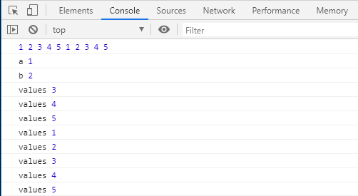
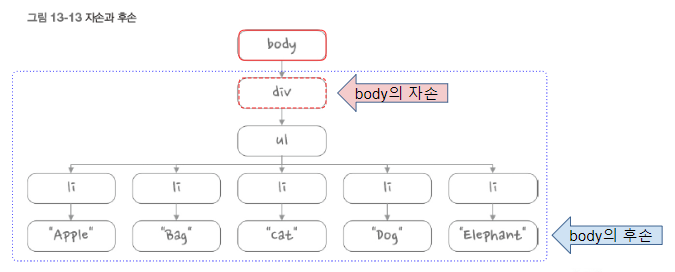

# JavaScript

4일차

## 5. 함수

### 기본 매개변수


```html
<html>
    <head>
        <script>
           function add ( a, b, c) {
               return a + b + c;
           }

           console.log(add(1));
           console.log(add(1,2));
           console.log(add(1,2,3));
        </script>


    </head>
    <body>
    </body>
</html>
```


오류가 나지 않게 하기 위해서

```html
<script>
           function add ( a, b=0, c=0) {
               return a + b + c;
           }
```

으로 뒤부터 기본값 설정을 해줘야 한다. 왜 뒤 부터?

add함수의 매개변수가 앞 부터 채워지기 때문에 

### 화살표 함수

```html
<html>
    <head>
        <script>
            let sum1 = function(a, b=0, c=0) {
                return a + b + c;
            };

            let sum2 = (a, b=0, c=0) => {
                return a + b + c;
            };

           console.log(sum1(1));
           console.log(sum2(1,2));
           console.log(sum1(1,2,3));
        </script>


    </head>
    <body>
    </body>
</html>
```

### 전개 연산자

> 마침표 3개(...)를 찍어 표기하는 연산자
>
> `함수` 또는 `배열`에 적용할 수 있다.
>
> 배열을 풀어 헤치거나 받아 들일 때

```html
<html>
    <head>
        <script>
            function test(...values) {
                console.log(arguments[0]);
                console.log(arguments[1]);
                console.log(arguments[2]);

                console.log(values[0]);
                console.log(values[1]);
                console.log(values[2]);

            }

            test(1, 2, 3);
        </script>


    </head>
    <body>
    </body>
</html>
```


#### 일반 매개변수와 전개 연산자 매개변수 조합

> 반드시 입력해야 하는 것은 일반 매개변수로 설정
>
> 부가적인 것은 전개 연산자 매개변수

```html
<html>
    <head>
        <script>
            function test(a, b, ...values) {
                console.log('a', a);
                console.log('b', b);
                values.forEach(i => console.log('values', i));
            }

            test(1, 2, 3);
            test(1, 2, 3, 4);
            test(1, 2, 3, 4, 5);
        </script>


    </head>
    <body>
    </body>
</html>
```


예를들어, 회원가입이라고 생각하면 a,b는 아이디 패스워드를 꼭 받고 나머지 핸드폰, 이메일 등은 매개변수로 받을 때 유용하게 사용할 수 있다.


```html
<html>
    <head>
        <script>
            function test(a, b, ...values) {
                console.log('a', a);
                console.log('b', b);
                values.forEach(i => console.log('values', i));
            }

            let value = [1,2,3,4,5];
            test(value);
        </script>


    </head>
    <body>
    </body>
</html>
```


```html
test(...value); // 로 쓰면

<html>
    <head>
        <script>
            function test(a, b, ...values) {
                console.log('a', a);
                console.log('b', b);
                values.forEach(i => console.log('values', i));
            }

            let value = [1,2,3,4,5];
            test(...value);
        </script>


    </head>
    <body>
    </body>
</html>
```


```html
test(...value, ...value); // 로 쓰면

<html>
    <head>
        <script>
            function test(a, b, ...values) {
                console.log('a', a);
                console.log('b', b);
                values.forEach(i => console.log('values', i));
            }

            let value = [1,2,3,4,5];
            console.log(...value, ...value);
            test(...value, ...value);
        </script>


    </head>
    <body>
    </body>
</html>
```



활용

학생DB(학번, 이름, 전공, ... )이 있을 때

속성(객체를 이용해서 나타 냄) , 레코드(배열을 이용해서 나타 냄)

`객체-배열`에서 전개 연산자가 많이 사용된다!!!!!!!!!!!!!!!!


## 6. 객체

> 데이터를 제대로 관리하기 위해서 만듦
>
> 객체가 갖을 수 있는 성격(데이터)를 정의하고
>
> 객체가 갖을 수 있는 함수를 정리해서 객체 안 함수(메서드)를 통해서 활용할 수 있도록 만듦(this.~)

### 6.1 객체 개요

```html
<html>
    <head>
        <script>
            // 배열 요소에 접근하기 위해서는 배열의 인덱스를 이용
            let colors = ['빨강', '파랑', '초록'];
            console.log(colors);
            console.log(colors[0]);

            // 객체 {} 이용 , 제이슨형식, ''로 묶어주는 경우 = 공백이 들어갈 때
            // 객체 요소에 접근하기 위해서는 속성(요소)의 이름을 이용
            
            let person = {
                name: '홍길동' ,
                age: 23,
                isMarried: false,
                'favorite colors': [ '빨강' , '초록' ],

            };
            console.log(person);
            console.log(person.name);
            console.log(person['name']); // [] 사용할 때 ''를 꼭 사용

        </script>


    </head>
    <body>
    </body>
</html>

```


```javascript
            let person = {
                name: '홍길동' ,
                age: 23,
                isMarried: false,
                'favorite colors': [ '빨강' , '초록' ],

            };
            console.log(person);
            console.log(person.name);
            console.log(person['name']);
            console.log(person.favorite colors); // 오류
            console.log(person['favorite colors']); // 공백문자 요소는 꼭 []
```


```html
<html>
    <head>
        <script>
            // 배열 요소에 접근하기 위해서는 배열의 인덱스를 이용
            let colors = ['빨강', '파랑', '초록'];
            console.log(colors);
            console.log(colors[0]);

            // 객체 {} 이용 , 제이슨형식, ''로 묶어주는 경우 = 공백이 들어갈 때
            // 객체 요소에 접근하기 위해서는 속성(요소)의 이름을 이용
            // 객체에 정의되어 있는 함수를 메소드라고 한다.
            let person = {
                name: '홍길동' ,
                age: 23,
                isMarried: false,
                'favorite colors': [ '빨강' , '초록' ],
                hello: function() { return "안녕, 나는 홍길동이야";},

            };
            console.log(person);
            console.log(person.name);
            console.log(person['name']); // [] 사용할 때 ''를 꼭 사용
            console.log(person['favorite colors']);
            console.log(person.hello());
        </script>


    </head>
    <body>
    </body>
</html>
```

객체에 숫자, 문자열, 불, 함수 사용 가능


### 6.2 속성과 메서드

#### this. 키워드

> 객체가 가지고 있는 속성

```html
<html>
    <head>
        <script>
            // 객체 요소에 접근하기 위해서는 속성(요소)의 이름을 이용
            let person = {
                firstName: "길동" ,
                lastName: "홍" ,
                id : 1234 ,
                getFullName : function() {
                    // return lastName + firstName 오류, 객체 내부에서 참조할 때 this.~ 으로 써야함
                    return this.lastName + this.firstName
                }

            };
            console.log(person);
            console.log(person.lastName + person.firstName); // 홍길동
            console.log(person.getFullName()); // 홍길동
        </script>


    </head>
    <body>
    </body>
</html>
```

`lastName + firstName 오류, 객체 내부에서 참조할 때 this.~ 으로 써야함` 메서드 안에 this를 안쓰고 오류가 나지 않으려면 함수 밖 전역변수에 있으면 됨

```html
<html>
    <head>
        <script>
            // 객체 요소에 접근하기 위해서는 속성(요소)의 이름을 이용
            let firstName = "익명";
            let lastName = "이";
            
            let person = {
                firstName: "길동" ,
                lastName: "홍" ,
                id : 1234 ,
                getFullName : function() {
                    return lastName + firstName
                }

            };
            console.log(person);
            console.log(person.lastName + person.firstName); // 홍길동
            console.log(person.getFullName()); // 이익명
        </script>


    </head>
    <body>
    </body>
</html>

```


외부에서 전달 된 값으로 '박길동' 만들기

```html
<html>
    <head>
        <script>
            // 객체 요소에 접근하기 위해서는 속성(요소)의 이름을 이용
            let person = {
                firstName: "길동" ,
                lastName: "홍" ,
                id : 1234 ,
                getFullName : function(lastName) {
                    return lastName + this.firstName
                }

            };
            console.log(person);
            console.log(person.lastName + person.firstName); // 홍길동
            console.log(person.getFullName("박")); // 박길동
        </script>


    </head>
    <body>
    </body>
</html>

```


#### ? 객체 안의 객체, 객체 안의 객체의 요소


### 6.3 객체와 반복문

> 배열은 단순 for 반복문과 for in 반복문으로 요소에 쉽게 접근 가능
>
> 그러나, 객체는 단순 for 반복문으로 객체 속성을 살펴보는 것이 불가능
>
> 따라서 객체 속성을 모두 살펴 보려면 `for in` 써야함

```html
<html>
    <head>
        <script>
            // 객체 요소에 접근하기 위해서는 속성(요소)의 이름을 이용
            let person = {
                firstName: "길동" , // key : value 라고 함
                lastName: "홍" ,
                id : 1234 ,
                getFullName : function() {
                    return this.lastName + this.firstName;
                }

            };

            // for in 구문을 이용해서 객체 내부를 출력
            for (let key in person) {
                console.log(`${key} : ${person[key]}`);
            }

        </script>


    </head>
    <body>
    </body>
</html>
```


### 6.4 객체 관련 키워드

#### in 키워드

> 해당하는 객체에 그 요소가 `있다 없다` 를 판정

```html
<html>
    <head>
        <script>
            let score = {
                C : 80 ,
                Java : 90 ,
                Python : 100 ,
            };

            console.log(`score 객체에 Java 점수 항목이 포함되어 있나요? ${'Java' in score}`);
            console.log(`score 객체에 Java 점수 항목이 포함되어 있나요? ${'JavaScript' in score}`);
        </script>


    </head>
    <body>
    </body>
</html>
```


#### with 키워드

> 동일 객체를 대상으로 반복작업을 실행할 때

```html
<html>
    <head>
        <script>
            let score = {
                C : 80 ,
                Java : 90 ,
                Python : 100 ,
            };
            
            // 각 과목별 점수 출력, 동일 객체를 대상으로 반복작업을 실행할 때 with 
            console.log(`C: ${score.C}`);
            console.log(`Java: ${score.Java}`);
            console.log(`Python: ${score.Python}`);

            with(score) {
                console.log(`C: ${C}`);
            console.log(`Java: ${Java}`);
            console.log(`Python: ${Python}`);
            }

        </script>


    </head>
    <body>
    </body>
</html>
```


### 6.5 객체의 속성 추가와 제거

> 추가

```html
<html>
    <head>
        <script>
            let score = {
                C : 80 ,
                Java : 90 ,
                Python : 100 ,
            };
            console.log(`#1`, `JavaScript` in score);
            score.JavaScript = 100;
            console.log(`#2`, `JavaScript` in score);

        </script>


    </head>
    <body>
    </body>
</html>
```


> 변경

```html
<html>
    <head>
        <script>
            let score = {
                C : 80 ,
                Java : 90 ,
                Python : 100 ,
            };
            console.log(`#1`, score);
            score.JavaScript = 100;
            score.C = 88;
            console.log(`#2`, score);

        </script>
    </head>

    <body>
    </body>
</html>
```


빈 객체를 만들고 객체를 추가할 수 있다.

```html
<html>
    <head>
        <script>
            let person = {};

            person.name = '홍길동';
            person.age = 23;
            person.isMarried = false;
            // person 객체가 가지고 있는 모든 속성과 속성 값을 반환하는 메소드
            person.toString = function() {
                let output = '';
                for (let key in person) {
                    if (key != 'toString') {
                    output += `${key} : ${person[key]}\n`;
                    }
                }
                return output;
            };

            console.log(person.toString());
        </script>
    </head>

    <body>
    </body>
</html>
```


> 제거

```html
<html>
    <head>
        <script>
            let person = {};

            person.name = '홍길동';
            person.age = 23;
            person.isMarried = false;
            // person 객체가 가지고 있는 모든 속성과 속성 값을 반환하는 메소드
            person.toString = function() {
                let output = '';
                for (let key in person) {
                    if (key != 'toString') {
                    output += `${key} : ${person[key]}\n`;
                    }
                }
                return output;
            };

            console.log(person.toString());

            delete person.name;
            console.log(person.toString());

            delete(person.isMarried); // delete를 함수처럼 쓸 수도 있다
            console.log(person.toString());
        </script>
    </head>

    <body>
    </body>
</html>
```


### 6.6 객체와 배열을 사용한 데이터 관리

데이터

```
let students = [];
    students.push({ name: 'aaa', korean: 46, math: 65, english: 25, science: 64 });
    students.push({ name: 'bbb', korean: 56, math: 63, english: 85, science: 62 });
    students.push({ name: 'ccc', korean: 56, math: 63, english: 22, science: 43 });
    students.push({ name: 'ddd', korean: 12, math: 25, english: 26, science: 23 });
    students.push({ name: 'eee', korean: 18, math: 85, english: 25, science: 25 });
    students.push({ name: 'fff', korean: 32, math: 22, english: 79, science: 25 });
    students.push({ name: 'ggg', korean: 52, math: 26, english: 42, science: 42 });
    students.push({ name: 'hhh', korean: 22, math: 25, english: 41, science: 56 });
    students.push({ name: 'iii', korean: 87, math: 79, english: 25, science: 86 });
    students.push({ name: 'jjj', korean: 24, math: 42, english: 71, science: 88 });
```

메서드 추가

```html
<html>
<head>
    <script>
        let students = [];
        students.push({ name: 'aaa', korean: 46, math: 65, english: 25, science: 64 });
        students.push({ name: 'bbb', korean: 56, math: 63, english: 85, science: 62 });
        students.push({ name: 'ccc', korean: 56, math: 63, english: 22, science: 43 });
        students.push({ name: 'ddd', korean: 12, math: 25, english: 26, science: 23 });
        students.push({ name: 'eee', korean: 18, math: 85, english: 25, science: 25 });
        students.push({ name: 'fff', korean: 32, math: 22, english: 79, science: 25 });
        students.push({ name: 'ggg', korean: 52, math: 26, english: 42, science: 42 });
        students.push({ name: 'hhh', korean: 22, math: 25, english: 41, science: 56 });
        students.push({ name: 'iii', korean: 87, math: 79, english: 25, science: 86 });
        students.push({ name: 'jjj', korean: 24, math: 42, english: 71, science: 88 });

        //	학생별 총점, 평균점을 구하는 메소드를 추가
        students.forEach(student => { 
            console.log(typeof student);
            console.log(student);
            //  총점을 구하는 메소드를 추가
            student.getSum = function() {
                return this.korean + this.math + this.english + this.science;
            };
            //  평균점을 구하는 메소드를 추가
            student.getAverage = function() {
                return this.getSum() / 4;
            };
        });

        //	학생별 총점, 평균점을 출력
        students.forEach(student => {
            // console.log(`이름 : ${student.name}, 총점 : ${student.getSum()}, 평균: ${student.getAverage()}`);
            with(student) {
                console.log(`이름 : ${name}, 총점 : ${getSum()}, 평균: ${getAverage()}`);
            }
        });
    </script>
</head>
<body></body>
</html>
```


### 6.7 함수를 사용한 객체 생성

```html
<html>
<head>
    <script>
        function makeStudent(name, korean, math, english, science) {
            let result = {
                'name' : name, // name : name, 이런 꼴이나 name, 이런 꼴도 가능
                korean : korean,
                math : math,
                english : english,
                science : science,
                getSum : function() {
                    return this.korean + this.math + this.english + this.science;
                },
                getAverage : function() {
                    return this.getSum() / 4 ;
                },

            };
            return result;
        }

        let students = [];
        students.push(makeStudent('aaa', 46, 65, 25, 64));
        students.push(makeStudent('bbb', 56, 63, 85, 62));
        students.push(makeStudent('ccc', 56, 63, 22, 43));
        students.push(makeStudent('ddd', 12, 25, 26, 23));
        students.push(makeStudent('eee', 18, 85, 25, 25));
        students.push(makeStudent('fff', 32, 22, 79, 25));
        students.push(makeStudent('ggg', 52, 26, 42, 42));
        students.push(makeStudent('hhh', 22, 25, 41, 56));
        students.push(makeStudent('iii', 87, 79, 25, 86));
        students.push(makeStudent('jjj', 24, 42, 71, 88));

        students.forEach(student => {
            with(student) {
                console.log(`이름 : ${name}, 총점 : ${getSum()}, 평균 : ${getAverage()}`);
                
            }
        });

    </script>
</head>
<body></body>
</html>
```


### 6.8 조금 더 나아가기

#### 옵션 객체

> 매개 변수가 객체인 경우

```html
<html>
<head>
    <script>
        // test 함수는 obj 객체를 매개변수로 받아들인다.
        function test(obj) {
            
            with(obj) {
                console.log(`${valueA} : ${valueB} : ${valueC}`);
            }
        };

        test({
            valueA : 52,
            valueB : 273,
        });
    </script>
</head>
<body></body>
</html>
```

오류발생. `초기화 작업` 필요.

사용자가 이 함수를 호출할 때, 밖에서는 어떤 객체를 매개변수로 받아들이는지 모르기 때문에

```html
<html>
<head>
    <script>
        // test 함수는 obj 객체를 매개변수로 받아들인다.
        function test(obj) {
            obj.valueA = obj.valueA || 0 ; // or 연산자 , 앞이 값이 있으면 그대로 앞 값이 들어가고 값이 없으면 뒤에 0이 들어감
            obj.valueB = obj.valueB || 0 ;
            obj.valueC = obj.valueC || 0 ;

            with(obj) {
                console.log(`${valueA} : ${valueB} : ${valueC}`);
            }
        };

        test({
            valueA : 52,
            valueB : 273,
        });
    </script>
</head>
<body></body>
</html>
```

+

```html
<html>
<head>
    <script>
        function makeStudent(obj) {
            let result = {
                'name' : obj.name, // name : name, 이런 꼴이나 name, 이런 꼴도 가능
                korean : obj.korean,
                math : obj.math,
                english : obj.english,
                science : obj.science,
                getSum : function() {
                    return this.korean + this.math + this.english + this.science;
                },
                getAverage : function() {
                    return this.getSum() / 4 ;
                },

            };
            return result;
        }

        let students = [];
        students.push(makeStudent({name : 'aaa', korean : 46, math : 65, english : 25, science : 64}));

        students.forEach(student => {
            with(student) {
                console.log(`이름 : ${name}, 총점 : ${getSum()}, 평균 : ${getAverage()}`);
                
            }
        });
    </script>
</head>
<body></body>
</html>
```


#### 참조 복사와 값 복사

> 숫자나 문자는 크기를 알기 때문에 새로운 공간에 저장하지만,
>
> 배열의 경우 크기를 모르기 때문에 주소만 참고 + 객체도 주소만 참고 `얕은복사`
>
> 

```html
<html>
<head>
    <script>
        let oldValue = 10;
        let newValue = oldValue;
        console.log(oldValue, newValue); // 10 10

        oldValue = 100;
        console.log(oldValue, newValue); // 100 10
    </script>
</head>
<body></body>
</html>
```


```html
<html>
<head>
    <script>
        let oldValue = 10;
        let newValue = oldValue;
        console.log(oldValue, newValue); // 10 10

        oldValue = 100;
        console.log(oldValue, newValue); // 100 10

        let oldArray = [10, 20];
        let newArray = oldArray;
        console.log(oldArray, newArray); //  [10, 20] [10, 20]

        oldArray[0] = 100;
        newArray[1] = 999;
        console.log(oldArray, newArray); // [100, 999] [100, 999]

    </script>
</head>
<body></body>
</html>
```


```html
<html>
<head>
    <script>
        let oldValue = 10;
        let newValue = oldValue;
        console.log(oldValue, newValue); // 10 10

        oldValue = 100;
        console.log(oldValue, newValue); // 100 10

        let oldArray = [10, 20];
        let newArray = oldArray;
        console.log(oldArray, newArray); //  [10, 20] [10, 20]

        oldArray[0] = 100;
        newArray[1] = 999;
        console.log(oldArray, newArray); // [100, 999] [100, 999]

        let oldObject = {name: 'aaa', age: 50};
        let newObject = oldObject;
        console.log(oldObject, newObject);

        oldObject.name = 'bbb';
        newObject.age = 30;
        console.log(oldObject, newObject);

        function cloneObject(obj) {
            let output = {};
            for (let key in obj) {
                output[key] = obj[key];
            }
            return output;
        }

        let oldObject2 = { name : 'xyz', age: 123};
        let newObject2 = cloneObject(oldObject2);
        console.log(oldObject2, newObject2);

        oldObject2.name = 'zzz';
        newObject2.age = 999;
        console.log(oldObject2, newObject2);

        function cloneArray(arr) {
            let output = [];
            for (let i of arr) {
                output.push(i);
            }
            return output;
        }

        let oldArray2 = [10, 20];
        let newArray2 = cloneArray(oldArray2);
        console.log(oldArray2, newArray2);

        oldArray2[0] = 100;
        newArray2[1] = 999;
        console.log(oldArray2, newArray2);
    </script>
</head>
<body></body>
</html>
```


#### 전개 연산자를 이용한 깊은 복사

> 복잡한 `for`문을 안 돌려도 간단하게 깊은 복사가 가능 

```html
<html>
<head>
    <script>
        let oldArray = [1, 2, 3, 4];
        let newArray = [ ...oldArray];
        console.log(oldArray, newArray);

        oldArray[0] = 100;
        newArray[1] = 200;
        console.log(oldArray, newArray);


    </script>
</head>
<body></body>
</html>
```

#### 전개 연산자를 이용한 배열 합병

```html
<html>
<head>
    <script>
        let arrayA = [1, 2, 3];
        let arrayB = [ 'a', 'b', 'c'];
        let newArray = [...arrayA, ...arrayB];
        console.log(newArray);
    </script>
</head>
<body></body>
</html>
```

#### 전개 연사를 이용한 객채 깊은 복사

```html
<html>
<head>
    <script>
        let objA = { name : 'aaa', age : 10} ;
        let objB = { ...objA};

        console.log(objA, objB); // {name: "aaa", age: 10} {name: "aaa", age: 10}

        objA.name = 'bbb';
        objB.age = 100;
        console.log(objA, objB); // {name: "bbb", age: 10} {name: "aaa", age: 100}
        
    </script>
</head>
<body></body>
</html>
```


## 13. JQuery

### 13.1 개요

> 모든 브라우저에서 동작하는 클라이언트 자바스크립트 라이브러리

* 문서 객체 모델과 관련된 처리를 쉽게 구현
  * `문서 객체 모델` 은 화면이다. 화면에 태그, 속성, 값 등을 구조적으로 잡아두는 DOM
* 일관된 이벤트 연결을 쉽게 구현
* 시각적 효과를 쉽게 구현
* Ajax 애플리케이션을 쉽게 개발


### 13. 2[다운로드](https://jquery.com/download/)

CDN 사용

```html
<script src="https://ajax.googleapis.com/ajax/libs/jquery/3.4.1/jquery.min.js"></script>
```


설치해서 사용C:\javascript>npm install jquery


소스코드에 추가 

```html
<script src="/node_modules/jquery/dist/jquery.js"></script>
```


### 13.3 $(document).ready() 

jQuery 사용하겠다.

```html
<html>
<head>
    <script src="/node_modules/jquery/dist/jquery.js"></script>
    <script>
        // 문서가 준비되면 매개변수로 전달한 콜백 함수를 실행하라는 의미
        window.onload = () => {
            console.log("loaded");
        };
        jQuery(document).ready(function() {
            console.log("#1");
        });
        $(document).ready(function() {
            console.log("#2");
        });
        jQuery(function() {
            console.log("#3");
        });
        $(function() {
            console.log("#4");
        });
    </script>
</head>
<body></body>
</html>
```

window.jQuery = window.$ = jQuery;


### 13.4 기본 선택자

`selector(선택자)`

>  DOM(문서객체모델)에서 특정 위치를 지정(선택)하기 위한 방법

* CSS 선택자 대부분을 지원
* $("*")는 전체 선택자, all selector
* $(".class")는 클래스 선택자
* $("#id")는 아이디 선택자
* $("element")는 요소(태그, element) 선택자
* $("selector1, selector2, ... , selectorN")는 다중 선택자 (multiple selector)


##### 블락요소

> \<p>내가 특별히 지정하지 않으면 화면에 꽉 차지 않더라도 내가 쓴 내용이 한 줄을 차지
>
> \<span>과 차이

```html
<html>
<head>
    <script src="/node_modules/jquery/dist/jquery.js"></script>
    <script>
        $(function() {
            
        });
    </script>
</head>
<body>
    <h1>제목1</h1>
    <p>내용1내용1내용1내용1내용1내용1내용1내용1내용1내용1내용1내용1</p>
    <p>내용1내용1내용1내용1내용1내용1내용1내용1내용1내용1내용1내용1</p>
    <span>다른내용</span>
    <span>다른내용</span>
    <h1>제목2</h1>
    <p>내용2내용2내용2내용2내용2내용2내용2내용2내용2내용2내용2내용2내용2</p>
    <span>다른내용</span>
    <span>다른내용</span>

</body>
</html>
```


##### $("*")는 전체 선택자, all selector

```html
<head>
    <script src="/node_modules/jquery/dist/jquery.js"></script>
    <script>
        $(function() {
            $("*").css('color', 'red');
        });
    </script>
</head>
```


##### 후손 선택자, $("body *")

```html
<head>
    <script src="/node_modules/jquery/dist/jquery.js"></script>
    <script>
        $(function() {
            $("body *").css('color', 'red');
        });
    </script>
</head>
```


##### ID 선택자, 클래스 선택자, 다중 선택자

```html
<html>
<head>
    <script src="/node_modules/jquery/dist/jquery.js"></script>
    <script>
        $(function() {
            // body 태그 아래의 모든 태그
            // 후손 선택자
            $("body *").css('color', 'red');

            // H1 태그에 대해서 배경색을 부여
            // 요소 선택자
            $("H1").css('background', 'yellow');

            // ID 선택자 => 해당 문서에서 유일해야 함
            $("#title").css('border', '5px solid red');

            // 클래스 선택자
            $(".right").css('textAlign', 'right');

            // 다중 선택자
            $("span, #title, .right").css('text-decoration', 'underline');

        });
    </script>
</head>

<body>
    <h1 class="right">제목1</h1>
    <p>내용1내용1내용1내용1내용1내용1내용1내용1내용1내용1내용1내용1</p>
    <p>내용1내용1내용1내용1내용1내용1내용1내용1내용1내용1내용1내용1</p>
    <span>다른내용</span>
    <span>다른내용</span>
    <h1 id="title">제목2</h1>
    <p class="right">내용2내용2내용2내용2내용2내용2내용2내용2내용2내용2내용2내용2내용2</p>
    <span>다른내용</span>
    <span>다른내용</span>

</body>
</html>
```

##### JQuery 나오기 전

```html
<html>
<head>
    <script src="/node_modules/jquery/dist/jquery.js"></script>
    <script>
        $(function() {
            //  후손 선택자
            //  body 태그 아래의 모든 태그
            $("body *").css('color', 'red');

            //  요소 선택자(element selector)
            //  H1 태그
            $("H1").css('background', 'yellow');

            //  ID 선택자 => 해당 문서에서 유일해야 함
            $("#title").css('border', '1px solid red');

            //  클래스 선택자 
            $(".right").css('textAlign', 'right');

            //  다중 선택자
            $("span, #title, .right").css('text-decoration', 'underline');
        });

        window.onload = () => {
            let ptags = document.getElementsByTagName("p");
            for (let p of ptags) {
                p.innerText = 'ptags';
            }
            
            let title = document.getElementById("title");
            title.style.borderWidth = '3px';
            title.style.borderStyle = 'dotted';
            title.style.borderColor = 'blue';
            
            let rights = document.getElementsByClassName("right");
            for (r of rights) {
                r.style.textAlign = "center";
            }
 
    </script>
</head>
<body>
    <h1 class="right">제목1</h1>
    <p>내용1내용1내용1내용1내용1내용1내용1내용1내용1내용1내용1</p>
    <p>내용1내용1내용1내용1내용1내용1내용1내용1내용1내용1내용1</p>
    <span>다른내용</span>
    <span>다른내용</span>
    <h1 id="title">제목2</h1>
    <p class="right">내용2내용2내용2내용2내용2내용2내용2내용2내용2</p>
    <span>다른내용</span>
    <span>다른내용</span>
</body>
</html>
```


### 13.5 자식 선택자와 후손 선택자 ([Child Selector](https://api.jquery.com/child-selector/))

자식 선택자 => $("parent > child")

후손 선택자 => $("parent child")



```html
<html>
<head>
    <script src="/node_modules/jquery/dist/jquery.js"></script>
    <script>
    </script>
</head>

<body>
    <div>
        <ul>
            <li>삼각형</li>
            <li>사각형</li>
            <li>오각형</li>
        </ul>
        <ol>
            <li>첫번째</li>
            <li>두번째</li>
            <li>세번째</li>
        </ol>
    </div>
</body>
</html>
```


```html
<html>
<head>
    <script src="/node_modules/jquery/dist/jquery.js"></script>
    <script>
        $(function(){
            // ID가 menu인 ul 태그 아래 있는 모든 li 태그의 값 색깔을 파란색으로 설정
            $("ul#menu li").css('color', 'blue');

            //ID가 menu인 ul 태그 바로 아래 있는 li 태그의 값에 대해 밑줄을 출력
            $("ul#menu > li").css('text-decoration', 'underline');
        });
    </script>
</head>

<body>
    <div>
        <ul id = "menu">
            <li>첫번째</li>
            <li>두번째</li>
            <li>세번째</li>
                <ul>
                    <li>3-1</li>
                    <li>3-2</li>
                    <li>3-3</li>
                </ul>              
            <li>네번째</li>
        </ul>
    </div>
</body>
</html>
```


### 13.6 속성 선택자

> 기본 선택자 뒤에 붙여 사용

$(요소명(엘리먼트이름)[속성이름='속성값']")

\<form> 아래에서 사용하는 사용자 입력을 처리하는 태그를 제어할 때 사용

\<form>형태는 <input type="text"> <input type="number"> <input type = "radio"> ...


```html
<html>
<head>
    <script src="/node_modules/jquery/dist/jquery.js"></script>
    <script>
        $(function(){
            // 속성 선택자
            // $(요소명(엘리먼트이름)[속성이름='속성값']")
            // <form> 아래에서 사용하는 사용자 입력을 처리하는 태그를 제어할 때 사용
            // <form>형태는 <input type="text"> <input type="number"> <input type = "radio"> ...
            $('ul[id="submenu"] li').css('color', 'red');
            $('ul#submenu li').css('background', 'blue');
        });
    </script>
</head>

<body>
    <div>
        <!-- <태그명 속성명 = "속성값" 속성명="속성값">태그값<태그명>
        태그 => element
        속성 => attribute
        -->
        <ul id = "menu">
            <li>첫번째</li>
            <li>두번째</li>
            <li>세번째</li>
                <ul id="submenu">
                    <li>3-1</li>
                    <li>3-2</li>
                    <li>3-3</li>
                </ul>              
            <li>네번째</li>
        </ul>
    </div>
</body>
</html>
```


