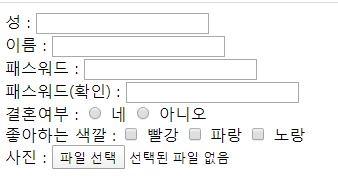
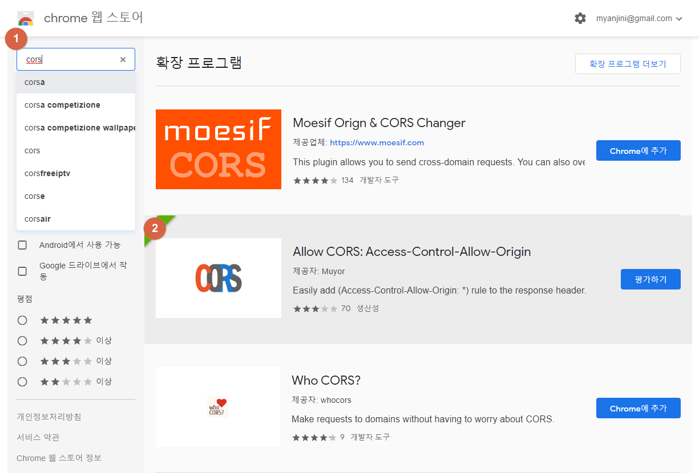

# JavaScript

5일차

## 13. JQuery

### 13.7 필터 선택자

```html
<html>
<head>
    <script src="/node_modules/jquery/dist/jquery.js"></script>
    <script>
        $(function(){
        });
    </script>
</head>

<body>
    성 : <input  type = "text" name = "lastName"><br>
    이름 : <input  type = "text" name = "firstName"><br>
    패스워드 : <input  type = "password" name = "pw"><br>
    패스워드(확인) : <input  type = "password" name = "pw2"><br>
    결혼여부 :
    <input  type = "radio" name="ismarried" value="Y"> 네
    <input  type = "radio" name="ismarried" value="N"> 아니오<br>
    좋아하는 색깔 :
    <input  type = "checkbox" name = "color" value="red"> 빨강
    <input  type = "checkbox" name = "color" value="red"> 파랑
    <input  type = "checkbox" name = "color" value="red"> 노랑<br>    
    사진 : <input  type = "file" name="photo">
</body>
</html>
```



type : 어떤 유형의 값을 입력 받을 지 선택

name : 사용자가 입력한 값을 식별할 수 있는 이름. 파라미터 값


서버로 보낼 때

```html
<form action="#" method="get">
    ...
<input type = "submit" value="전송">
```

이런 형태로 보낼 수 있는데 method 방식으로 `get`과 `post`방식이 있다.

get은 URL에 보임, post는 안 보임


속성 선택자로 성, 이름 입력창에 ooo을 입력하세요. 문장을 추가

```html
// id로
<head>
    <script src="/node_modules/jquery/dist/jquery.js"></script>
    <script>
        $(function(){
            // 성, 이름 입력창에 ooo을 입력하세요. 문장을 추가
            $("#lastName").val('성을 입력하세요.');
        });
    </script>
</head>

// input type으로
<head>
    <script src="/node_modules/jquery/dist/jquery.js"></script>
    <script>
        $(function(){
            // 성, 이름 입력창에 ooo을 입력하세요. 문장을 추가
            // $("#lastName").val('성을 입력하세요.');
            $('input[type="text"]').val("입력하세요.");
        });
    </script>
</head>

<head>
    <script src="/node_modules/jquery/dist/jquery.js"></script>
    <script>
        $(function(){
            // 성, 이름 입력창에 ooo을 입력하세요. 문장을 추가
            // $("#lastName").val('성을 입력하세요.');
            $('input[name="lastName"]').val("성을 입력하세요.");
            $('input[name="firstName"]').val("이름을 입력하세요.");
        });
    </script>
</head>
```


### 13.6 속성 선택자

```html
<head>
    <script src="/node_modules/jquery/dist/jquery.js"></script>
    <script>
        $(function(){
            // 성, 이름 입력창에 ooo을 입력하세요. 문장을 추가
            // $("#lastName").val('성을 입력하세요.');
            $('input[name="last Name"]').val("성을 입력하세요.");
            $('input[name="first Name"]').val("이름을 입력하세요.");

            // 요소[속성!=값] 속성값이 다른 문서 객체를 선택
            // 요소[속성~=값] 속성값에 단어가 포함된 문서 객체를 선택
            // 요소[속성^=값] 속성값이 글자로 시작하는 문서 객체를 선택
            // 요소[속성$=값] 속성값이 글자로 끝나는 문서 객체를 선택
            // 요소[속성*=값] 속성값이 글자가 포함된 문서 객체를 선택

            // 파일 선택창을 제외하고 나머지 입력창에 대해서 (필수입력) 표시
            $('input[type!="file"]').prev().append("(필수입력)").css('color', 'red');

            // name 속성에 'Name'이 포함된 것을 검색
            $('input[name~="pw"]').css('background', 'green');

            // name 속성이 p로 시작하는 입력창
            $('input[name^="p"]').css('border', '3px dotted blue');

            // name 속성이 Name으로 끝나는 입력창
            $('input[name$="Name"]').css('border', '3px solid pink');
            
            // type 속성에 o가 들어가 있는 입력창을 삭제
            // $('input[type*="o"]').hide();
        });
    </script>
</head>
```


```html
<html>
<head>
    <script src="/node_modules/jquery/dist/jquery.js"></script>
    <script>
        $(function(){
            // $("div").css('background','gray');

        });
    </script>
        
    <style>
        div {
            border: 1px solid black;
        }
        div.num {
            background: greenyellow;
        }
        div.red { 
            color: red;
        }
        
    </style>
</head>

<body>
    <div class = "num red">1</div>
    <div class = "num blue">2</div>
    <div class = "num yellow">3</div>
    <div class = "num green">4</div>

    <div class = "char red">하나</div>
    <div class = "char blue">둘</div>
    <div class = "char yellow">셋</div>
    <div class = "char green">넷</div>
</form>
</body>
</html>
```

css의 `div`를 셀렉터, `.~` 는 클래스

를 JQuery에서는 $().css(); 이런 식으로 사용


```html
<html>
<head>
    <script src="/node_modules/jquery/dist/jquery.js"></script>
    <script>
        $(function(){
            // $("div").css('background','gray');

        });
    </script>
        
    <style>
        div {
            border: 1px solid black;
            padding: 10px;
            margin: 10px 20px 30px 40px
            
            width: auto;
            height: auto;
            font-size: 30px;
            float: left;
        }
        div.num {
            background: greenyellow;
        }
        div.red { 
            color: red;
        }
        
    </style>
</head>

<body>
    <div class = "num red">1</div>
    <div class = "num blue">2</div>
    <div class = "num yellow">3</div>
    <div class = "num green">4</div>

    <div class = "char red">하나</div>
    <div class = "char blue">둘</div>
    <div class = "char yellow">셋</div>
    <div class = "char green">넷</div>
</form>
</body>
</html>
```


`padding`은 내부여백

`margin`은 외부여백

`margin` 옵션

```html
margin: 10px 20px 30px 40px
위 오 아래 왼 순서
margin-top: 10px;
...
```


```html
<head>
    <script src="/node_modules/jquery/dist/jquery.js"></script>
    <script>
        $(function(){
            // $("div").css('background','gray');

        });
    </script>
        
    <style>
        div {
            border: 1px solid black;
            padding: 10px;
            margin: 10px 20px 30px 40px;
            
            width: auto;
            height: auto;
            font-size: 30px;
            float: left;
        }
        div.num {
            background: greenyellow;
        }
        div.char { 
            color: rebeccapurple;
        }
        div.red { 
            color: red;
        }
        div.blue { 
            color: blue;
        }
        div.green { 
            color: green;
        }
        div.red { 
            color: yellow;
        }
    </style>
</head>
```


```html
    <script>
        $(function(){
            // $("div").css('background','gray');
            // class 가 num 인 것 : 배경색 회색
            // char : 배경색 적당한 색
            // red, yellow, green, blue -> 글자색
            /* 
            $("div.num").css('background','gray');
            $("div.char").css('background','brown');

            $("div.red").css('color','red');
            $("div.yellow").css('color','yellow');
            $("div.green").css('color','green');
            $("div.blue").css('color','blue');
            */
            $('div.num').each(function(index, item) {
                
                let color = $(item).attr('class').substr(4);
                $(item).css('color', color);
            });
        });
    </script>
```


### + 16. 이벤트

```html
<html>
<head>
    <script src="/node_modules/jquery/dist/jquery.js"></script>
    <script>
        $(function(){
            // $("div").css('background','gray');
            // class 가 num 인 것 : 배경색 회색
            // char : 배경색 적당한 색
            // red, yellow, green, blue -> 글자색
            /* 
            $("div.num").css('background','gray');
            $("div.char").css('background','brown');

            $("div.red").css('color','red');
            $("div.yellow").css('color','yellow');
            $("div.green").css('color','green');
            $("div.blue").css('color','blue');
            */
            $('div.num').each(function(index, item) {
                
                let color = $(item).attr('class').substr(4);
                $(item).css('color', color);
            });

            //이벤트 핸들링
            $('div#input div').css('cursor','pointer').click(function(){
                let value = $(this).text();
                let attr = $(this).attr('class');
                console.log(value, attr);
                $('div#disp').append(value, attr);
            });
        });
    </script>
        
    <style>
        div {
            border: 1px solid black;
            padding: 10px;
            margin: 10px 20px 30px 40px;
            width: auto;
            height: auto;
            font-size: 30px;
            float: left;
        }
    </style>
</head>

<body>
    <div id="disp"></div>

    <div id='input'>
    <div class = "num red">1</div>
    <div class = "num blue">2</div>
    <div class = "num yellow">3</div>
    <div class = "num green">4</div>

    <div class = "char red">하나</div>
    <div class = "char blue">둘</div>
    <div class = "char yellow">셋</div>
    <div class = "char green">넷</div>
    </div>
</form>
</body>
</html>
```

​      // div 박스를 클릭하면 

​      // 동일한 data가 있으면 다른 class의 박스를 숨김(hide)

​      // 없으면 다른 class의 박스를 보임(show)

```html
    <script>
        $(function() {
            // div 박스를 클릭하면 동일한 value가
            // 화면에 있으면 다른 class의 박스를 숨김(hide)
            // 화면에 없으면 다른 class의 박스를 보임(show)
            // 화면 제어에 필요

            $('div').click(function(){
                let cls = $(this).attr('class');
                let val = $(this).attr('value');
                // 현재 클릭된 div와 value가 같고 class가 다른 div를 선택

                if ($('div[value="'+val+'"][class!="'+cls+'"]').is(':visible')) {
                    ($('div[value="'+val+'"][class!="'+cls+'"]').hide();
                } else {
                    ($('div[value="'+val+'"][class!="'+cls+'"]').show();
                }
            });
            

        });
    </script>
```

 위 아래 같음

```html
    <script>
        $(function() {
            // div 박스를 클릭하면 동일한 value가
            // 화면에 있으면 다른 class의 박스를 숨김(hide)
            // 화면에 없으면 다른 class의 박스를 보임(show)
            // 화면 제어에 필요

            $('div').click(function() {
                let cls = $(this).attr('class');
                let val = $(this).attr('value');
                // 현재 클릭된 div와 value가 같고 class가 다른 div를 선택

                let div = $('div[value="'+val+'"][class!="'+cls+'"]');
                /*
                if (div.is(':visible')) {
                    div.hide()
                } else {
                    div.show()
                }
                */
                div.toggle();
            });
            

        });
    </script>
```

##### 구구단

```html
<html>
<head>
    <script src="/node_modules/jquery/dist/jquery.js"></script>
    <script>
        $(function() {
            $('select').change(function() {
                console.log($(this).val());
                for (let i = 1; i <= 9; i ++) {
                    $('div').append(`${$(this).val()} * ${i} = ${$(this).val() * i}<br>`)
                }
            });
        });
    </script>
        
    <style>

    </style>
</head>

<body>
    <select>
        <option value="">선택하세요.</option>
        <option value="1">1</option>
        <option value="2">2</option>
        <option value="3">3</option>
        <option value="4">4</option>
        <option value="5">5</option>
        <option value="6">6</option>
        <option value="7">7</option>
        <option value="8">8</option>
        <option value="9">9</option>
    </select>
    <div></div>
</body>

</html>
```

위 아래 같음

```html
<html>
<head>
    <script src="/node_modules/jquery/dist/jquery.js"></script>
    <script>
        $(function() {
            $('select').change(function() {
                //$('div').text(''); 아래와 같음
                $('div').empty();
                let dan = $(this).val();
                for (let i = 1; i <= 9; i ++) {
                    $('div').append(`${dan} * ${i} = ${dan * i}<br>`)
                }
            });
        });
    </script>
        
    <style>

    </style>
</head>

<body>
    <select>
        <option value="">선택하세요.</option>
        <option value="1">1</option>
        <option value="2">2</option>
        <option value="3">3</option>
        <option value="4">4</option>
        <option value="5">5</option>
        <option value="6">6</option>
        <option value="7">7</option>
        <option value="8">8</option>
        <option value="9">9</option>
    </select>
    <div></div>
</body>

</html>
```

##### mouseover, mouseleave 이벤트 처리

```html
<html>
<head>
    <script src="/node_modules/jquery/dist/jquery.js"></script>
    <script>
        $(function() {
            // p430
            // 홀수번째 : red
            // 짝수번째 : blue
            // 첫번째 : yellow
            // 마지막은 : green
            $('div:odd').css('background', 'red');
            $('div:even').css('background', 'blue');
            $('div:first').css('background', 'yellow');
            $('div:last').css('background', 'green');
            // div 태그 내부에 마우스가 들어가면 배경색을 회색으로
            // 마우스가 빠져 나오면 원래 색깔로 변경
            // $('div').mouseover(function() {
            //     console.log("마우스 진입");
            // });
            // $('div').mouseleave(function() {
            //     console.log('진출');
            // });
            // 이 방식도 가능
            let orgColor;
            $('div').mouseover(function() {
                orgColor = $(this).css('background');
                $(this).css('background', 'black');
                })
                .mouseleave(function() {
                    $(this).css('background', orgColor);
            });
            
        });
    </script>        
    <style>
        div {
            width : 100px;
            height : 100px;
            border : 1px solid blue;
            float: left;
            margin: 20px;
        }

    </style>
</head>

<body>
    <div></div>
    <div></div>
    <div></div>
    <div></div>
</body>

</html>
```


### 13. 10 jQuery 충돌 방지

> jQuery 이외에도 여러 가지 자바스크립트 프레임워크가 있습니다.
>
> 여러 플러그인을 함께 사용할 때 플러그인 간의 충돌이 발생할 수 있습니다.


### jquery-ui

```html
<html>
<head>
    <script src="/node_modules/jquery/dist/jquery.js"></script>
    <script src="/node_modules/jquery-ui-css/jquery-ui.js"></script>
    <link rel="stylesheet" href="/node_modules/jquery-ui-css/jquery-ui.min.css">

    <script>
        $(function() {
            $("div").mouseover(function() {
                $(this).attr('class', 'mycolor1');
            }).mouseleave(function() {
                $(this).attr('class', 'mycolor2');
            });
        });
    </script>        
    <style>
        div { width: 100px; height: 100px; float: left; border: 1px solid rebeccapurple;}
        .mycolor1 {background: red;}
        .mycolor2 { background: blue;}

    </style>
</head>

<body>
    <div>1111</div>
    <div>2222</div>
</body>

</html>
```


```html
https://jqueryui.com/

C:\javascript>npm install jquery-ui
npm WARN javascript@1.0.0 No description
npm WARN javascript@1.0.0 No repository field.

+ jquery-ui@1.12.1
added 1 package from 1 contributor and audited 181 packages in 3.432s

1 package is looking for funding
  run `npm fund` for details

found 0 vulnerabilities

C:\javascript>npm install jquery-ui-css
npm WARN javascript@1.0.0 No description
npm WARN javascript@1.0.0 No repository field.

+ jquery-ui-css@1.11.5
added 1 package from 1 contributor and audited 182 packages in 1.195s

1 package is looking for funding
  run `npm fund` for details

found 0 vulnerabilities


<!DOCTYPE html>
<html>
<head>
    <script src="/node_modules/jquery/dist/jquery.js"></script>
    <script>
        $(function() {
            $('div').mouseover(function() {
                $(this).attr('class', 'mycolor1');
            }).mouseleave(function() {
                $(this).attr('class', 'mycolor2');
            }); 
        });
    </script>
    <style>
        div { width: 100px; height: 100px; float: left; border: 1px solid red; }
        .mycolor1 { background: red; }
        .mycolor2 { background: blue; }
    </style>
</head>
<body>    
    <div>1111</div>
    <div>2222</div>
</body>
</html>


UI 테마를 적용
https://jqueryui.com/themeroller/


<!DOCTYPE html>
<html>
<head>
    <link rel="stylesheet" href="/jquery-ui-1.12.1/jquery-ui.css">
    <link rel="stylesheet" href="/jquery-ui-1.12.1/jquery-ui.theme.css">
    <script src="/jquery-ui-1.12.1/external/jquery/jquery.js"></script>
    <script src="/jquery-ui-1.12.1/jquery-ui.js"></script>
    <script>
        $(function() {
            $("#tabs").tabs();
        });
    </script>
    <style>        
    </style>
</head>
<body>    
    <div id="tabs">
        <ul>
          <li><a href="#matzip">맛집예약</a></li>
          <li><a href="#hospital">병원예약</a></li>
          <li><a href="#car">공유자동차예약</a></li>
        </ul>
        <div id="matzip">
          <p>맛집 예약과 관련한 컨텐츠</p>
        </div>
        <div id="hospital">
          <p>병원 예약과 관련한 컨텐츠</p>
        </div>
        <div id="car">
          <p>공유자동차 예약과 관련한 컨텐츠</p>
        </div>
    </div>
</body>
</html>


toast.js 적용
https://github.com/kamranahmedse/jquery-toast-plugin/
C:\javascript>npm install jquery-toast-plugin
npm WARN javascript@1.0.0 No description
npm WARN javascript@1.0.0 No repository field.

+ jquery-toast-plugin@1.3.2
added 1 package and audited 183 packages in 1.043s

1 package is looking for funding
  run `npm fund` for details

found 0 vulnerabilities


<!DOCTYPE html>
<html>
<head>
    <link rel="stylesheet" href="/jquery-ui-1.12.1/jquery-ui.css">
    <link rel="stylesheet" href="/jquery-ui-1.12.1/jquery-ui.theme.css">
    <script src="/jquery-ui-1.12.1/external/jquery/jquery.js"></script>
    <script src="/jquery-ui-1.12.1/jquery-ui.js"></script>

    <script src="node_modules/jquery-toast-plugin/dist/jquery.toast.min.js"></script>
    <link rel="stylesheet" href="node_modules/jquery-toast-plugin/dist/jquery.toast.min.css">

    <script>
        $(function() {
            $('input[name="userid"]').focusout(function() {
                if ($(this).val() == "") {
                    // $("#dialog").dialog();
                    $.toast({
                        text: "아이디를 입력하세요.",
                        showHideTransition : 'fade', 
                        bgColor : '#E01A31'
                    });
                }
            });
        });
    </script>
    <style>        
    </style>
</head>
<body>    
    <label>아이디</label>
    <input type="text" name="userid" />

    <div id="dialog" title="알림">
        <p>아이디를 입력하지 않았습니다.</p>
    </div>    
</body>
</html>


P588 colorbox 플러그인 사용
https://www.jacklmoore.com/colorbox/

C:\javascript>npm install jquery-colorbox
npm WARN javascript@1.0.0 No description
npm WARN javascript@1.0.0 No repository field.

+ jquery-colorbox@1.6.4
added 1 package from 1 contributor and audited 185 packages in 1.702s

1 package is looking for funding
  run `npm fund` for details

found 0 vulnerabilities


<!DOCTYPE html>
<html>
<head>
    <link rel="stylesheet" href="/jquery-ui-1.12.1/jquery-ui.css">
    <script src="/jquery-ui-1.12.1/external/jquery/jquery.js"></script>
    <script src="/jquery-ui-1.12.1/jquery-ui.js"></script>

    <script>
        $(function() {

        });
    </script>
    <style>        
    </style>
</head>
<body>    

</body>
</html>

```


## ajax JSON

HTTP 호출 _ http://localhost:8080/studnets.json

```html
{
    "studnets" :
        [
            {"name" : "홍길동", "age" :23, "score" : "A+"},
            {"name" : "홍동", "age" :25, "score" : "B+"},
            {"name" : "홍동길", "age" :19, "score" : "D+"}

        ]

}
```

ajax 호출 _


## jQuery 정리

### jQuery에서 가장 중요한 것은 `Selector`  

셀렉터를 제대로 사용하려면 문서구조가 제대로 만들어져야한다.


1. 선택자 `$("...")`
2. 화면제어 `.css` 
3. 값 제어 `.text`, `html`, `attr` 등 
4. 루프`.each` 
5. 이벤트 `.click`, `mouse~` 등
6. `UI plug-in`

7. 통신 `$.ajax` 비동기 통신방식, json 데이터 형태


\<div id = "content" class = "bgblue" data = "123">

`<div` 부분은 태그(요소)

뒤 `id ~ "123"`은 속성(attribute)

`id`는 이름

`="content"` 는 값

\<a href = "..."> 의 `<a>` 태그는 뒤에 속성을 꼭 가져야한다.

---

# LAB

사이트 미리 보기를 제작

* jquery UI에서 제공하는 TAB 위젯을 이용
* 미리 보기 사이트 명과 주소(URL)은 ajax 통신으로 가져오기
* /preview.html ⇒ 미리 보기 사이트 
* /siteinfo.html ⇒ 미리 보기 사이트 명과 주소를 포함한 JSON 형식의 파일


## siteinfo.html


# CORS

## 설치

https://chrome.google.com/webstore/category/extensions?hl=koAllow CORS: Access-Control-Allow-Origin 확장 프로그램 설치


웹은 교차 자원 요청이 가능


SOP(Same Origin Policy)

> 자바스크립트에서 다른 사이트에서 무엇인가 가져와서 사용하는 것을 막은 것
>
> 왜? 보안 때문에
>
> 어떤 기준으로? Origin
>
> Origin은 스킴 + 호스트 + 포트
>
> 브라우저에 적용된 보안기술
>
> 

ajax가 될 수 있도록 만들어주는 근본기술(XHR, XMLHttpRequest)


웹이 발전하면서 완화정책이 필요 => CORS(Cross-Origin-Resourse-Sharing)

응답해더

CORS => Acess-Controll-Allow-Origin : (*)을 


