# react

* 페이스북에서 개발하고 관리하는 `UI`라이브러리


props = 속성 = 부모 컴포넌트가 전달

state = 상태 = 자기(해당 컴포넌트) 보유값

## create-react-app

### 작업 디렉터리 생성

1. 명령 프롬프트 실행(cmd에서 PowerShell에서 안됨)
2. 작업 디렉터리 생성 및 이동
   * C:\Users\myanj>mkdir c:\react
   * C:\Users\myanj>cd 
   * C:\reactC:\react>
3. Visual Studio Code 실행
4. File > Open Folder … > C:\react 를 선택 후 오픈
5.  create-react-app 패키지 설치
   * C:\react>npm install -g create-react-app
6. create-react-app으로 리액트 프로젝트 생성
   * C:\react>create-react-app hello-react
7.  디렉터리 이동 후 실행
   * C:\react>cd hello-react
   * C:\react>npm start

create-react-app을 boot strap이라고도 함. 필요로 하는 작업들을 함.


## 1.1 리액트란 무엇인가

### 리엑트의 장점

가상 돔(virtual dom)을 통해서 UI를 빠르게 업데이트한다는 점


## 1.2 리액트 개발 환경 직접 구축

### 외부 패키지를 사용하지 않고 리액트 웹 페이지 제작

##### 1. 작업 디렉터리 생성

 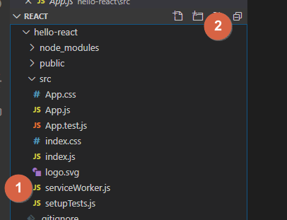

C:\react\hello-world
리액트 라이브러리 다운로드( C:\react\hello-world 디렉터리 아래에 저장 )

##### 2. 리액트 라이브러리 다운로드

[#1](https://unpkg.com/react@16.12.0/umd/react.development.js)

[#2](https://unpkg.com/react@16.12.0/umd/react.production.min.js)

[#3](https://unpkg.com/react-dom@16.12.0/umd/react-dom.development.js)

[#4](https://unpkg.com/react-dom@16.12.0/umd/react-dom.production.min.js)

우클릭 후 다른이름으로 저장

* development => #1,#3 개발 환경에서 사용하는 파일 -> 에러 메시지 확인이 가능
* production => #2,#4 실행(배포) 환경에서 사용하는 파일
* react => 플랫폼 구분 없이 공통으로 사용되는 파일
* react-dom => #3, 웹 환경에서 사용되는 파일


##### 3. 필요 파일 생성

c:\react\hello-world\sample1.html, c:\react\hello-world\sample1.js 파일 생성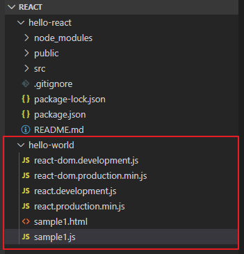


##### 4. 아래 화면과 같은 출력을 제공하는 sample1.html 작성

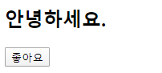

"좋아요" 상태에서 버튼을 클릭하면 "좋아요 취소"로 변경

```html
<html>
    <body>
        <h2>안녕하세요, 이 프로젝트가 마음에 드시면 좋아요 버튼을 눌러주세요.</h2>
        <div id="react-root"></div> 
        <script src="react.development.js"></script>
        <script src="react-dom.development.js"></script>
        <script src="sample1.js"></script>
    </body>
</html>
```

###### 4.1 react를 사용하지 않고 처리

jQuery 이용

```html
<html>
    <body>
        <h2>안녕하세요, 이 프로젝트가 마음에 드시면 좋아요 버튼을 눌러주세요.</h2>

        <div id="react-root"></div>
            <button>
                좋아요
            </button>
            <!-- 
        <script src="react.development.js"></script>
        <script src="react-dom.development.js"></script>
        <script src="sample1.js"></script>
        
        -->
        <!--jQuery로 구현하면-->
        <script src="https://ajax.googleapis.com/ajax/libs/jquery/3.4.1/jquery.min.js"></script>
        <script>
            $(function() {
                $('button').click(function(){
                    if ($(this).text() == '좋아요') {
                        $(this).text('좋아요 취소');
                    } else {
                        $(this).text('좋아요');
                    }
                });
            });
            
        </script>
    </body>
</html>
```

[<script src="https://ajax.googleapis.com/ajax/libs/jquery/3.4.1/jquery.min.js"></script>](https://developers.google.com/speed/libraries#jquery)


```html
<html>
    <body>
        <h2>안녕하세요, 이 프로젝트가 마음에 드시면 좋아요 버튼을 눌러주세요.</h2>

        <div id="react-root"></div>
            <button>
                
            </button>
            <!-- 
        <script src="react.development.js"></script>
        <script src="react-dom.development.js"></script>
        <script src="sample1.js"></script>
        
        -->
        <!--jQuery로 구현하면-->
        <script src="https://ajax.googleapis.com/ajax/libs/jquery/3.4.1/jquery.min.js"></script>
        <script>
            $(function() {
                // liked 변수의 값이 false 이면 좋아요 취소
                // liked 변수의 값이 true 이면 좋아요
                // button을 클릭하면 liked 변수의 값은 토글

                let liked = false;
                $('button').click(function() {
                    liked = !liked;
                    if (liked) $(this).text('좋아요');
                    else $(this).text('좋아요 취소');
                });

                $('button').trigger('click');
            });
            
        </script>
    </body>
</html>
```

```html
$('button').trigger('click');
```

사용자에게 보여지는 화면과 상태가 불일치되는 것을 방지하기 위해서 써줌.

###### 4.2 react 사용

```html
<html>
    <body>
        <h2>안녕하세요, 이 프로젝트가 마음에 드시면 좋아요 버튼을 눌러주세요.</h2>

        <div id="react-root"></div>

        <script src="react.development.js"></script>
        <script src="react-dom.development.js"></script>
        <script>
        // p6 코드1-2
        class LikeButton extends React.Component {
            constructor(props) {
                super(props);
                this.state = { liked: false };
            }
            render() {
                const text = this.state.liked ? '좋아요 취소' : '좋아요' ;
                return React.createElement(
                 'button',
                 /* 
                { onClick: () => this.setState({ liked: true }) }, 좋아요 취소에서 화면이 안 바뀜
                */ 
                { onClick: () => this.setState({ liked: !this.state.liked }) },
                text,
                 );
            }
        }        
const domContainer = document.querySelector('#react-root');
ReactDOM.render(React.createElement(LikeButton), domContainer);
        </script>
    </body>
</html>
```

`this.state = { liked: false };`

`this=LikeButton` 이 가지고 있는 state 객체 = {속성 : 값 }

render() { } _ 함수

const text _ 

return _ 반환

React.createElement( 첫번째 인자, 두번째 인자, 세번째 인자)

두번째 인자 _ onClick(객체 속성) _ 메소드이고, => this.setState({ liked: !this.state.liked }) _ onClick의 값(값이 함수) 

```javascript
                { onClick: () => {
                    console.log(this.state.liked);
                    this.setState({ liked: !this.state.liked }) 
                } },
```


#### 5 

http-server를 실행해서 확인

#5-1 http-server 실행 ⇒ C:\react>npx http-server -c-1(캐시 없이)

#5-2 브라우저로 접속 ⇒ http://localhost:8080/hello-world/sample1.html


#### 6. 여러 개의 돔 요소를 렌더링

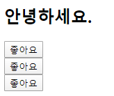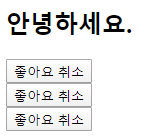


##### 6.1 jQuery 이용한 구현

```html
<html>
    <body>
        <h2>프로젝트가 마음에 들면 좋아요 버튼을 클릭해 주세요</h2>
        <div id="react-root">
            <button id="btn1">좋아요</button>
            <button id="btn2">좋아요</button>
            <button id="btn3">좋아요</button>
        </div>

        <!-- jQuery 기반으로 구현 -->
        <script src="https://ajax.googleapis.com/ajax/libs/jquery/3.4.1/jquery.min.js"></script>
        <script>
            $(function() {
                //  liked 변수의 값이 false 이면 좋아요 취소
                //                   true 이면 좋아요 
                //  버튼을 클릭하면 liked 변수의 값은 토글
                let liked1 = false;
                let liked2 = false;
                let liked3 = false;
                $('button#btn1').click(function() {
                    liked1 = !liked1;
                    if (liked1) $(this).text('좋아요');
                    else $(this).text('좋아요 취소');
                });
                $('button#btn2').click(function() {
                    liked2 = !liked2;
                    if (liked2) $(this).text('좋아요');
                    else $(this).text('좋아요 취소');
                });
                $('button#btn3').click(function() {
                    liked3 = !liked3;
                    if (liked3) $(this).text('좋아요');
                    else $(this).text('좋아요 취소');
                });
                    
                $('button#btn1').trigger('click');
                $('button#btn2').trigger('click');
                $('button#btn3').trigger('click');
            });  
        </script>
    </body>
</html>
```


##### 6.2 react 이용한 구현

```html
<html>
    <body>
        <h2>안녕하세요, 이 프로젝트가 마음에 드시면 좋아요 버튼을 눌러주세요.</h2>

        <div id="react-root1"></div>
        <div id="react-root2"></div>
        <div id="react-root3"></div>

        <script src="react.development.js"></script>
        <script src="react-dom.development.js"></script>
        <script>
        // p6 코드1-2
        class LikeButton extends React.Component {
            constructor(props) {
                super(props);
                this.state = { liked: false };
            }
            render() {
                const text = this.state.liked ? '좋아요 취소' : '좋아요' ;
                return React.createElement(
                 'button',
                { onClick: () => this.setState({ liked: !this.state.liked }) },
                text,
                 );
            }
        }        

ReactDOM.render(React.createElement(LikeButton), document.querySelector('#react-root1'));
ReactDOM.render(React.createElement(LikeButton), document.querySelector('#react-root2'));
ReactDOM.render(React.createElement(LikeButton), document.querySelector('#react-root3'));
        </script>
    </body>
</html>
```

### 바벨(babel)

> 자바스크립트 코드를 변환해 주는 컴파일러
>
> 최신 자바스크립트 문법을 지원하지 않는 환경에서도 최신 문법을 사용할 수 있다.


#### 1. 증가, 감소 버튼으로 count 상태값을 변경하는 코드를 작성

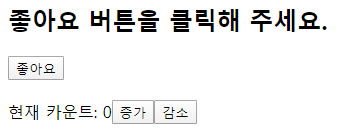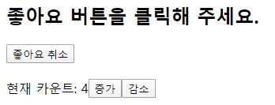


##### 1.1 sample3.html

###### templete

```html
<html>
    <body>
        <h2>안녕하세요, 이 프로젝트가 마음에 드시면 좋아요 버튼을 눌러주세요.</h2>

        <div id="react-root"></div>

        <script src="react.development.js"></script>
        <script src="react-dom.development.js"></script>
        <script>

        </script>
    </body>
</html>
```

###### React.createElement 메소드를 이용해서 구현

*  문서의 구조 및 엘리먼트의 포함 관계 등을 이해하기 어려움 

* 문서의 구조와 엘리먼트의 포함 관계를 쉽게 표현하고 파악할 수 있는 표현식이 필요 ⇒ JSX 
*  JSX로 작성한 코드를 바벨을 이용해서 React.createElement 메소드 형식으로 트랜스 컴파일

```html
<div id="react-root">
    <H1>좋아요 버큰을 클릭해 주세요.</H1>
    <div>
        <button …> … </button> ⇐ LikeButton
        <div>
            <span>현재 카운트: </span>
            <span>0</span>
            <button>증가</button>
            <button>감수</button>
         </div>
    </div> ⇐ Container
</div>
```

```html
<html>
    <body>
        <h2>안녕하세요, 이 프로젝트가 마음에 드시면 좋아요 버튼을 눌러주세요.</h2>

        <div id="react-root"></div>

        <script src="react.development.js"></script>
        <script src="react-dom.development.js"></script>
        <script>
            class LikeButton extends React.Component {
                constructor(props) {
                    super(props);
                    this.state = { liked: false };
                }
                render () {
                    const text = this.state.liked ? '좋아요 취소' : '좋아요';
                    return React.createElement(
                        'button',
                        { onClick: () => this.setState({ liked: !this.state.liked}) },
                        text,
                    );
                }
            }
            // p9 코드 1-6 참고
            class Container extends React.Component {
                constructor(props) {
                    super(props);
                    this.state = { count: 0 };
                }
                render() {
                    return React.createElement(
                        'div',
                        null,
                        React.createElement(LikeButton),
                        React.createElement(
                            'div',
                            { style: { marginTop: 20} },
                            React.createElement( 'span' , null , '현재 카운트: '),
                            React.createElement( 'span' , null , this.state.count),
                            React.createElement(
                                'button',
                                { onClick: () => this.setState({ count: this.state.count + 1 }) },
                                '증가',
                            ),
                            React.createElement(
                                'button',
                                { onClick: () => this.setState({ count: this.state.count -1 }) },
                                '감소',
                            ),
                        ),
                    );
                }
            }

            ReactDOM.render(
                React.createElement(Container),
                document.querySelector('#react-root')
            );
            

        </script>
    </body>
</html>
```

###### 단순한 기능인데도 render 메서드 코드가 상당히 복잡, JSX버전으로 변경

<b>주의!!!!!!!!!!</b> C:\react\hello-world\sample4.html

```html
<html>
    <body>
        <h2>안녕하세요, 이 프로젝트가 마음에 드시면 좋아요 버튼을 눌러주세요.</h2>

        <div id="react-root"></div>

        <script src="react.development.js"></script>
        <script src="react-dom.development.js"></script>
        <!-- 바벨을 이용해서 ./src/sample4.js 파일의 컴파일 결과로 생성-->
        <script src="sample4.js"></script>
    </body>
</html>
```

<b>주의!!!!!!!!!!</b> C:\react\hello-world\src\sample4.js (수정전 : #1-2 코드 일부)

```javascript
class LikeButton extends React.Component {
    constructor(props) {
        super(props);
        this.state = { liked: false };
    }
    render() {
        const text = this.state.liked ? '좋아요 취소' : '좋아요';
        return React.createElement(
            'button', 
            { onClick: () => this.setState({ liked: !this.state.liked }) },
            text,
        );
    }
}
// P9 코드1-6 참조
class Container extends React.Component {
    constructor(props) {
        super(props);
        this.state = { count: 0 };
    }
    render() {
        return React.createElement(
            'div',
            null, 
            React.createElement(LikeButton), 
            React.createElement(
                'div',

```

C:\react\hello-world\src\sample4.js (수정후)

```javascript
class LikeButton extends React.Component {
    constructor(props) {
        super(props);
        this.state = { liked: false };
    }
    render() {
        const text = this.state.liked ? '좋아요 취소' : '좋아요';
        return React.createElement(
            'button', 
            { onClick: () => this.setState({ liked: !this.state.liked }) },
            text,
        );
    }
}
// P11 코드1-7 참조
class Container extends React.Component {
    constructor(props) {
        super(props);
        this.state = { count: 0 };
    }
    render() {
        return (
            <div>
                <LikeButton/>
                <div style = {{ marginTop: 20}}>
                    <span>현재 카운트: </span>
                    <span>{this.state.count}</span>
                    <button onClick={() => this.setState({ count : this.state.count +1 })}>증가</button>
                    <button onClick={() => this.setState({ count : this.state.count -1 })}>감소</button>
                </div>
            </div>
        )
    }
}


ReactDOM.render(
    React.createElement(Container), 
    document.querySelector('#react-root')
);

```


###### 바벨 패키지를 설치하고 자바스크립트를 변환(컴파일)

> .js파일은 컴퓨터가 알아듣지 못해 바벨로 변환

```cmd
C:\react\hello-world> npm install @babel/core @babel/cli @babel/preset-react

C:\react\hello-world> npx babel --watch ./src --out-dir ./ --presets @babel/preset-react
```


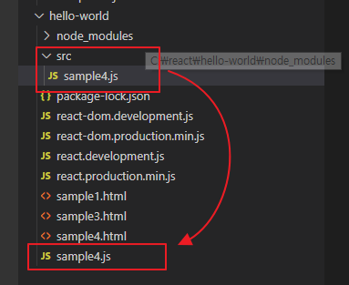

```javascript
class LikeButton extends React.Component {
  constructor(props) {
    super(props);
    this.state = {
      liked: false
    };
  }

  render() {
    const text = this.state.liked ? '좋아요 취소' : '좋아요';
    return React.createElement('button', {
      onClick: () => this.setState({
        liked: !this.state.liked
      })
    }, text);
  }

} // P11 코드1-7 참조


class Container extends React.Component {
  constructor(props) {
    super(props);
    this.state = {
      count: 0
    };
  }

  render() {
    return React.createElement("div", null, React.createElement(LikeButton, null), React.createElement("div", {
      style: {
        marginTop: 20
      }
    }, React.createElement("span", null, "\uD604\uC7AC \uCE74\uC6B4\uD2B8: "), React.createElement("span", null, this.state.count), React.createElement("button", {
      onClick: () => this.setState({
        count: this.state.count + 1
      })
    }, "\uC99D\uAC00"), React.createElement("button", {
      onClick: () => this.setState({
        count: this.state.count - 1
      })
    }, "\uAC10\uC18C")));
  }

}

ReactDOM.render(React.createElement(Container), document.querySelector('#react-root'));
```

!!!!!!!!!!!!!!!!!!!!!!!!!!!!!!!!!!!!!!!!!!!!!!!!!!!!!!!!!!!!!!!!!!!!!!!!이렇게 바뀜


오류발생 시 확인 사항

1. server가동 확인 + port확인
2. 404 Not Found -> Web Root(Web Document Root) 확인
   * npx http-server 를 싱행시킨 디렉터리가 Web Root가 됨

3. 캐시 (일정시간 가지고 있는 데이터)
   * npx http-server -c-1 (캐싱하지 말라는 옵션)
   * html문서에서만
   * browser에서 캐싱하지 않도록 바꿔줘야함
   * F12에서 network창에서 clear browser cache


### 웹팩(webpack)

> 자바스크립트로 만든 프로그램을 배포하기 좋은 형태로 묶어주는 툴
>
> 중복문제나 충돌문제를 해결해 줌


#### ESM 문법

> 모듈을 내보내고 가져옴

file1.js 파일은 코드를 내보내는 쪽이고 file2.js , file3.js 파일은 코드를 사용하는 쪽

```javascript
// P15 ESM 예제

// file1.js
export default function func1() { … }
export function func2() { … }
export const variable1 = 123;
export let variable2 = 'hello';

// file2.js
import myFunc1, { func2, variable1, variable2 } from './file1.js';

// file3.js
import { func2 as myFunc2 } from './file1.js';

```

#### 작업 디렉터리 설정

1. C:\react\hello-world> cd C:\react

   C:\react> mkdir webpack-test

2. npm init -y (노드 템플릿 생성)
3. C:\react\webpack-test> mkdir src

4. C:\react\webpack-test에 index.html 생성, src에 Button.js, index.js 파일 생성

   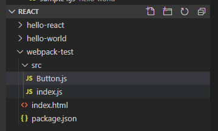


#### 외부 패키지 설치

```cmd
C:\react\webpack-test> npm install webpack webpack-cli react react-dom
```


#### 코드작성

##### C:\react\webpack-test\index.html

```html
<html>
    <body>
        <h2>좋아요 버튼을 클릭해 주세요</h2>
        <div id="react-root"></div>
        <!-- dist/main.js : 웹팩으로 자바스크립트 파일을 결합하면 생성 -->
        <script src="dist/main.js"></script>
    </body>
</html>
```


##### C:\react\webpack-test\src\index.js

```javascript
import React from 'react';
import ReactDOM from 'react-dom';
import Button from './Button.js';

// 함수형 컴포넌트
function Container () {
    return React.createElement(
        'div',
        null,
        React.createElement('p', null, '버튼을 클릭해 주세요.'),
        React.createElement(Button, { label: '좋아요' }),
        React.createElement(Button, { label: '싫어요' }),
    );
}
const domContainer = document.querySelector('#react-root');
ReactDOM.render(React.createElement(Container), domContainer);
```


##### C:\react\webpack-test\src\Button.js

```javascript
import React from 'react';

function Button(props) {
    return React.createElement('button', null, props.label);
}
export default Button;
```

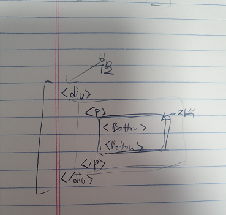


#### 웹팩을 이용해서 두개의 자바스크립트 파일을 하나로 결합

```cmd
C:\react\webpack-test> npx webpack
```


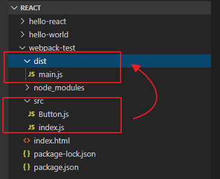


#### 브라우저를 통해서 확인

http://localhost:8080/webpack-test/index.html

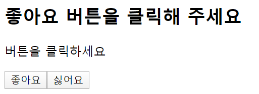

## create-react-app

> 리액트로 웹 애플리케이션을 만들기 위한 환경을 제공

* 바벨과 웹팩도 포함

* 테스트 용이, HMR(Hot-Module-Replacement), ES6+ 문법, CSS 후처리 등을 제공


### 1. 개발 환경 설정

C:\react> cd c:\react

C:\react> npx create-react-app cra-test

C:\react> cd cra-test


### 2. 개발 서버 실행

C:\react\cra-test> npm start


### 3. 빌드

C:\react\cra-test>npm run build


* 자바스크립트 파일에서 import 키워드를 이용해서 가져온 CSS 파일은 build/static/css/main.{해쉬값}.chunk.css 파일에 모두 저장
  * 해쉬(hash)
    * 임의 크기 입력 => 고정 크기 출력
    * 유일성 보장 , a != b => H(a) != H(b)
      * 무결성(바뀌지 않음) 보장
    * 단방향성(일방향성), a => H(a)는 가능하지만 H(a) => a 는 불가
      * 인증(Type1 : 지식, Type2 : 소유, Type3 : 특징)정보 저장&처리
    * 빠른 연산
    * 충돌이 날 수 있지만(같은 값이 나올 수 있음), 회피해야 좋음

* 자바스크립트 파일에서 import 키워드를 이용해서 가져온 폰트, 이미지 등의 리소스 파일은 build/static/media 폴더에 저장 ( 10K 이하의 작은 파일은 data url 형식으로 자바스크립트 파일에 저장 -> 불필요한 용량을 줄일 수 있다.)

  


