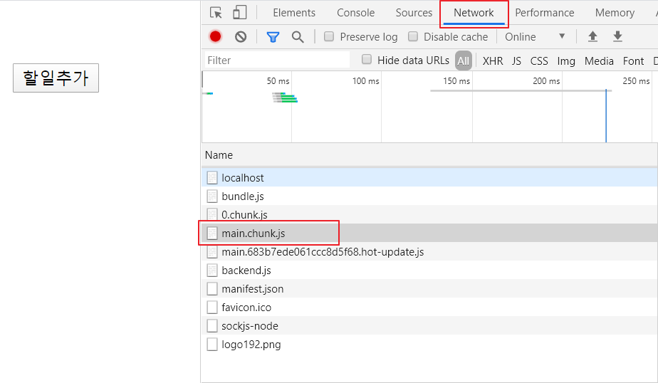
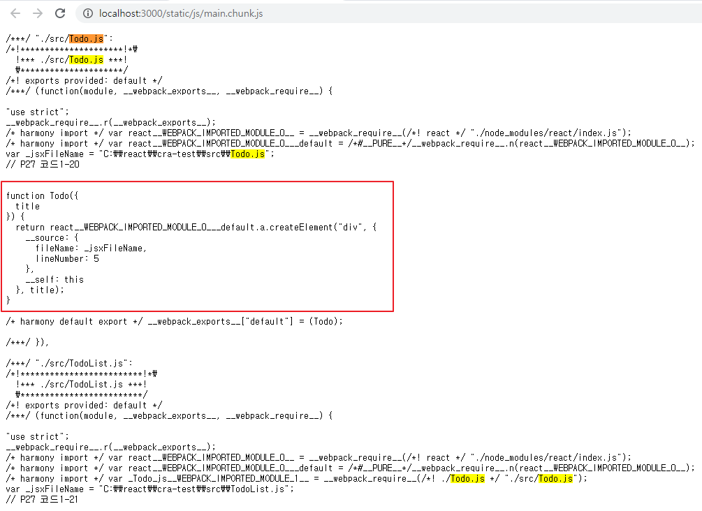
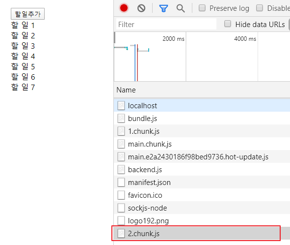

# react

2일

## create-react-app

### 코드 분할하기

#### 코드 분할하지 않고 사용

react.js, react-dom.js, index.js, App.js, TodoList.js, Todo.js 등이 하나의 파일(main.chunck.js)로 묶여서 내려옴 -> 첫 화면 로딩에 부하가 발생 -> 불필요한 부하를 줄이기 위해 코드 분할이 필요


##### C:\react\cra-test\src\Todo.js

```html
import React from 'react'; // react모듈 가지고 오는 것
// import { React } 중괄호를 해야하는데 default 해 놓으면 안해도 됨 from 'react' // react모듈 가지고 오는 것


export function Todo ({ title }) {
    return <div>{title}</div>;
}

/*
function Todo ({ title }) {
    return <div>{title}</div>;
}

export default Todo;

위 아래 동일한 의미인데 오류 남

export function 으로 써라
*/
```


##### C:\react\cra-test\src\TodoList.js

```html
import React, { Component } from 'react';

class TodoList extends Component {
    // 상태 변수 = 해당 컴포넌트 내에서 사용(유지)되는 값
    //state는 키워드
    state = { //객체 선언!
        todos: [], // todos 는 객체 이름!, []는 객체 값, todos는 배열을 갖음
    };
    onClick = () => {
        import('./Todo.js').then(({ Todo }) => {
            const { todos } = this.state;
            const position = todos.length + 1;
            const newTodo = <Todo key={position} title={`할 일 ${position}`} />;
            this.setState({ todos: [...todos, newTodo] });
        });
    };

    //render 는 리액트 컴포넌트에 정의돼 있는 함수
    render () {
        const { todos } = this.state;
        return (
            <div>
                <button onClick={this.onClick}>할 일 추가</button>
                {todos}
            </div>
        );
    }
}

export default TodoList;

/* onClick은 함수이기 때문에 아래
<button onClick={this.doClick}처럼 바꿀 수 있다.
        그럼 위에 doClick = () =>   {} 로
</button>*/
///////////////////////////////////////////////////////////////////////////
import React, { Component } from 'react';
import Todo from './Todo.js';

class TodoList extends Component {
    // 상태 변수 = 해당 컴포넌트 내에서 사용(유지)되는 값
    //state는 키워드
    state = { //객체 선언!
        todos: [], // todos 는 객체 이름!, []는 객체 값, todos는 배열을 갖음
    };

    doClick = () => {
        const { todos } = this.state;
        const position = todos.length + 1;
        const newTodo = <Todo key={position} title={`할 일 ${position}번째`} />;
        this.setState({ todos: [...todos, newTodo] });
    };

    // onClick = () => {
    //     import('./Todo.js').then(({ Todo }) => {
    //         const { todos } = this.state;
    //         const position = todos.length + 1;
    //         const newTodo = <Todo key={position} title={`할 일 ${position}`} />;
    //         this.setState({ todos: [...todos, newTodo] });
    //     });
    // };

    //render 는 리액트 컴포넌트에 정의돼 있는 함수
    render () {
        const { todos } = this.state;
        return (
            <div>
                <button onClick={this.doClick}>할 일 추가</button>
                {todos}
            </div>
        );
    }
}

export default TodoList;
```


##### C:\react\cra-test\src\App.js

```html
import React from 'react';
import TodoList from './TodoList';

function App() {
  return (
    <div className="App">
      <TodoList />
    </div>
  );
}

export default App;
```


크롬 개발자도구의 Network 탭에서 확인 가능

---



---



---


#### 코드 분할을 통해서 동적으로 자바스크립트 파일을 로딩

C:\react\cra-test\src\TodoList.js

```javascript
// P27 코드1-21
import React, { Component } from 'react';
// import Todo from './Todo.js';
class TodoList extends Component {
    state = { 
        todos: [], 
    };

    doClick = () => {
        import('./Todo.js').then(({ Todo }) => {
            const { todos } = this.state;
            const position = todos.length + 1;
            const newTodo = <Todo title={`할 일 ${position}`} />;
            this.setState({ todos: [...todos, newTodo]});
        });
    };

    render() {
        const { todos } = this.state;
        return (
            <div>
                <button onClick={this.doClick}>할일추가</button>
                {todos}
            </div>
        );
    }
}
```

main.chunck.js 파일에 Todo.js 파일의 본문이 포함되지 않음

"할일추가" 버튼을 클릭하면 2.chunck.js 파일(Todo.js 파일의 본문 내용을 포함)이 내려옴

2.chunck.js 파일은 최초 한번만 다운로드

## 2.2 객체와 배열의 사용성 개선

### 객체와 배열을 간편하게 생성하고 수정하기

 `객체와 배열에 추가된 새로운 문법` 

#### 단축 속성명

> 객체 리터럴 코드를 간편하게 작성할 목적으로 만들어진 문법

```html
<script>
    // 단축 속성명
    const name = 'mike';
    const obj_new = {
        age : 21,
        name, // 객체의 속성값이 변수로 존재하면 간단하게 변수 이름만 기술
        getName() {return this.name;},
    }

    console.log(obj_new.getName()); // mike
    console.log(obj_new.name); // mike
    // name이 정의 돼 있지 않으면 name = '' 이고,  name이 위에 정의 돼 있지 않으면 오류발생.
</script>

```

---

```html
// 단축 속성명을 사용하지 않은 코드와 사용 한 코드
<script>

{
    function makePerson_old(age, name) {
        return {age: age, name: name};
    }
    console.log(makePerson_old(12, 'mike')); // {age: 12, name: "mike"}

    function makePerson_new(age, name) {
        return {age, name};
    }
    console.log(makePerson_new(12, 'mike')); // {age: 12, name: "mike"}
}

</script>
```

---

```html
<script>
// 콘솔 로그 출력시 단축 속성명 활용
{
    const name = 'John';
    const age = 21;
    console.log('name =', name, 'age =' , age); // name = John age = 21

    console.log({ name, age }); // {name: "John", age: 21}
}
</script>
```

---

#### 계산된 속성명

> 객체의 속성명을 동적으로 결정하기 위해 나온 문법

```html
<script>
{
    function makeObject_unused(key, value) {
        const obj = {};
        obj[key] = value;
        return obj;
    }

    function makeObject_used(key, value) {
        return { [key] : value };
    }

    console.log(makeObject_unused("name", "John")); // {name: "John"}
    console.log(makeObject_used("name", "John")); // {name: "John"}

    let i = 0;
    let obj = {
        ["val" + i++ ] : i,
        ["val" + i++ ] : i,
        ["val" + i++ ] : i,
    };
    console.log(obj.val0, obj.val1, obj.val2); // 1,2,3

    let param = 'size';
    let config = {
        [param]: 12,
        ["mobile" + param.charAt(0).toUpperCase() + param.slice(1)]: 4
    };
    console.log(config); // {size: 12, mobileSize: 4}
}
</script>
```

#### 전개 연산자

> 배일이나 객체의 모든 속성을 풀어놓을 때 사용하는 문법

```html
<script>
{
    // 전개 연산자를 이용해서 함수의 매개변수를 입력
    console.log(Math.max(1,3,7,9)); // 9

    const numbers = [ 1, 3, 7, 9];
    //Math.max(numbers); // 안됨, max는 배열을 받아 들일 수 없기 때문에.
    console.log(Math.max(...numbers)); // 9
}

// 전개 연산자를 이용해서 배열과 객체를 복사
{
    let arr1 = [ 1, 2, 3 ];
    let arr2 = [ ...arr1 ];
    let arr3 = arr1;

    console.log(arr1); 
    console.log(arr2); 
    console.log(arr3); // 동일한 결과 (3) [1, 2, 3]
    
    arr1[0] = 10;
    console.log(arr1); // (3) [10, 2, 3]
    console.log(arr2); // (3) [1, 2, 3] 깊은 복사
    console.log(arr3); // (3) [10, 2, 3] 얕은 복사

    let obj1 = { age: 23, name: "Mike" };
    let obj2 = { ...obj1 };
    let obj3 = obj1

    console.log(obj1); 
    console.log(obj2);
    console.log(obj3); // 동일한 결과 {age: 23, name: "Mike"}

    obj1["age"] = 30;
    console.log(obj1); 
    console.log(obj2); // {age: 23, name: "Mike"} 깊은복사
    console.log(obj3); // {age: 30, name: "Mike"} 

}
</script>
```

---

```html
<script>
// 배열에서 전개 연산자를 사용하면 배열 요소의 순서가 유지

{
    console.log( [1, ...[2, 3], 4]); // 1, 2, 3, 4 
    console.log(new Date(...[2020, 0, 12])); // Sun Jan 12 2020 00:00:00 GMT+0900 (한국 표준시)
    console.log(new Date(2020, 0, 12)); // Sun Jan 12 2020 00:00:00 GMT+0900 (한국 표준시)
    
    let today = [ 2020, 0, 12 ];
    console.log(new Date(today[0], today[1], today[2])); // Sun Jan 12 2020 00:00:00 GMT+0900 (한국 표준시)
    console.log(new Date(...today)); // Sun Jan 12 2020 00:00:00 GMT+0900 (한국 표준시)

}

// 전개 연산자를 이용한 두 개체 병합

{
    const obj1 = { age: 21, name: "Mike" };
    const obj2 = { hobby: 'soccer' };
    const obj3 = { ...obj1, ...obj2 };
    console.log(obj3); // {age: 21, name: "Mike", hobby: "soccer"}
    console.log(obj1 + obj2); // [object Object][object Object]

}

// 객체 리터럴에서 중복된 속성명 사용이 가능

{
    const obj1 = { x: 1, x: 2, y: 'a' };
    console.log(obj1); // {x: 2, y: "a"} 객체에서 속성명이 동일하면 뒤에 정의되는 속성명이 남는다.

    obj1["x"] = 3;
    obj1["z"] = 4;
    console.log(obj1); // {x: 3, y: "a", z: 4}

    const obj2 = { ...obj1, y: 'b' };
    console.log(obj2); // {x: 3, y: 'b', z: 4} {x: 3, y: "b", z: 4}
    // 객체의 특정한 요소의 값만 바꿀 때 사용
    
}
</script>
```

#### 배열 비구조화

> 배열의 여러 속성값을 변수로 쉽게 할당할 수 있는 문법
>
> 인덱스

```html
<script>
    // 배열 비구조화
{
    const arr = [ 1, 2 ];
    const [ a, b ] = arr;
    /* 예전 방법
    const [c] = arr[0];
    const [d] = arr[1];
    */
    console.log(a); // 1
    console.log(b); // 2
    //onsole.log(c); 
    //console.log(d); 

}

// 배열 비구조화를 이용한 변수 값 할당
{
    let a, b;
    console.log(a, b); // undefined, undefined 

    /* 예전 방법
    a = 0;
    b = 1;
    */
    [ a, b ] = [ 0, 1 ];
    console.log(a, b); // 0, 1

}

// 배열 비구조화를 이용한 기본값 설정
{
    const arr = [ 1 ];
    
    const [ a = 10, b ] = arr;
    console.log(a); // 1
    console.log(b); // undefined

    const [ c = 10, d = 20 ] = arr;
    console.log(c); // 1
    console.log(d); // 20
    
}

// 배열 비구조화를 이용한 값 교환
{
    let a = 10;
    let b = 20;

    // a, b의 값을 교환
    /* 과거
    let temp = a;
    a = b;
    b = temp;
    console.log(a, b); // 20 , 10
    */
   [ a, b ] = [ b, a ]; // 변 수 = 값
   console.log( a, b ); // 20 , 10
}

</script>
```

```html
<script>
    // 배열 비구조화
{
    const arr = [ 1, 2 ];
    const [ a, b ] = arr;
    /* 예전 방법
    const [c] = arr[0];
    const [d] = arr[1];
    */
    console.log(a); // 1
    console.log(b); // 2
    //onsole.log(c); 
    //console.log(d); 

}

// 배열 비구조화를 이용한 변수 값 할당
{
    let a, b;
    console.log(a, b); // undefined, undefined 

    /* 예전 방법
    a = 0;
    b = 1;
    */
    [ a, b ] = [ 0, 1 ];
    console.log(a, b); // 0, 1

}

// 배열 비구조화를 이용한 기본값 설정
{
    const arr = [ 1 ];
    
    const [ a = 10, b ] = arr;
    console.log(a); // 1
    console.log(b); // undefined

    const [ c = 10, d = 20 ] = arr;
    console.log(c); // 1
    console.log(d); // 20
    
}

// 배열 비구조화를 이용한 값 교환
{
    let a = 10;
    let b = 20;

    // a, b의 값을 교환
    /* 과거
    let temp = a;
    a = b;
    b = temp;
    console.log(a, b); // 20 , 10
    */
   [ a, b ] = [ b, a ]; // 변 수 = 값
   console.log( a, b ); // 20 , 10
}

// 쉼표를 이용해서 일부 속성값을 건너뛸 수 있음

{
    const arr = [ 1, 2, 3, 4 ];
    // let a = arr[0];
    // let b = arr[2];

    const [ a, , b ] = arr;
    console.log(a); // 1
    console.log(b); // 3
}

// 나머지 값을 별도의 배열로 만들기
{
    const arr = [ 1, 2, 3 ];
    const [ first, ...rest ] = arr;

    console.log(first); // 1
    console.log(rest); // [ 2, 3 ]

    const [ a, b, c, ...rest2 ] = arr;
    console.log(rest2); // []
}
</script>
```


#### 객체 비구조화

> 객체의 여러 속성값을 변수로 쉽게 할당할 수 있는 문법
>
> 속성 이름

```html
<script>
    // 객체 비구조화에서는 속성이름이 중요
    // 속성 이름과 변수 이름이 같아야 한다.

{
    const obj1 = { age: 21, name: 'Mike' };
    // const obj2 = { age: 22, name: 'John' };
    
    const { age, name } = obj1;
    console.log(age); // 21
    console.log(name); // Mike
}

    // 배열은 인덱스를 기준으로 움직이기 때문에 차곡차곡 쌓이지만,
    // 객체는 이름을 단위로 쌓임

{
    const obj1 = { age: 21, name: 'Mike' };
    // const obj2 = { age: 22, name: 'John' };
    
    const { name, age } = obj1;
    console.log(age); // 21
    console.log(name); // Mike
}

    // 이름이 같지 않으면 맵핑되지 않는다. 변수명을 임의로 가지고 갈 수 없다

{
    const obj1 = { age: 21, name: 'Mike' };
    // const obj2 = { age: 22, name: 'John' };
    
    const { a, b } = obj1;
    console.log(a); // undefined
    console.log(b); // undefined
}

    // 객체 비구조화에서 별칭 사용
{
    const obj1 = { age: 21, name: 'Mike' };
    // const obj2 = { age: 22, name: 'John' };
    
    const { age: a, name: b } = obj1;
    console.log(a); // 21
    console.log(b); // Mike
}

{
    const obj1 = { age: 21, name: 'Mike' };
    // const obj2 = { age: 22, name: 'John' };
    
    const { name: b, age: a } = obj1;
    console.log(a); // 21
    console.log(b); // Mike
}

// 객체 비구조화에서 기본값 설정
{
    const obj = { age: undefined, name: null, grade: 'A' };
    const { age = 0, name = 'noname', grade = 'F' } = obj;
    console.log(age); // 0
    console.log(name); // null
    console.log(grade); // 'A'
}

// 기본값과 별칭을 동시에 사용
{
    const obj = { age: undefined, name: 'Mike' };
    const { age : newAge = 0, name } = obj;
    // console.log(age); // Error
    console.log(newAge); //0
}

// 함수를 이용한 기본값
{
    function getDefaultAge() {
        return 0;
    }

    const obj1 = { age: 21, grade: 'A' };
    const { age = getDefaultAge(), grade } = obj1;
    console.log(age); //21
    console.log(grade); // A
}
{
    function getDefaultAge() {
        return 0;
    }

    const obj1 = { age: undefined, grade: 'A' };
    const { age = getDefaultAge(), grade } = obj1;
    console.log(age); // 0
    console.log(grade); // A
}

// 객체 비구조화에서 나머지 속성들을 별도의 객체로 생성
{
    const obj = { age: 21, name: 'Mike', grade: 'A' };
    const { age, ...rest } = obj;
    console.log(rest); // {name: "Mike", grade: "A"}
}
// 배열보다 더 쉬움
{
    const obj = { age: 21, name: 'Mike', grade: 'A' };
    const { name, ...rest } = obj;
    console.log(rest); // {name: "Mike", grade: "A"}
}

// for 문에서 객체 비구조화를 활용
{
    const people = [
        { age: 21, name: "Mike" },
        { age: 22, name: "John" },
    ];
    /* 과거
    for (i of people) {

        console.log(i.age, i.name); // 21 "Mike"
        console.log(i["age"], i["name"]);                // 22 "John"
    }

    for (i of people) {
        let age = i.age;
        let name = i.name;
        console.log(age, name);
    }
    */
    for ({ age, name } of people) {
        console.log(age, name);
    }
}
</script>
```


#### 비구조화 심화학습

```html
<script>
    // 중첩된 객체의 비구조화
{
    const obj = { name: "Mike", mother: { name: "Sara"} };
    const { name, mother: { name: motherName } } = obj;
    console.log(name); // Mike
    console.log(motherName); // Sara
}

{
    const obj = { name: "Mike", mother: { name: "Sara"} };
    const { name, mother} = obj;
    console.log(name); // Mike
    console.log(mother["name"]); // Sara
}

{
    const obj = { name: "Mike", mother: { motherName: "Sara"} };
    const { name, mother : {motherName}} = obj;
    console.log(name); // Mike
    console.log(motherName); // Sara
}

    //비구조화에서 기본값은 변수 단위가 아니라 패턴 단위로 적용
{
    const [ { prop: x1 } = { prop: 123} ] = []; // 뒤 prop는 초기값 
    console.log(x1); // 123
}

{
    const [ { prop: x1 } = { prop: 123} ] = [ { } ]; // 배열 안에 {}객체가 있어 초기화 값이 작동하지 않아 prop: x1이 undefined가 된다.  
    console.log(x1); // undefined
}

    // 객체 비구조화에서 계산된 속성명을 사용
    // 객체 비구조화에서 계산된 속성명을 사용할 때는 반드시 별칭을 입력해야 함
{
    const index = 1;
    // const { key1 } = { key1: 123 };
    const { [`key${index}`]: valueOfTheIndex } = { key1: 123};
    console.log(valueOfTheIndex);
}

    // 별칭을 이용해서 다른 객체와 배열의 속성값 할당
{
    const obj = {};
    const arr = [];
    const res = { foo: obj.prop, bar: arr[0] } = { foo: 123, bar: true };
    console.log(obj); // { prop: 123}
    console.log(arr); // [ true ]
    console.log(res); // {foo: 123, bar: true}
}    
</script>
```


## 2.3 강화된 함수의 기능

### 2.3.1 매개변수에 추가된 기능

```html
<script>
// 매개변수 기본값 설정
{
    function printLog(a = 1) {
        console.log(a);
        console.log({ a }); // 단축 속성명
    }
    printLog(); // 1 <= 매개변수의 기본값이 사용
                // {a: 1} <= a라는 속성 이름, 단축 속성명
    printLog(2); // 2
                // {a: 2} <= a라는 속성 이름, 단축 속성명
}

// 매개변수 기본값으로 함수 호출
{
    function getDefault() {
        return 1;
    }
    function printLog(a = getDefault()) {
        console.log({ a });
    }
    printLog(); // { a: 1 }
    printLog(2); // { a: 2 }
}

// 매개변수 기본값을 이용해서 필수입력 여부를 표현
{
    function required() {
        throw new Error('필수입력입니다.');
    }
    function printLog(a = required()) {
        console.log({ a });
    }
    printLog(2); // { a: 2 }
    printLog(); // Uncaught Error: 필수입력입니다.
}


</script>
```


#### 나머지 매개변수

> 입력된 인수 중에서 정의된 매개변수 개수만큼을 제외한 나머지를 배열로 만들어 준다.

```html
<script>
// 나머지 매개변수를 사용하는 코드
{
    function printLog(a, ...rest) {
        console.log({ a, rest });
    }
    printLog(1, 2); // {a: 1, rest: [2]}
    printLog(1, 2, 3); // {a: 1, rest: [2, 3]}
    printLog(1, 2, 3, 4); // {a: 1, rest: [2, 3, 4]}
}

// arguments 키워드를 이용해서 구현
{
    function printLog() {
        let a = Array.from(arguments).slice(0, 1);
        let rest = Array.from(arguments).slice(1);
        console.log({ a, rest });
    }
    printLog(1, 2); // {a: 1, rest: [2]}
    printLog(1, 2, 3); // {a: 1, rest: [2, 3]}
    printLog(1, 2, 3, 4); // {a: 1, rest: [2, 3, 4]}
}
</script>
```


#### 명명된 매개변수

> 비구조화를 이용해서 구현
>
> 함수 호출 시 매개변수의 이름과 값을 동시에 적을 수 있으므로 가독성이 높다.

```html
<script>
// 명명된 매개변수의 사용 여부에 따라서 가독성이 달라짐
{
    const numbers = [ 10, 20, 30, 40 ];

     const result1 = getValues(numbers, 5, 25); // getValues가 뭐하는 앤지 모름 아래처럼 쓰면 가독성이 좋아짐
    const result2 = getValues({ numbers, greaterThan: 5, lessThan: 25 }); //이러한 방식을 명명된 매개변수
}

// 명명된 매개변수를 사용하면 사용하지 않는 매개변수를 생략하는 것도 가능
{
    const result1 = getValues(number, undefined, 25);
    const result2 = getValues({ number, greaterThan: 5 });
    const result3 = getValues({ number, lessThan: 25 });
}
</script>
```


### 2.3.2 화살표 함수 : 함수를 정의하는 새로운 방법

```html
<script>
{
    // 함수 표현식을 이용한 함수 정의 (익명함수)
    const add1 = function (a, b) { return a+b; };

    //화살표 함수
    const add2 = (a, b) => { return a+b; };

    // 화살표 함수에서 중괄호로 감싸지 않으면 화살표 오른쪽의 계산 결과를 반환
    const add3 = (a,b) => a + b;

    console.log(add1(1,2)); //3
    console.log(add2(1,2)); //3
    console.log(add3(1,2)); //3

    // 매개변수가 하나이면 매개변수를 감싸고 있는 소괄호도 생략이 가능
    const add5 = a => a+5;
    console.log(add5(10)); // 15

    // 객체를 반환하는 경우 소괄호로 감싸야 함
    const addAndReturnObject = (a, b) => ({ result: a + b }); // ({ }) 객체로 반환하는 애() 로 감싸야 함
    console.log(addAndReturnObject(10,20)); // {result: 30} 
    console.log(addAndReturnObject(10,20).result); // 30 
}

    // 화살표 함수의 코드가 여러 줄인 경우
    //전체를 중괄호로 묶고, 반환값에는 return 키워드를 사용

{
    const add = (a, b) => {
        if (a <=0 || b <= 0) {
            throw new Error ("양수만 입력하세요");
        }
        return a+b;
    };
    console.log(add(10, 20)); // 30
}

// 화살표 함수에서 나머지 매개변수를 사용
// 화살표 함수는 일반 함수와 달리 this와 arguments가 바인딩되지 않음

{
    const obj = {
        value1: 1,
        value2: 1,
        increase: function() {
            if (this.value1 !== undefined)
                this.value1 ++;
            else
                this.value1 = 1;
        },
        add: () => {
            console.log(this);
            if (this.value2 !== undefined)
                this.Value2 ++;
            else
                this.value2 = 1;
        }
    };

    obj.increase();
    console.log(obj.value1) // 2

    const increase = obj.increase;
    increase();
    console.log(obj.value1); // 2
    console.log(globalThis,value1); // 1

    obj.increase();
    increase();
    console.log(obj.value1); // 3
    console.log(globalThis,value1); // 2

    console.log('------------------------------------------');

    obj.add();
    console.log(obj.value2); // 1

    const add = obj.add;
    add();
    console.log(obj.value2); // 1
    console.log(globalThis.value2);  //2

    obj.add();
    add();
    console.log(obj.value2); // 1
    console.log(globalThis.value2);  //4

}
</script>


```

```html
<script>
//  화살표 함수에서 나머지 매개변수를 사용
//  화살표 함수는 일반 함수와 달리 this와 arguments가 바인딩되지 않음
//  ⇒ P71 일반 함수에서 this는 호출 시점에 사용된 객체로 바인딩
//  객체에 정의된 일반함수를 다른 변수에 할당해서 호출하면 버그가 발생할 수 있다
{
    const obj = {
        value1: 1, 
        value2: 1, 
        increase: function() {
            console.log(this);
            if (this.value1 !== undefined)
                this.value1 ++;
            else 
                this.value1 = 10;
        }, 
        add: () => {
            console.log(this);
            if (this.value2 !== undefined)
                this.value2 ++
            else 
                this.value2 = 10;
        }
    };

    console.log('-----------------');

    console.log(obj.value1);            // 1
    console.log(globalThis.value1);     // undefined

    obj.increase();
    console.log(obj.value1);            // 2
    console.log(globalThis.value1);     // undefined

    const increase = obj.increase;
    increase();
    console.log(obj.value1);            // 2
    console.log(globalThis.value1);     // 10 초기화

    obj.increase();
    increase();
    console.log(obj.value1);            // 3
    console.log(globalThis.value1);     // 11

    console.log('-----------------');

    console.log(obj.value2);            // 1
    console.log(globalThis.value2);     // undefined

    obj.add();
    console.log(obj.value2);            // 1
    console.log(globalThis.value2);     // 10

    const add = obj.add;
    add();
    console.log(obj.value2);            // 1
    console.log(globalThis.value2);     // 11

    obj.add();
    add();
    console.log(obj.value2);            // 1
    console.log(globalThis.value2);     // 13
}
</script>
```


##### 생성자 함수 내부에서 정의된 화살표 함수의 this

```html
<script>
{
    function Something () {
        this.value = 1;
        this.increase = () => this.value ++ ;
    }

    const obj = new Something();
    obj.increase();
    console.log(obj.value);     // 2

    const increase = obj.increase;
    increase();
    console.log(obj.value);     // 3
}
</script>
```


#### setInterval 함수 사용 시 this 바인딩 문제

```html
<script>
{
    function Something1() {
        this.value = 1;
        setInterval( // setInterval 이 전역에서 시작되기 때문에 여기 아래 this가 global this가 됨
            function increase() {
                this.value ++;

                console.log(this.value);
            },
            1000
        );
    }

    const obj1 = new Something1();

}
</script>
```

아래처럼 해결

```html
<script>
{
    function Something1() {
        this.value = 1;
        setInterval( // setInterval 이 전역에서 시작되기 때문에 여기 아래 this가 global this가 됨
            function increase() {
                if (this.value !== undefined)
                    this.value ++;
                else
                    this.value ++;
                console.log(this.value);
            },
            1000
        );
    }

    const obj1 = new Something2();

    function Something2() {
        this.value = 1;
        let that = this;
        setInterval(
            function increase() {
                that.value ++;
                console.log(that.value);
            },
            1000
        );
    }

    const obj2 = new Something2();

    function Something3() {
        this.value = 1;
        setInterval(
            () => {
                this.value ++;
                console.log(this.value);
            },
            1000
        );
    }

    const obj3 = new Something3();
}
</script>
```


## 2.4 프로미스

> 비동기 상태를 값으로 다룰 수 있는 객체
>
> 프로미스 이전에는 콜백 패턴을 많이 사용

프로미스 상태

* 대기중(pending) : 결과를 기다리는 상태
* 이행됨(fulfilled) : 수행이 정상적으로 끝났고 결과값을 갖고 있는 상태
* 거부됨(rejected) : 수행이 비정상적으로 끝난 상태
* 이행됨, 거부됨 상태를 처리됨(settled) 상태라고 함


프로미스는 처리됨(settled) 상태가 되면 더 이상 다른 상태로 변경되지 않으며, 대기중 상태에서만 이행됨, 거부됨 상태로 변경될 수 있다.

```html
<script>
 // 프로미스를 생성하는 방법
 // new 키워드를 사용해서 프로미스를 생성하는 방법
 // 이렇게 생성된 프로미스는 대기중 상태가 됨
 // 생성자에 입력된 함수는 resolve와 reject라는 콜백 함수를 매개변수로 가지며,
 // 비동기로 작업 수행 후 성공했을 때 resolve를 호출하고, 실패했을 때 reject를 호출

    const p1 = new Promise((resolve, reject) => {
     // ...
     // resolve(data) or reject('error message')
 });

    // new 키워드를 사용하지 않고, Promise.reject를 호출하면 거부됨 상태의 프로미스가 생성
    const p2 = Promise.reject('error message');

    // Promise.resolve를 호출해도 프로미스가 생성
    // 입력값이 프로미스이면 그 객체가 그대로 반환되고,
    // 프로미스가 아니라면 이행됨 상태의 프로미스가 반환
    const p3 = Promise.resolve(param);
</script>

```


```html
<script>
    //  p77 Promise.resolve 반환값
    //  Promise.resolve 입력값이 프로미스가 아니면 이행된 상태의 프로미스가 반환
    const p1 = Promise.resolve(123);
    console.log(p1); // Promise {<resolved>: 123}
    
    // Promise.resolve 입력값이 프로미스이면, 그 객체가 그대로 반환
    const p2 = new Promise(resolve => setTimeout(() => resolve(10), 1));
    console.log(Promise.resolve(p2) === p2); // true
    console.log(p2); // Promise {<pending>}
</script>
```


#### 프로미스 이용하기 1: then

```html
<script>
    //  p77 프로미스 이용하기 : then
    //프로미스가 처리됨 상태가 되면 then 메서드의 인수로 전달된 함수가 호출된다.

    const p1 = Promise.resolve(123).then(data => console.log("#1", data));  // (3) #1 123
    console.log(p1 !== 123);    //  (1) true
    console.log(p1);    //  (2) Promise {<pending>}

    p1.then(data => console.log("#1-1", data)); //  (4) #1-1 undefined

</script>
```


