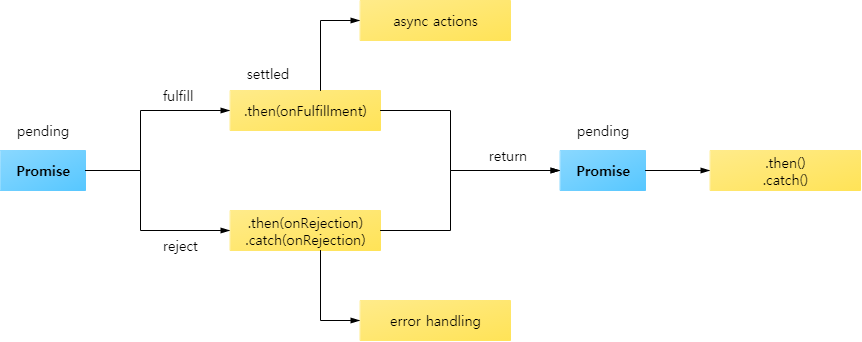
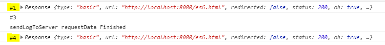
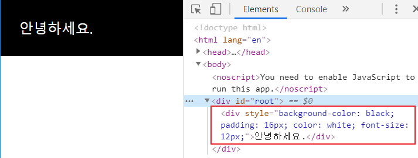

# react

3일

  

## 2.4 프로미스

### 프로미스 생성

```html
<script>
 // 프로미스를 생성하는 방법
 // new 키워드를 사용해서 프로미스를 생성하는 방법
 // 이렇게 생성된 프로미스는 대기중 상태가 됨
 // 생성자에 입력된 함수는 resolve와 reject라는 콜백 함수를 매개변수로 가지며,
 // 비동기로 작업 수행 후 성공했을 때 resolve를 호출하고, 실패했을 때 reject를 호출

    const p1 = new Promise((resolve, reject) => {
     // ...
     // resolve(data) or reject('error message')
 });

    // new 키워드를 사용하지 않고, Promise.reject를 호출하면 거부됨 상태의 프로미스가 생성
    const p2 = Promise.reject('error message');

    // Promise.resolve를 호출해도 프로미스가 생성
    // 입력값이 프로미스이면 그 객체가 그대로 반환되고,
    // 프로미스가 아니라면 이행됨 상태의 프로미스가 반환
    const p3 = Promise.resolve(param);
</script>
```


### 프로미스 이용하기 1: then

```html
<script>
    const p1 = Promise.resolve(123);
    console.log( p1 === 123); // false
    console.log(p1); // Promise {<resolved>: 123}

    const p2 = new Promise(
        resolve => { setTimeout(() => resolve('1초 경과'), 1000) } // resolve의 함수 본문
        ); 
    console.log(p2 === Promise.resolve(p2)); // true
    console.log(p2); // Promise {<pending>}
    p2.then(data => {
        console.log(p2); // Promise {<resolved>: "1초 경과"}
        console.log(data); // '1초 경과'
    }); 
</script>
```


```html
<script>
// {
// Promise.reject("error message")
//     .then(() => console.log("#1"))
//     .then(() => console.log("#2"))
//     .then(() => console.log("#3-1"), () => console.log("#3-2"))
//     .then(() => console.log("#4-1"), () => console.log("#4-2"));
// }

// {
//     Promise.reject("error message")
//     .then(() => console.log("#1"))
//     .then(() => console.log("#2"))
//     .then(() => console.log("#3-1"), (data) => console.log("#3-2" , data))
//     .then((data) => console.log("#4-1", data), () => console.log("#4-2"));
// }

// {
//     Promise.reject("error message")
//     .then(() => console.log("#1"))
//     .then(() => console.log("#2"))
//     .then(
//         () => console.log("#3-1"),
//         (data) => {
//             console.log("#3-2" , data);
//             return "hello";
//         }
//     )
//     .then((data) => console.log("#4-1", data), () => console.log("#4-2"));
// }

{
    Promise.resolve(100)
    .then((data) => {
        console.log("#1", data);
        data += 100;
        return data;
    })
    .then((data) => {
        console.log("#2", data);
        data += 100;
        return data
    })
    .then((data) => {
        console.log("#3", data);
        return Promise.reject("error");
        }
    )
    .then(null, (data) => console.log("#4", data));
}
</script>
<!-- #3-2, #4-1 위 #1, #2 -->
```


### 프로미스 이용하기 2:catch

#### 예제1

```html
<script>
// {   // 예외 처리를 catch 구문을 이용해야하는 이유
//     // 1. 가독성이 좋다
//     Promise.reject("error1").then(null, reject => console.log(reject) ); // error1
//     Promise.reject("error2").catch(error => console.log(error) ); // error2

//     // 2. resolve 함수 내에서 발생하는 예외를 처리
//     Promise.resolve("data")
//         .then(
//             (data) => {
//                 console.log("#1", data);
//                 throw new Error("Error Occured"); // Uncaught (in promise) Error: Error Occured
//             },
//             (data) => {
//                 console.log("#2", data);
//             }
//         );

// }
//     // #3 나오게 하려면 then 한번 더 써줌
// {
//     Promise.resolve("data")
//         .then(
//             (data) => {
//                 console.log("#1", data);
//                 throw new Error("Error Occured"); // Uncaught (in promise) Error: Error Occured
//             },
//             (data) => {
//                 console.log("#2", data);
//             }
//         )
//         .then(
//             null,
//             (data) => {
//                 console.log("#3", data); // #3 Error: Error Occured
//             }
//         )

// }

// resolve 함수 내에서 catch로 간단하게 사용
{
    Promise.resolve("data")
        .then(
            (data) => {
                console.log("#1", data);
                throw new Error("Error Occured"); // Uncaught (in promise) Error: Error Occured
            }
        )
        .catch(data => console.log("#4", data));

}
</script>
```

#### 예제2

```html	
<script>
    Promise.reject(10)
        .then(data => {
            console.log("then1", data);
            return 20;
        })  // reject 안 탐
        .catch(data => {
            console.log("catch", data);
            return 30;
        }) // catch 10
        .then(data => {
            console.log("then2", data);
        }); // then2 30
</script>
```


### 프로미스 이용하기 3: finally

finally 메서드는 프로미스 체인의 가장 마지막에 사용된다.

이전에 사용된 프로미스를 그대로 반환한다는 점이 다르다.

(then은 새 프로미스 생성, finally는 생성 X)


```html
<script>
{
    // p80, finally 메소드 : 더 이상 Promise를 생성하지 않음
    function sendLogToServer(msg) {
        console.log("sendLogToServer", msg);
    }

    function requestData() {
        let url = "http://localhost:8080/es6.html";
        return fetch(url)
            .then(resolve => {
                console.log("#1", resolve);
                return resolve;
            })
            .catch(error => {
                console.log("#2", error)
                return error;
            })
            .finally(() => {
                console.log("#3");
                sendLogToServer("requestData Finished");
            });
    }

    requestData().then(resolve => console.log("#4", resolve));
}
</script>
```



then으로 쓰려면,

```html
.then(data => {
                console.log("#3");
                sendLogToServer("requestData Finished");
                return data;
            });
```


### 병렬로 처리하기: Promise.all

```html
<script>
    // 의존관계가 있는 업무는 순차적으로 비동기 처리
    // requestData1() 업무가 끝나야 requestData2() 업무를 처리할 수 있는 경우
    // 예) 데이터를 가져와야 데이터를 파싱할 수 있다.
// {
//     function requestData1() {
//         return Promise.resolve("requestData1 called");
//     }
//     function requestData2() {
//         return Promise.reject("requestData2 called");
//     }

//     requestData1()
//         .then(data => {
//             console.log("#1", data);
//             return requestData2();
//         })
//         .then(data => {
//             console.log("#2", data);
//         })
//         .catch(error => {
//             console.log("ERROR", error)
//         });
// }
/* 위 코드 결과
#1 requestData1 called
ERROR requestData2 called
*/

    // 의존관계가 없는 업무는 병렬로 처리
{
    function requestData1() {
        return Promise.resolve("requestData1 called");
    }
    function requestData2() {
        return Promise.reject("requestData2 called");
    }

    requestData1().then(data => console.log("#1", data), error => console.log("#2", error));
    requestData2().then(data => console.log("#3", data), error => console.log("#4", error));


    Promise.all([requestData1(), requestData2()])
        .then(([data1, data2]) => {
            console.log("#1", data1, data2);
        }, ([data1, data2]) => {
            console.log("#2", data1, data2);
        })
        .then(
            () => console.log("모든 프로미스가 처리된 상태"),
            () => console.log("프로미스 중 하나 이상이 거부된 상태")
        )
}
/* 위 코드 결과
#1 requestData1 called
#4 requestData2 called
프로미스 중 하나 이상이 거부된 상태

#1 requestData1 called
#4 requestData2 called
#2 r e
모든 프로미스가 처리된 상태
*/


</script>
```


## 리액트를 다루는 기술

리액트를 다루는 기술[**https://velopert.com/3613**](https://velopert.com/3613)

**#1 create-react-app을 이용해서 프로젝트 생성**

c:\react>create-react-app hello-react2

c:\react>cd hello-react2

c:\react\hello-react2>npm start

http://localhost:3000 ⇐ 브라우저를 통해서 확인


**c:\react\hello-react2\src\App.js**

```javascript
import React from 'react';
import logo from './logo.svg';
import './App.css';

<!-- 함수 형태로 컴포넌트를 선언 -->

function App() {
  return (
    <div className="App">
      <header className="App-header">
        
        <p>
          Edit <code>src/App.js</code> and save to reload.
        </p>
        <a
          className="App-link"
          href="https://reactjs.org"
          target="_blank"
          rel="noopener noreferrer"
        >
          Learn React
        </a>
      </header>
    </div>
  );
}

export default App;

<!-- 클래스 형태로 컴포넌트를 선언 => render 함수를 포함 -->
import React from 'react';
import logo from './logo.svg';
import './App.css';

class App extends React.Component {
  render() {
    return (
      <div className="App">
        <header className="App-header">
          
          <p>
            Edit <code>src/App.js</code> and save to reload.
          </p>
          <a
            className="App-link"
            href="https://reactjs.org"
            target="_blank"
            rel="noopener noreferrer"
          >
            Learn React
          </a>
        </header>
      </div>
    );
  }
}

export default App;
```

App 는 index.js에서 사용

index.js의 root(id)는 index.html에


HTML에서는 닫는 태그가 존재하지 않는(필수가 아닌) 태그들이 존재

```html
<input type="text">
<input type="text" />
<br>
<br/>
```


### JSX에서는 반드시 닫는 태그를 사용

```jsx
<input type="text" />
<input type="text"></input>
<br />
<br></br>
```


### JSX에서는 반드시 하나의 태그(엘리먼트)로 감싸져 있어야 한다.

```JSX
<!-- 잘못된 예 -->
<div>...</div>
<div>...</div>

<!-- 올바른 예 -->
<div>
	<div>...</div>
	<div>...</div>
</div>
```


```JSX
<!--엘리먼트를 묶어줄 때 다른 태그(<div>)를 사용하는 경우 -->
class App extends React.Component {
  render() {
    return (
      <div>
        <div>
          abc
        </div>
        <div>
          xyz
        </div>
      </div>
    );
  }
}

<!-- 2개의 <div> 엘리먼트를 묶어주는 역할의 <div>가 생성 → 불필요한 DOM 객체가 사용(생성) -->


<!-- <></> 또는 <Fragment></Fragment>를 사용해서 엘리먼트를 묶을 수 있음 -->
class App extends React.Component {
  render() {
    return (
      <>
        <div>
          abc
        </div>
        <div>
          xyz
        </div>
      </>
    );
  }
}

<!-- 불필요한 DOM 요소가 생성되지 않았음 -->
```


### JSX 안에 자바스크립트 값 사용

> {} 사용

```jsx
class App extends React.Component {
  render() {
    const name = "react";
    return (
      <div> Hello {name}! </div>
    );
  }
}
```


```jsx
class App extends React.Component {
  render() {
    const name = "react";
    return (
      <div>
        {
          name == 'react' ? 'Hello react' : 'Error'
        }
      </div>
    );
  }
}
```


```jsx
class App extends React.Component {
  render() {
    const value = 1;
    return (
      <div>
        {
          (function() {
            if (value == 1) return <div>하나</div>
            if (value == 2) return <div>둘</div>
          })()
        }
      </div>
    );
  }
}
```


```jsx
import React from 'react';

class App extends React.Component {
  render() {
    const styles = {
      backgroundColor : 'black' ,
      padding: '16px' ,
      color: 'white' ,
      fontSize: '12px'
    };
    return (
      <div style = {styles}>
        안녕하세요.
      </div>
    );
  }
}

export default App;
```




`App.css`에서

```javascript
.App {
  background : black;
  color : aqua;
  font-size: 36px;
  padding: 1rem;
  font-weight: 600;
  text-align: center;
}
```

`App.js`에서

```javascript
import React from 'react';
import './App.css';

class App extends React.Component {
  render() {
    const styles = {
      backgroundColor : 'black' ,
      padding: '16px' ,
      color: 'white' ,
      fontSize: '12px'
    };
    return (
      <>
      <div style = {styles}>
        안녕하세요.
      </div>
      <div className="App">
        또 안녕하세요.
      </div>
      </>
    );
  }
}

export default App;
```

`주석`

```javascript
    return (
      <>
      { /* 이것은 주석 입니다. */}
      <div /* 이것도 주석 */
      // 이것도 주석
      
      style = {styles}>
        안녕하세요.
      </div>
      <div className="App">
        또 안녕하세요.
      </div>
      </>
    );
  }
}
```


### 컴포넌트 생성

c:\react\hello-react2\src\MyName.js 파일을 생성

`Myname.js`

```javascript
/*
import React from 'react';

class MyName extends React.Component {
    ...
}
*/

import React, { Component } from 'react';

class MyName extends Component {
    render() {
        return (
            <div>
                안녕하세요.
            </div>
        );
    }
    
}

export default MyName;
```


`index.js`

```javascript
import React from 'react';
import ReactDOM from 'react-dom';
import './index.css';
import App from './App';
import * as serviceWorker from './serviceWorker';

import MyName from './MyName';

ReactDOM.render(<MyName />, document.getElementById('root'));

// If you want your app to work offline and load faster, you can change
// unregister() to register() below. Note this comes with some pitfalls.
// Learn more about service workers: https://bit.ly/CRA-PWA
serviceWorker.unregister();

```

`import MyName from './MyName';` 추가

`ReactDOM.render(<MyName />, document.getElementById('root'));` 변경


`App 안에서 넣어주는 방법`

`App.js`에서

```javascript
import React from 'react';
import './App.css';
import MyName from './MyName';

class App extends React.Component {
  render() {
    return (
      <>
      <MyName whoami="홍길동"/>
      <MyName whoami="리액트"/>
      <MyName whoami="땡땡떙"/>
      </>
    );
  }
}

export default App;

```

`import MyName from './MyName';` 추가

render() 안에 `render() {
    return <MyName/>
  }` 추가


`MyName.js`에서

```javascript
import React, { Component } from 'react';

class MyName extends Component {
    render() {
        return (
            <div>
                안녕하세요.
                나는 {this.props.whoami} 입니다.
            </div>
        );
    }
    
}

export default MyName;
```

`props` 여기서 this 는 `App.js`


+

```javascript
import React, { Component } from 'react';

class MyName extends Component {
    // 부모 컴포넌트에서 props 값이 전달되지 않았을 때 사용할 기본값을 정의
    static defaultProps = {
        whoami : 'OOO'
    };
    render() {
        return (
            <div>
                안녕하세요.
                나는 <b>{ this.props.whoami } </b>입니다.
            </div>
        );
    }
    
}

export default MyName;
```


### 함수로 컴포넌트

`MyName2.js` 만들고 

`MyName2.js` 

```javascript
import React from 'react';

// state (상태변수) , LifeCycle 개념이 빠져 있음

function MyName2({ whoami , age }) {
    return (
            <div>
                안녕하세요.
                나는 <b>{ whoami } </b>입니다.
                나이는 <b>{ age } </b>입니다.
            </div>
        );
    }

export default MyName2;
```


`App.js`

```javascript
import React from 'react';
import './App.css';
import MyName from './MyName';
import MyName2 from './MyName2';

class App extends React.Component {

  render() {
    return (
      <>
      <MyName whoami="홍길동"/>
      <MyName whoami="리액트"/>
      <MyName/>
      <MyName2 whoami="또길동" age="23"/>
      </>
    );
  }
}

export default App;
```


나이 색 빨간색으로

`Myname2.js`

```javascript
import React from 'react';
import './App.css';

// state (상태변수) , LifeCycle 개념이 빠져 있음

function MyName2({ whoami , age }) {
    let redColor = {
        color: 'red'
    };
    return (
            <div>
                안녕하세요.
                나는 <b>{ whoami } </b>입니다.
                { /*
            나이는 <b className="red">{ age }</b>살 입니다.
            
            나이는 <b style={redColor}>{ age }</b>살 입니다.
            */ }
            나이는 <b style={{color: 'red'}}>{ age }</b>살 입니다.
            </div>
        );
    }

export default MyName2;
```

`App.css`

```javascript
.red {
  color: red;
}
```


## State

state로 정의 돼 있는 값이 화면과 똑같은 값을 보장해줌


C:\react\hello-react2\src\Counter.js 파일을 생성

`App.js`에서

```javascript
import React from 'react';
import './App.css';
import MyName from './MyName';
import MyName2 from './MyName2';
import Counter from './Counter';

class App extends React.Component {

  render() {
    return <Counter/>
    
  }
}

export default App;
```


`Counter.js`에서

```javascript
import React from 'react';

class Counter extends React.Component {
    // Counter 클래스의 필드 문법을 이용해서 state를 정의
    /*
    필드 = 클래스가 가지고 있는 변수,
    메소드 = 클래스가 가지고 있는 함수,
    
    아래 필드말고, 생성자에서 state를 정의
    class Counter extends React.Component {
    constructor(props) {
        super(props);
        this.state = {
            number: 0
        };
    }
    이렇게 쓸 수도 있다
    */
    state = {
        number: 0
    };

    // 컴포넌트에서 발생한 이벤트를 처리할 메소드를 정의
    // onXXXX = () =>
    // handleXXX = () =>
    // 이렇게 많이 사용한다.

    onIncrease = () => {
        //  상태 변수의 값을 변경할 때는 직접 변경하면 
        //  값은 바뀔지라도 화면에 갱신(업데이트)이 되지 않음
        //  this.state.number = this.state.number + 1;
        //  상태 변수의 값은 setState() 메소드를 이용해서 변경

        this.setState({number: this.state.number + 1})
    };

    onDecrease = () => {
        this.setState({number: this.state.number - 1})
    };

    render() {
        return (
            <div>
                <h1> 카운터</h1>
                <div> 값 : {this.state.number} </div>
                <button onClick={this.onIncrease}>+</button>
                <button onClick={this.onDecrease}>-</button>
            </div>
        );
    }
}

export default Counter;
```

다른 표현 방법

```javascript
방법0
this.setState({ number: this.state.number + 1 });

방법1 상태변수의 값을 지역변수에 할당해서 처리
let number = this.state.number;
number += 1;
this.setState({ number: number });

방법2 객체 비구조화를 이용해서 상태변수의 값을 지역변수에 할당
let { number } = this.state;
number += 1;
this.setState({ number: number });

방법3 단축속성명을 이용해서 상태변수의 값을 변경
let { number } = this.state;
number += 1;
this.setState({ number });
```


### p106 UI 라이브러리를 사용하지 않는 코드

C:\react\hello-react2\todo.html 파일을 생성

C:\react>npx http-server

http://localhost:8080/hello-react2/todo.html → 실행 확인

```todo.html
<html>
    <body>
        <div class="todo">
            <h3>할 일 목록</h3>
            <ul class="list"></ul>
            <input class="desc" type="text" />
            <button onclick="onAdd()">추가</button>
            <button onclick="onSaveToServer()">서버에 저장</button>
        </div>
        <script>
            let currentId = 1;
            const todoList = [];
            function onAdd() {
                const inputEl = document.querySelector('.todo .desc');
                const todo = { id: currentId, desc: inputEl.value };
                todoList.push(todo);
                currentId ++;
                const elemList = document.querySelector('.todo .list');
                const liEl = makeTodoElement(todo);
                elemList.appendChild(liEl);
            }
            function makeTodoElement(todo) {
                const liEl = document.createElement('li');
                const spanEl = document.createElement('span');
                const buttonEl = document.createElement('button');
                spanEl.innerHTML = todo.desc;
                buttonEl.innerHTML = '삭제';
                buttonEl.dataset.id = todo.id;
                buttonEl.onclick = onDelete;
                liEl.appendChild(spanEl);
                liEl.appendChild(buttonEl);
                return liEl;
            }
            function onDelete(e) {
                const id = Number(e.target.dataset.id);
                const index = todoList.findIndex(item => item.id === id);
                if (index >= 0) {
                    todoList.splice(index, 1);
                    const elemList = document.querySelector('.todo .list');
                    const liEl = e.target.parentNode;
                    elemList.removeChild(liEl);
                }
            }
            function onSaveToServer() {
                //  todoList 전송
            }
        </script>
    </body>
</html>
```


`MyComponent.js`

```javascript
import React from 'react';

class MyComponent extends React.Component {
    state = {
        desc: '',
        currentId: 1,
        todoList: []
    };

    onAdd = () => {
        const { desc, currentId, todoList } = this.state;
        const todo = { id: currentId, desc };
        this.setState({
            currentId: currentId + 1,
            todoList: [...todoList, todo],
        });
    };

    onDelete = e => {
        const { todoList } = this.state;
        const id = Number(e.target.dataset.id);
        const newTodoList = todoList.filter(todo => todo.id !== id);
        this.setState({ todoList: newTodoList });
    };
    
    onSaveToServer = () => {

    };
    
    onChangeDesc = e => {
        const desc = e.target.value;
        this.setState({ desc });
    };

    render() {
        const { desc, todoList } = this.state;
        return (
            <div>
                <h3>할 일 목록</h3>
                <ul>
                    {todoList.map(todo => (
                        <li key={todo.id}>
                            <span>{todo.desc}</span>
                            <button data-id={todo.id} onClick={this.onDelete}>삭제</button>
                        </li>
                    ))}
                </ul>
                <input type="text" value={desc} onChange={this.onChangeDesc} />
                <button onClick={this.onAdd}>추가</button>
                <button onClick={this.onSaveToServer}>서버에 저장</button>
            </div>
        );
    }
}

export default MyComponent;
```


강의

```javascript
class MyComponent extends React.Component {
    state = {
        desc: '',
        currentId: 1,
        todoList: []
    };

render() {
        const { desc, todoList } = this.state;
        return (
            <div>
                <h3>할 일 목록</h3>
                <ul>
            // map 은 배열을 가지고와서 뒤에 규칙으로 새로 배열을 만듦
            // {todoList.map(todo => ( 왜 { 가 아님?
            // 		반환하는 값이 객체면 ()여야 함 p70
                    {todoList.map(todo => (
                        <li key={todo.id}>
                            <span>{todo.desc}</span>
                            <button data-id={todo.id} onClick={this.onDelete}>삭제</button>
                        </li>
                    ))}
                </ul>
                <input type="text" value={desc} onChange={this.onChangeDesc} />
                <button onClick={this.onAdd}>추가</button>
                <button onClick={this.onSaveToServer}>서버에 저장</button>
            </div>
        );
    }
    
	onChangeDesc = e => {
        const desc = e.target.value;
        this.setState({ desc });
        //this.setState({ desc: desc });
    
    onAdd = () => {
        const { desc, currentId, todoList } = this.state;
        const todo = { id: currentId, desc };
        //const todo = { id: currentId, desc: desc };
        /*
        const { desc, currentId: id, todoList } = this.state;
        const todo = { id, desc };
        */
        this.setState({
            currentId: currentId + 1,
            todoList: [...todoList, todo],
        });
    };
     // filter: 뒤에 명시하고 있는 조건에 만족하는 애들로 다시 배열을 만듦   
     
     onDelete = e => {
        const { todoList } = this.state;
        const id = Number(e.target.dataset.id);
        const newTodoList = todoList.filter(todo => todo.id !== id);
        this.setState({ todoList: newTodoList });
         
         
     onSaveToServer = () => {
        console.log(this.state.todoList);
    };
```


# 시험

```javascript
import React from 'react';

class MyComponent extends React.Component {
    state = {
        desc: '', 
        currentId: 1, 
        todoList: [],
    };

    onAdd = () => {

    };

    onDelete = e => {

    };

    onSaveToServer = () => {

    };

    onChangeDesc = e => {

    };

    render() {
        const { desc, todoList } = this.state;
        return (
            <div>
                <h3>할 일 목록</h3>
                <ul>
                    {

                    }
                </ul>
                <input type="text" value={desc} onChange={this.onChangeDesc} />
                <button onClick={this.onAdd}>추가</button>
                <button onClick={this.onSaveToServer}>서버에 저장</button>
            </div>
        );
    }
}

export default MyComponent;

```


## LAB1

```javascript
import React from 'react';

//  좋아요 버튼을 클릭하면 배경색을 붉은색에서 파란색으로 변경
class App extends React.Component {
  state = { 
    color: 'red'
  }; 

  onClick = () => {
    this.setState({ color: 'blue' });
  };

  render() {
    return (
      <button style={{backgroundColor: this.state.color}} onClick={this.onClick}>좋아요</button>
    );
  }
}

export default App;

```


## LAB2

```javascript
import React from 'react';

//  "좋아요" 버튼을 클릭하면 배경색이 붉은색이면 파란색으로, 파란색이면 붉은색으로 변경
class App extends React.Component {
  state = { 
    color: 'red'
  }; 

  onClick = () => {
    let { color } = this.state;
    color = color === 'red' ? 'blue' : 'red';
    this.setState({ color });
  };

  render() {
    return (
      <button style={{backgroundColor: this.state.color}} onClick={this.onClick}>좋아요</button>
    );
  }
}

export default App;

```


## LAB3

### 방법1

```javascript
import React from 'react';

//  "좋아요" 버튼을 클릭하면 배경색을 붉은색으로, 버튼 라벨을 "싫어요"로 변경
//  "싫어요" 버큰을 클릭하면 배경색을 파란색으로, 버튼 라벨을 "좋아요"로 변경
class App extends React.Component {
  state = { 
    color: 'red',
    text: '싫어요'
  }; 

  onClick = () => {
    let { color, text } = this.state;
    color = color === 'red' ? 'blue' : 'red';
    text = text === '좋아요' ? '싫어요' : '좋아요';
    this.setState({ color, text });
  };

  render() {
    return (
      <button style={{backgroundColor: this.state.color}} onClick={this.onClick}>{this.state.text}</button>
    );
  }
}

export default App;

```

### 방법2

```javascript
import React from 'react';

//  "좋아요" 버튼을 클릭하면 배경색을 붉은색으로, 버튼 라벨을 "싫어요"로 변경
//  "싫어요" 버큰을 클릭하면 배경색을 파란색으로, 버튼 라벨을 "좋아요"로 변경
class App extends React.Component {
  state = { 
    color: 'red',
    text: '싫어요', 
    liked: false
  }; 

  onClick = () => {
    let { color, text, liked } = this.state;
    liked = !liked;
    if (liked) {
      color = 'blue';
      text = '좋아요';
    } else {
      color = 'red';
      text = '싫어요';
    }
    this.setState({ color, text, liked });
  };

  render() {
    return (
      <button style={{backgroundColor: this.state.color}} onClick={this.onClick}>{this.state.text}</button>
    );
  }
}

export default App;

```


## p110 부모 컴포넌트에서 속성값을 내려 주는 코드

### 구성

```javascript
<App>
	<Todo>
		<Title title="OOOO">
			<p>OOOO</p>
</Title>
<button>증가</button>
	</Todo>
</App>
증가 버튼을 클릭하면 "현재 카운트는 OOOO입니다."를 출력
```


### App.js

```javascript
import React from 'react';
import Todo from './Todo';

class App extends React.Component {
  render() {
    return <Todo />
  }
}

export default App;

```

### Todo.js

```javascript
import React, { Fragment } from 'react';
import Title from './Title';

class Todo extends React.Component {
    state = {
        count: 0
    };
    onClick = () => {
        this.setState({ count: this.state.count + 1 });
    };
    render() {
        return (
            <Fragment>
                <Title title={`현재 카운트는 ${this.state.count} 입니다.`}/>
                <button onClick={this.onClick}>증가</button>
            </Fragment>
        );
    }
}

export default Todo;

```


### Title.js

```javascript
import React from 'react';

function Title(props) {
    return <p>{props.title}</p>
}

export default Title;

```


++

### LAB 버튼 클릭 회수가 10 이상이면 글자색을 붉은색으로 변경

#### Title.js

```javascript
import React from 'react';

function Title(props) {
    if (props.count < 10)  
        return <p>{props.title}</p>
    else 
        return <p style={{color: 'red'}}>{props.title}</p>
}

export default Title;

```


#### Todo.js

```javascript
import React, { Fragment } from 'react';
import Title from './Title';

class Todo extends React.Component {
    state = {
        count: 0
    };
    onClick = () => {
        this.setState({ count: this.state.count + 1 });
    };
    render() {
        return (
            <Fragment>
                <Title count={this.state.count} title={`현재 카운트는 ${this.state.count} 입니다.`}/>
                <button onClick={this.onClick}>증가</button>
            </Fragment>
        );
    }
}

export default Todo;

```


# 시험

1. 식별자 

   식별자 유형

   

   변수 속성 함수 메소드 구분하기 위해 사용되는 이름

   식별자의 유형

   속성, 메소드 : 객체가 가지고 있는 

   ex) Math.PI : 속성

   ​		PI : 변수

   ​		Math.max() : 메소드

   ​		max() : 함수

   

2.  주석

   /* */

   //


3. 문자열 'abc', "abc", \`abc`

   ex) 'John's car' => 'John`\`'s car`

   ​	"John's car"

   ​	\`John's car`

   XYZ


4. console.log(100 < 200 < 300); // true

   console.log(300 > 200 > 100); // false

   ​						앞 300 > 200 에서 true가 나오고

   ​								그다음 true > 100 에서 false

   ​	300>200 && 200>100으로 써줘야 함

   console.log(100 > 200 > 300); // false


5. console.log('크다' > '작다') // true 가나다 순이라서


6. Boolean() 함수 p64. 0, NaN, '', null, undefined ⇒ false로 변환


7. P89 짧은 조건식(short-circuit)

   A || B ⇐ A 또는 B, 둘 중 하나가 참이면 참 = A와 B, 둘 모두 거짓이어야 거짓

   A && B ⇐ A와 B, 둘 모두 참이어야 참 = A 또는 B 둘 중 하나가 거짓이면 거짓


8. ```javascript
   <script>
       let score = {
           korean : 90,
           math : 100,
           science : 80,
   
           sum : function() {
              return this.korean + this.math + this.science;
           },
   
           average : function () {
               return this.sum() / 3;
           },
                  
       };
   
       console.log(`총점: ${score.sum()}, 평균: ${score.average()}`);
   </script>
   ```


9. ```javascript
   <script>
       function sum(i, j, k, l = 10, m = 20 ,n = 30) {
           return i + j + k + l + m + n;
   
       }
   
       let data = [ 1, 2, 3 ];
   
       console.log(sum(...data)) // 1 + 2 + 3 + 10 + 20 + 30
       console.log(sum(...data, ...data)) // 1 + 2 + 3 + 1 + 2 + 3
       console.log(sum(4, 5, ...data)) // 4 + 5 + 1 + 2 + 3 + 30
   
   </script>
   ```

10. 


