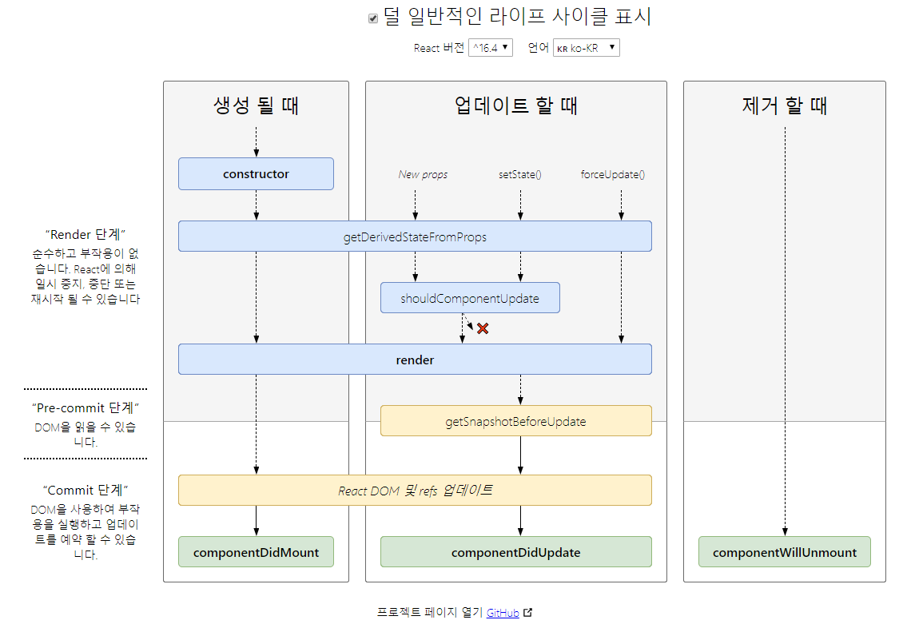

# react

4일차 C:\react\hello-react2>npm start


## p111, React.memo, React.PureComponent

자식 컴포넌트는 부모 컴포넌트가 렌더링될 때 함께 렌더링된다.

`증가`, `증가2` 에서

`증가2`를 눌렀을 때 자식 컴포넌트도 같이 렌더링 됨

=> 불필요한 렌더링이 발생

=> 불필요한 렌더링을 방지하기 위해서는 React.memo, React.PureComponent를 사용


### APP.js

```javascript
import React from 'react';
import Todo from './Todo';

class App extends React.Component {
  render() {
    return <Todo />
  }
}

export default App;

```


### Todo.js

```javascript
import React, { Fragment } from 'react';
import Title from './Title';

class Todo extends React.Component {
    state = { count: 0, count1: 0 };

    onClick = () => {
        this.setState({ count: this.state.count +1});
    };
    
    onClick2 = () => {
        this.setState({ count1: this.state.count1 +1});
    };

    render() {
        return (
            <div>
                <Title title = {`현재 카운트: ${this.state.count}`}></Title>
                <p>{this.state.count1}</p>
                <button onClick={this.onClick}>증가</button>
                <button onClick={this.onClick2}>증가2</button>
            </div>
        )
    }
}
export default Todo;

```


### Title.js

```javascript
import React from 'react';

function Title(props) {
    console.log(props);
    return <p>{props.title}</p>
}

export default Title;

```

---

### 불필요한 렌더링을 방지

### React.memo

`함수형 컴포넌트`인 경우에는 React.memo()를 이용해서 자식 컴포넌트의 불필요한 렌더링을 줄일 수 있음

#### Title.js

`export default React.memo(Title);`추가

```javascript
import React from 'react';

function Title(props) {
    console.log(props);
    return <p>{props.title}</p>
}

export default React.memo(Title);
// 함수형 컴포넌트인 경우에는 React.memo()를 이용해서 자식 컴포넌트의 불필요한 렌더링을 줄일 수 있음
// props값이 변경되는 경우에만 호출되는 것을 확인할 수 있음
```

`증가2`를 눌러도 자식 컴포넌트는 렌더링이 안됨


### React.PureComponent

`클래스형 컴포넌트`인 경우에는 React.PureComponent를 이용하면 자식 컴포넌트의 불필요한 렌더링을 줄일 수 있음

#### Title.js

```javascript
import React from 'react';

class Title extends React.PureComponent {
    constructor (props) {
        super(props);
    }
    
    render() {
        console.log(this.props);
        return <p>{this.props.title}</p>
    }
}

export default Title;

//클래스형 컴포넌트인 경우에는 React.PureComponent를 이용하면 자식 컴포넌트의 불필요한 렌더링을 줄일 수 있음
```


## p112, setState

* `클래스형 컴포넌트`에서 상태값을 변경할 때 호출하는 메소드
* setState 메서드로 입력된 객체는 기존 상탯값과 병합(merge)됨


### App.js

```javascript
import React from 'react';

class App extends React.Component {
  state = { count1: 0, count2: 0 };
  onClick = () => {
    this.setState({ count1: this.state.count1 + 1});
    this.setState({ count1: this.state.count1 + 1});
    this.setState({ count1: this.state.count1 + 1});
  };

  render() {
    const { count1, count2} = this.state;
    return (
      <div>
        <p>{count1}, {count2}</p>
          <button onClick={this.onClick}>증가</button>
      </div>
    );
  }
}

export default App;

```

3만큼 증가시키고 싶었는데 1만큼 증가한다.

이는 setState메서드가 비동기로 동작하기 때문이다.

리액트는 효율적으로 렌더링하기 위해 여러 개의 setState 메서드를 배치(batch)로 처리하기 때문이다.


### 방법1. 호출 직전의 상태값을 매개변수로 받아서 처리

#### App.js

```javascript
this.setState(prevState => ({ count2: prevState.count2 + 1 }));
```


```javascript
import React from 'react';

class App extends React.Component {
  state = { count1: 0, count2: 0 };
  onClick = () => {
    this.setState({ count1: this.state.count1 + 1});
    this.setState({ count1: this.state.count1 + 1});
    this.setState({ count1: this.state.count1 + 1});

    this.setState(prevState => ({ count2: prevState.count2 + 1 }));
    this.setState(prevState => ({ count2: prevState.count2 + 1 }));
    this.setState(prevState => ({ count2: prevState.count2 + 1 }));
  };

  render() {
    const { count1, count2} = this.state;
    return (
      <div>
        <p>{count1}, {count2}</p>
          <button onClick={this.onClick}>증가</button>
      </div>
    );
  }
}

export default App;

```


### 방법2. 상태값 로직을 분리해서 사용

#### App.js

```javascript
import React from 'react';

const actions = {
  init() {
    return { count: 0 };
  },

  increment(state) {
    return { count: state.count + 1 };
  },

  decrement(state) {
    return { count: state.count - 1 };
  },
};

class App extends React.Component {
  state = actions.init();

  onIncrement = () => {
    this.setState(actions.increment);
  };
  /* 
  this.setState(prevState => ({ count2: prevState.count + 1 }));
  이 함수를 밖에 actions로 빼 놓음, 따라서 위 increment의 state가 prevState
  */
  onDecrement = () => {
    this.setState(actions.decrement);
  };

  render() {
    return (
      <div>
        <p>{this.state.count}</p>
        <button onClick={this.onIncrement}>증가</button>
        <button onClick={this.onDecrement}>감소</button>

      </div>
    );
  }
}

export default App;

```


## p114 setState 메소드는 비동기로 처리되지만 호출 순서는 보장된다.

### App.js

```javascript
import React from 'react';

class App extends React.Component {
  state = { count1: 0, count2: 0 };

  onClick = () => {    
    this.setState({ count1: this.state.count1 + 1});
    this.setState({ count2: this.state.count2 + 1});
  };
/*
 onClick = () => {

  let { count1, count2 } = this.state;

  count1 += 1;

  count2 += 1;

  this.setState({ count1 });

  this.setState({ count2 });

};
*/
  render() {
    const { count1, count2} = this.state;
    let result = count1 >= count2;
    return (
      <div>
        <p>{count1} >= {count2}</p>
        <p>{String(result)}</p>
        <button onClick={this.onClick}>증가</button>
      </div>
    );
  }
}

export default App;

```


## p115 [setState 메소드의 두 번째 매개변수는 처리가 끝났을 때 호출되는 콜백 함수다.](https://ko.reactjs.org/docs/react-component.html#setstate)

두번째 매개변수는 `setState`의 실행이 완료되고 컴포넌트가 다시 렌더링된 뒤에 실행될 함수에 대한 콜백

 (componentDidUpdate()의 사용을 권장)

### App.js

```javascript
import React from 'react';

class App extends React.Component {
  state = { count1: 0, count2: 0 };

  onClick = () => {

    let { count1, count2 } = this.state;
  
    count1 += 1;
  
    count2 += 1;
  
    this.setState({ count1 }, () => console.log(`count1 = ${count1}`));
  
    this.setState({ count2 }, () => console.log(`${this.state.count2}`));
  }

  render() {
    const { count1, count2} = this.state;
    let result = count1 >= count2;
    console.log('render is called')
    return (
      <div>
        <p>{count1} >= {count2}</p>
        <p>{String(result)}</p>
        <button onClick={this.onClick}>증가</button>
      </div>
    );
  }
}

export default App;

```

`render is called` 가 찍히고 `count1`, `count2` 가 찍힌다.


## p116 3.2 리액트 요소와 가상 돔

JSX 코드에서 태그 사이에 표현식을 넣은 코드

```javascript
const element = <h1>제 나이는 {20 + 5} 세 입니다.</h1>;
가
{
    type: 'h1',
    props: {
        			// 아래처럼 표현식 앞, 뒤로 나뉘어서 들어감
        children: ['제 나이는', 25, '세 입니다.' ],
    }
}
```


### App.js


```javascript
import React from 'react';

class App extends React.Component {
  render() {
    const code3_16 = <a href="http://www.google.com">click here</a>;
    console.log(code3_16);
    const code3_17 = <a key="key1" style={{width:100}} href="http://google.com">click here</a>;
    console.log(code3_17);
    const code3_18 = <h1>제 나이는 {20+5} 세입니다.</h1>;
    console.log(code3_18);
    return(<div></div>);
  }
}

export default App;

```


### p119 리액트 요소가 돔 요소로 만들어지는 과정

리액트에서 데이터 변경에 의한 화면 업데이트는 `렌더 단계`와 `커밋 단계`를 거친다.

`렌더 단계`는 실제 돔에 반영할 변경 사항을 `파악`하는 단계,

`커밋 단계`는 변경 사함을 파악하기 위해 `가상 돔`을 이용

`가상 돔`은 리액트 요소로부터 만들어진다


#### App.js

```javascript
import React from 'react';
import Todo from './Todo';


class App extends React.Component {
  render() {
    const element = <Todo title="리액트 공부하기" desc="실전 리액트를 열심히 읽는다"></Todo>;
    console.log(element);
    return (element);
  }
}

export default App;

```


#### Todo.js

```javascript
import React, { Fragment } from 'react';
import Title from './Title';

class Todo extends React.Component {
    state = { priority: 'high'};

    onClick = () => {
        let { priority } = this.state;
        priority = priority === 'high' ? 'low' : 'high';
        this.setState({ priority });
    };

    render() {
        const { title, desc } = this.props;
        const { priority } = this.state;
        const element = (
            <div>
                <Title title={title} />
                <p>{desc}</p>
                <p>{priority === 'high' ? '우선순위 높음' : '우선순위 낮음'}</p>
                <button onClick={this.onClick}>우선순위 변경</button>
            </div>
        );
        console.log(element);
        return element;
    };
}

export default Todo;

```


#### Title.js

```javascript
import React from 'react';

class Title extends React.PureComponent {
    constructor (props) {
        super(props);
    }
    
    render() {
        const { title } = this.props;
        const element = <p style={{color: 'skyblue'}}>{title}</p>;
        console.log(element);
        return element;
    }
}

export default Title;

```


실제 돔을 만들 수 있는 리액트 요소 트리를 `가상 돔`이라고 한다.

최초의 리액트 요소 트리로부터 가상 돔을 만들고 이전 가상 돔과 비교해서 실제 돔에 반영할 내용을 결정하는 단계를 `렌더 단계`라고 부른다

브라우저에서 실제 돔을 변경하는 작업은 다른 작업에 비해 시간이 오래 걸리기 때문에 꼭 필요한 부분만 변경하는 것이 중요하다.


# 시험

## Javascript & jQuery

1. 식별자 

   식별자 유형

   

   변수 속성 함수 메소드 구분하기 위해 사용되는 이름

   식별자의 유형

   속성, 메소드 : 객체가 가지고 있는 

   ex) Math.PI : 속성

   ​		PI : 변수

   ​		Math.max() : 메소드

   ​		max() : 함수

   

2.  주석

   /* */

   //


3. 문자열 'abc', "abc", \`abc`

   ex) 'John's car' => 'John`\`'s car`

   ​	"John's car"

   ​	\`John's car`

   XYZ


4. console.log(100 < 200 < 300); // true

   console.log(300 > 200 > 100); // false

   ​						앞 300 > 200 에서 true가 나오고

   ​								그다음 true > 100 에서 false

   ​	300>200 && 200>100으로 써줘야 함

   console.log(100 > 200 > 300); // false


5. console.log('크다' > '작다') // true 가나다 순이라서


6. Boolean() 함수 p64. 0, NaN, '', null, undefined ⇒ false로 변환


7. P89 짧은 조건식(short-circuit)

   A || B ⇐ A 또는 B, 둘 중 하나가 참이면 참 = A와 B, 둘 모두 거짓이어야 거짓

   A && B ⇐ A와 B, 둘 모두 참이어야 참 = A 또는 B 둘 중 하나가 거짓이면 거짓


8. ```javascript
   <script>
       let score = {
           korean : 90,
           math : 100,
           science : 80,
   
           sum : function() {
              return this.korean + this.math + this.science;
           },
   
           average : function () {
               return this.sum() / 3;
           },
                  
       };
   
       console.log(`총점: ${score.sum()}, 평균: ${score.average()}`);
   </script>
   ```


9. ```javascript
   <script>
       function sum(i, j, k, l = 10, m = 20 ,n = 30) {
           return i + j + k + l + m + n;
   
       }
   
       let data = [ 1, 2, 3 ];
   
       console.log(sum(...data)) // 1 + 2 + 3 + 10 + 20 + 30
       console.log(sum(...data, ...data)) // 1 + 2 + 3 + 1 + 2 + 3
       console.log(sum(4, 5, ...data)) // 4 + 5 + 1 + 2 + 3 + 30
   
   </script>
   ```

10. ```javascript
    <html>
        <head>
            <script>
                // 두번째 xyz의 글자 색을 붉은 색으로 만드는 jQuery 코드?
                $(function() {
                    $('#a2').css('color', 'red'); // 다 같음.. 
                    $('#abc #a2').css('color', 'red');
                    $('p#a2').css('color', 'red');
                    $('.b:odd').css('color', 'red');
                    $('div#abc p#a2').css('color', 'red');
                });
    
            </script>
        </head>
        <body>
            <div id="abc">
    
                <p  id="a1" class="b">xyz</p>
                <p  id="a2" class="b">xyz</p>
                <p  id="a3" class="b">xyz</p>
    
            </div>
    </body>
    </html>
    ```

    

11. jQuery 

    <script>       //  문서가 준비되면 매개변수로 전달한 콜백 함수를 실행하라는 의미
        jQuery(document).ready(function() {
                console.log("#1");
            });
            $(document).ready(function() {
                console.log("#2");
            });      
            jQuery(function() {
                console.log("#3");
            });
            $(function() {
                console.log("#4");


## React 

### [w3school](https://www.w3schools.com/react/default.asp)

1. create-react-app

   ```javascript
   ReactDOM.render(
                   React.createElement(Container), 
                   document.querySelector('#react-root')
               );
   
   <div id="xyz"></div>
   
   <script>
       class Hello extends React.Component {
           render() {
               return <h1>Hello React !!!</h1>
           };
       };
   
   	ReactDOM.render(
       		<Hello/>,
           	document.getElementByID('xyz')
       );
   </script>
   ```

   

2. npm start 개발모드로 실행

   npm run build 실행환경으로 

   npm run eject 
   
   
   
3. ```javascript
   // JSX 구문
   <h1>Hello React!!!</h1>
   //createElement 구문
   React.createElement(
     'h1',
     {},
     'Hello React!!!'
   );
   
   // JSX구문
   <input type="text"> 이렇게 쓰면 안됨 닫아줘야함
   <input type="text"></input>
   <input type="text" />
       
   
       
   ```

4. ```javascript
   class Car extneds React.Component {
     render() {
       return <div>It's {this.props.color} color.</div>;
     }
   }
   
   ReactDOM.render(<Car color="red"/>, document.getElementById("root"));
   
   
   //It's red color. 가 출력 되려면? {this.props.color} 부모 컴포넌트로 부터 전달된 값을 찍을 때 props
   ```

5. ```javascript
   class Car extneds React.Component {
     render() {
       return <h2>{this.props.brand.name} {this.props.brand.model}</h2>
     }
   }
   
   class Garage extends React.Component {
     render() {
       const carinfo = { name: "SM5", model: "2019년식" };
       return (
         <div>
           <Car brand={carinfo} />
         </div>
       );
     }
   }
   
   ReactDOM.render(<Garage />, document.getElementById("root"));
   
   // <div><h2>SM5 2019년식</h2></div>
   ```

6. ```javascript
   import React from 'react';
   import Todo from './Todo';
   
   
   class App extends React.Component {
     state = {
       name: ''
     };
   
     onChange = e => {
       const name  = e.target.value;
       this.setState({name});
     };
   
     render() {
       return (
         
         <form>
           <h1>Hello {this.state.name}</h1>
           <p>Enter your name: </p>
           <input type="text" onChange={this.onChange}></input>
         </form>
         
       )  
     }
   }
   
   export default App;
   /* 들어가야 할 내용
   <form>
   <h1>Hello _____</h1>
   <p>Enter your name: </p>
   <input type="text">
   </form>
   */ 
   
           <p style={{ color: 'red', backgroundColor: 'greenyellow' }}>Enter your name: </p>
   
   style = {} // javascript를 쓸 수 있음
   style = {{ }} // javascript객체를 이용함
   
   ```


실기

화면구성(소스 제공)

1. 마우스를 누르면 뉴스 내용 나오기
2. TodoList (취소선) _ (리액트를 다루는 기술 책)


## p124 3.3 [생명 주기 메서드](http://projects.wojtekmaj.pl/react-lifecycle-methods-diagram/)



### App.js

```javascript
import React from 'react';
import Counter from './Counter';


class App extends React.Component {
  render() {
    return <Counter />
  }
}
export default App;

```


### Counter.js

```javascript
import React from 'react';

class Counter extends React.Component {
    state = { number: 0 };
    
    onIncrease = () => {
        this.setState({ number: this.state.number + 1 });
    }

    constructor(props) {
        //p126, constructor 메서드 내부에서 반드시 super 함수를 호출해야 한다.
        super(props);
        console.log("constructor");
    }

    static getDerivedStateFromProps(props, state) {
        console.log("getDerivedStateFromProps");

    }

    render() {
        console.log("render");
        return (
            <div>
                <h1>Counter</h1>
                <div>Value : {this.state.number}</div>
                <button onClick={this.onIncrease}>+</button>
            </div>
        );
    };

    componentDidUpdate() {
        console.log("componentDidUpdate");
    }
}

export default Counter;

```


## P137 componetDidMount 메소드

C:\react\hello-react2\src\Box.js


### App.js

```javascript
import React from 'react';
import Box from './Box';


class App extends React.Component {
  render() {
    return <Box />
  }
}
export default App;

```


### Box.js

```javascript
import React from 'react';

class Box extends React.Component {
    state = {
        boxWidth: 0,
    };

    divRef = React.createRef();

    componentDidMount() {
        const rect = this.divRef.current.getBoundingClientRect();
        this.setState({ boxWidth: rect.width });
    };

    render() {
        const { boxWidth } = this.state;
        const backgroundColor = boxWidth < 600 ? 'pink' : 'yellowgreen';
        return (
            <div ref={this.divRef}
                 style={{ width: '100%', height: '100px', backgroundColor}}
            >box
            </div>

        );
    }
}

export default Box;
```

---

## p140 코드 3-47

```javascript
import React, { Fragment } from 'react';

class Box extends React.Component {
    state = {
        items: [],
    };

    divRef = React.createRef();

    getSnapshotBeforeUpdate(prevProps, prevState) {
        const { items } = this.state;
        if (prevState.items.length < items.length) {
            const rect = this.divRef.current.getBoundingClientRect();
            console.log("getSnapshotBeforeUpdate() 반환값", rect.height);
            return rect.height;
        }
        return null;
    };

    componentDidUpdate(prevProps, prevState, snapshot) {
        console.log('componentDidUpdate()');
        if (snapshot !== null) {
            const rect = this.divRef.current.getBoundingClientRect();
            console.log(rect.height);
            if (rect.height !== snapshot) {
                console.log("새로운 줄이 추가되었습니다.");
            }
        }
    }

    onClick = () => {
        console.log('onClick()');
        const { items } = this.state;
        this.setState({ items: [...items, '아이템'] });
    };

    render() {
        console.log('render()');
        const { items } = this.state;
        
        return (
            <Fragment>
            <button onClick={this.onClick}>추가하기</button>
            <div ref={this.divRef} style={{ width: '100%'}}>
                {
                items.map(item => <p style={{ height: 50 }}>{item}</p>)}
            </div>
            </Fragment>
        );
    }
}

export default Box;
```


## shouldComponentUpdate 메서드

예를들어 버스

```javascript
import React, { Fragment } from 'react';

class Box extends React.Component {
    state = {
        items: [],
    };

    divRef = React.createRef();

    // 짝수번째에 렌더링
    shouldComponentUpdate(nextProps, nextState) {
        return nextState.items.length % 2 === 0;
    }

    getSnapshotBeforeUpdate(prevProps, prevState) {
        const { items } = this.state;
        if (prevState.items.length < items.length) {
            const rect = this.divRef.current.getBoundingClientRect();
            console.log("getSnapshotBeforeUpdate() 반환값", rect.height);
            return rect.height;
        }
        return null;
    };

    componentDidUpdate(prevProps, prevState, snapshot) {
        console.log('componentDidUpdate()');
        if (snapshot !== null) {
            const rect = this.divRef.current.getBoundingClientRect();
            console.log(rect.height);
            if (rect.height !== snapshot) {
                console.log("새로운 줄이 추가되었습니다.");
            }
        }
    }

    onClick = () => {
        console.log('onClick()');
        const { items } = this.state;
        this.setState({ items: [...items, `${items.length + 1}'s item`] });
    };

    render() {
        console.log('render()');
        const { items } = this.state;
        
        return (
            <Fragment>
            <button onClick={this.onClick}>추가하기</button>
            <div ref={this.divRef} style={{ width: '100%'}}>
                {
                items.map(item => <p style={{ height: 50 }}>{item}</p>)}
            </div>
            </Fragment>
        );
    }
}

export default Box;
```


## p145 자식 컴포넌트에서 발생한 예외를 부모 컴포넌트에서 처리

### ErrorBoundary.js

```javascript
// P145 코드 3-52 참조
import React from 'react';

class ErrorBoundary extends React.Component {
    state = { error: null };

    // P144 
    //  에러 정보를 상태값에 저장
    static getDerivedStateFromError(error) {
        console.log("getDerivedStateFromError()", error);
        return { error };
    }
    //  에러 정보를 서버로 전송하는 용도로 사용
    componentDidUpdate(error, info) {
        console.log("componentDidUpdate()", error, info);
    }
    render() {
        const { error } = this.state;
        if (error) {
            return <div>{error.toString()}</div>
        } else
        return this.props.children;
    }
}

export default ErrorBoundary;

```


### Counter.js

```javascript
import React from 'react';
class Counter extends React.Component {
    state = { number: 0 };
    onIncrease = () => {
        this.setState({ number: this.state.number + 1 });
    }    
    render() {
        const { number } = this.state;
        if (number >= 3) {
            throw new Error("에러 발생!!!");
        }
        return <div onClick={this.onIncrease}>{`${number}번째 클릭입니다.`}</div>
    }
}
export default Counter;

```


### App.js

```javascript
import React from 'react';
import ErrorBoundary from './ErrorBoundary';
import Counter from './Counter';

class App extends React.Component {
  render() {
    return <ErrorBoundary><Counter></Counter></ErrorBoundary>;
  }
}
export default App;

```


## p148 컨텍스트 API

> 상위 컴포넌트에서 하위에 있는 모든 컴포넌트로 직접 데이터 전달이 가능

#### 컨텍스트 API를 사용하지 않으면 속성값(pros)로 전달

```javascript
import React from 'react';

class App extends React.Component {
  render() {
    return (
      <div>
        <div>상단 메뉴</div>
        <Profile username="홍길동"/>
        <div>하단 메뉴</div>
      </div>
    );
  }
}

function Profile({username}) {
  return (
    <div>
      <Greeting username={username}/>
    </div>
  );
}

function Greeting({username}) {
  return (
    <p>{`${username}님 안녕하세요.`}</p>

  );
}

export default App;

```


#### 컨텍스트 API를 사용

```javascript
import React from 'react';

const UserContext = React.createContext('unknown');

class App extends React.Component {
  render() {
    return (
      <div>
        <UserContext.Provider value="홍길동">
        <div>상단 메뉴</div>
        <Profile />
        <div>하단 메뉴</div>
        </UserContext.Provider>
      </div>
    );
  }
}

function Profile({}) {
  return (
    <div>
      <Greeting />
    </div>
  );
}

function Greeting({}) {
  return (
    <UserContext.Consumer>
      {
        username => <p> {`${username}님 안녕하세요.`} </p>
      }
        </UserContext.Consumer>
  );
}

export default App;

```


##### 중간 컴포넌트의 렌더링 여부에 상관없이 Provider 컴포넌트의 값이 바뀌면 Cosumer컴포넌트가 렌더링을 수행하는 것을 보장

```javascript
import React from 'react';

const UserContext = React.createContext('unknown');

class App extends React.Component {
  state = { username: '' };

  onChange = e => {
    const username = e.target.value;
    this.setState( { username });
  }

  render() {
    const {username} = this.state;

    return (
      <div>
        <UserContext.Provider value={username}>
        <div>상단 메뉴</div>
        <Profile />
        <div>하단 메뉴</div>
        </UserContext.Provider>
        <input type="text" value={username} onChange={this.onChange} /> 
      </div>
    );
  }
}

class Profile extends React.Component {
  render() {
    console.log("Profile's render() called");
    return (
    <div>
      <Greeting />
    </div>
    );
  }
}


function Greeting({}) {
  console.log("Greeting() called");
  return (
    <UserContext.Consumer>
      {
        username => <p> {`${username}님 안녕하세요.`} </p>
      }
        </UserContext.Consumer>
  );
}

export default App;

```


## P150 여러 컨텍스트를 중첩해서 사용

```javascript
import React from 'react';

const UserContext = React.createContext('unknown');
const ThemeContext = React.createContext('dark');

class App extends React.Component {
  state = { username: '' };
  onChange = e => {
    const username = e.target.value;
    this.setState({ username });
  };
  render() {
    const { username } = this.state;
    return (
      <div>
        <ThemeContext.Provider value="light">
          <UserContext.Provider value={username}>
            <div>상단 메뉴</div>
            <Profile />
            <div>하단 메뉴</div>
          </UserContext.Provider>
        </ThemeContext.Provider>
        <input type="text" value={username} onChange={this.onChange} />        
      </div>
    );
  }
}

class Profile extends React.Component {
  shouldComponentUpdate() {
    return false;
  }
  render() {
    console.log("Profile's render() called");
    return <div><Greeting /></div>;
  }
}

function Greeting() {
  console.log("Greeting() called");
  return (
    <ThemeContext.Consumer>
      { theme => (
        <UserContext.Consumer>
          { 
            username => (
              <p style={{ color: theme === 'dark' ? 'gray' : 'green' }}>{`${username}님 안녕하세요.`}</p>
            ) 
          }
        </UserContext.Consumer>
      ) }
    </ThemeContext.Consumer>
  );
}

export default App;

```

